### Audio

[previous](../rooms/README.md#user-content-change-rooms) • [home](../README.md#user-content-gms2-top-down-shooter)

The final part of this walk through we will add some sound the game.

 

---

##### `Step 1.`\|`SPCRK`|:small_blue_diamond:

Lets start by adding music to **obj_game**.  We should also make **obj_game** persistent as well so we have a **HUD** in level 2.

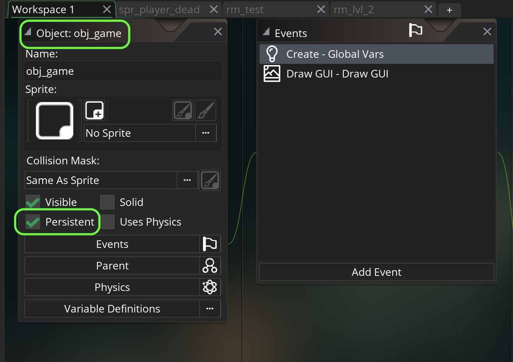

##### `Step 2.`\|`FHIU`|:small_blue_diamond: :small_blue_diamond: 

Download [EggyToast_7.mp3](images/EggyToast_7.mp3).  This was downloaded from **https://freemusicarchive.org/genre/Chiptune** and is from **Eggy Toas**.  The song is called **7**.

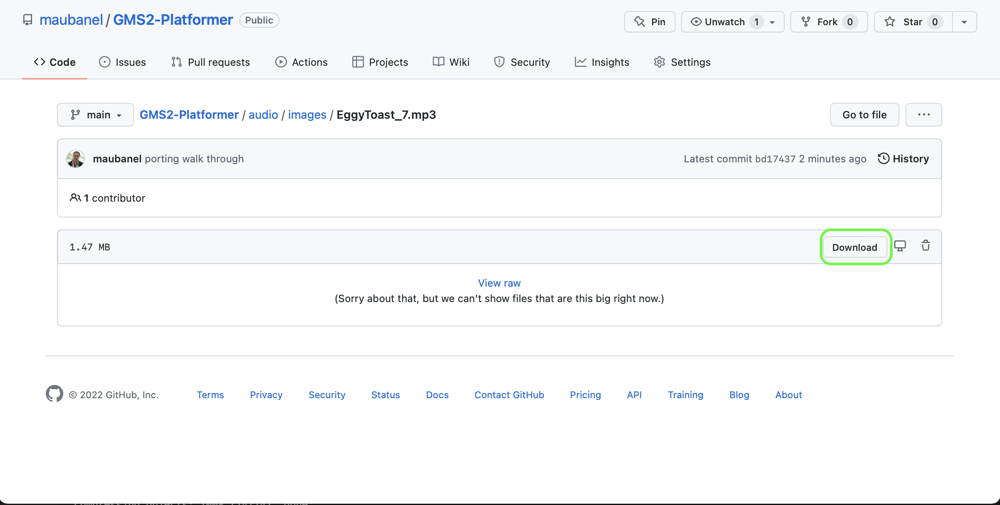

##### `Step 3.`\|`SPCRK`|:small_blue_diamond: :small_blue_diamond: :small_blue_diamond:

*Right click* on **Sounds** and select **New | Sound** and name it `snd_music`.  Press the **...** and select `EggyToast_7.mp3`.

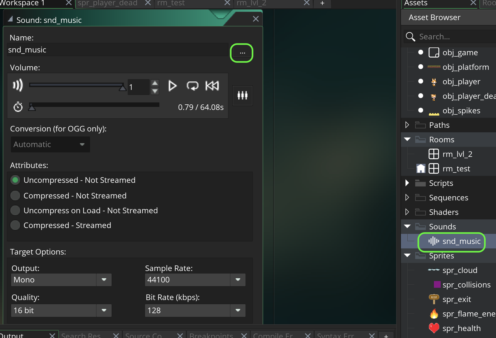

##### `Step 4.`\|`SPCRK`|:small_blue_diamond: :small_blue_diamond: :small_blue_diamond: :small_blue_diamond:

Open up **obj_game | Create** event.  Check to see if music is playing, if it is not then play the song as priority `1` and looping set to `true`.

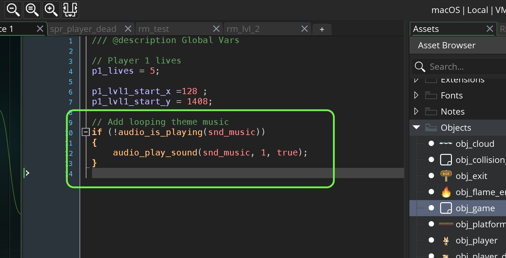

##### `Step 5.`\|`SPCRK`| :small_orange_diamond:

Now *press* the <kbd>Play</kbd> button in the top menu bar to launch the game. Now turn on the volume and you should hear the music in this video.

https://user-images.githubusercontent.com/5504953/158510468-88513c9b-0055-4c60-9534-2105abf5a67d.mp4

##### `Step 6.`\|`SPCRK`| :small_orange_diamond: :small_blue_diamond:

Find a suitable jump sound or download this one from [Jeremy Sykes on freesoun.org](https://freesound.org/people/jeremysykes/sounds/344500/).  Create a new sound file called `snd_jump` and bind the sound to it.

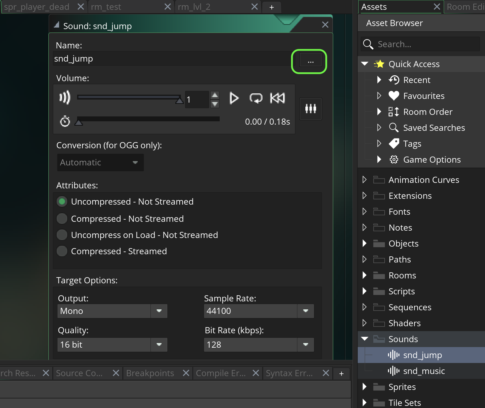

##### `Step 7.`\|`SPCRK`| :small_orange_diamond: :small_blue_diamond: :small_blue_diamond:

Open up **obj_player | Step** event and look for the jump code.  We will play the sound in both the first ground jump and double jump.  We will minimize repetition of the exact same sound by randomly modulating the pitch (frenquency) and gain (volume) of the sound before playing it.

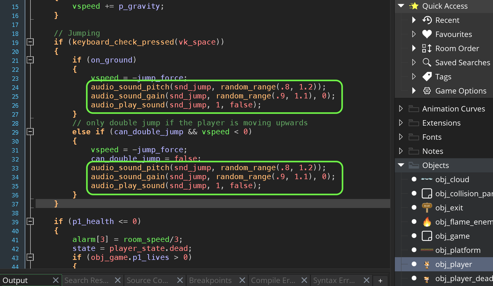

##### `Step 8.`\|`SPCRK`| :small_orange_diamond: :small_blue_diamond: :small_blue_diamond: :small_blue_diamond:

Now *press* the <kbd>Play</kbd> button in the top menu bar to launch the game. Unmute the audio to hear the jumping sounds!

https://user-images.githubusercontent.com/5504953/158620577-6e757cf6-6673-4bce-a752-50aa6c1cdc72.mp4

##### `Step 9.`\|`SPCRK`| :small_orange_diamond: :small_blue_diamond: :small_blue_diamond: :small_blue_diamond: :small_blue_diamond:

Now lets add a [fall sound](https://freesound.org/people/broumbroum/sounds/50543/).  Download the prior link or find your own sfx.  Now create a new **Sound** asset and link the sound.

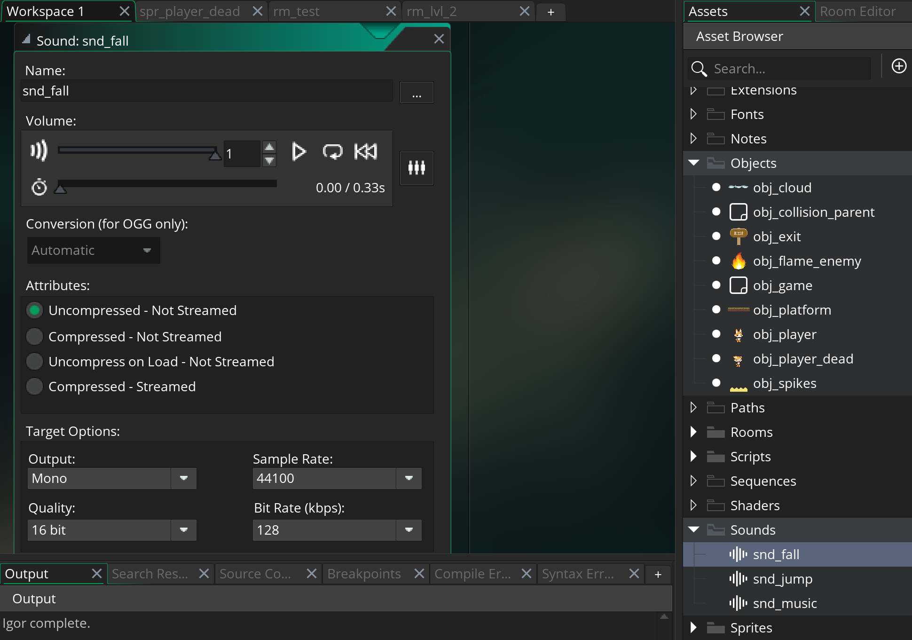

##### `Step 10.`\|`SPCRK`| :large_blue_diamond:

Open up **check_for_sound**.  Now look for where we lift the player outside the ground.  We will put in a pitch and volume shifted landing sound there. We do that for both objects and tile backgrounds.

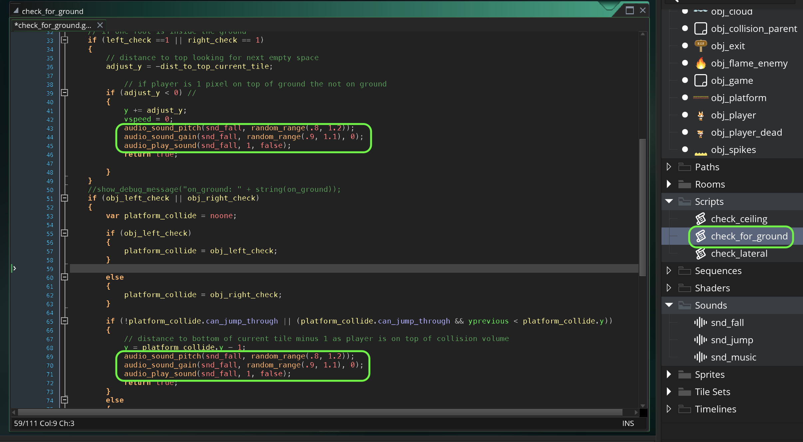

##### `Step 11.`\|`SPCRK`| :large_blue_diamond: :small_blue_diamond: 

Now *press* the <kbd>Play</kbd> button in the top menu bar to launch the game. Now jump and land.  It should make a sound on both tiles and object ground planes.

https://user-images.githubusercontent.com/5504953/158837594-d3da5aec-89a9-468d-9299-2039f3a2c469.mp4

##### `Step 12.`\|`SPCRK`| :large_blue_diamond: :small_blue_diamond: :small_blue_diamond: 

Now lets add a [footstep sound](https://freesound.org/people/MATRIXXX_/sounds/515783/).  Download the prior link or find your own sfx.  Make sure it is a single footstep. Now create a new **Sound** asset and link the sound.

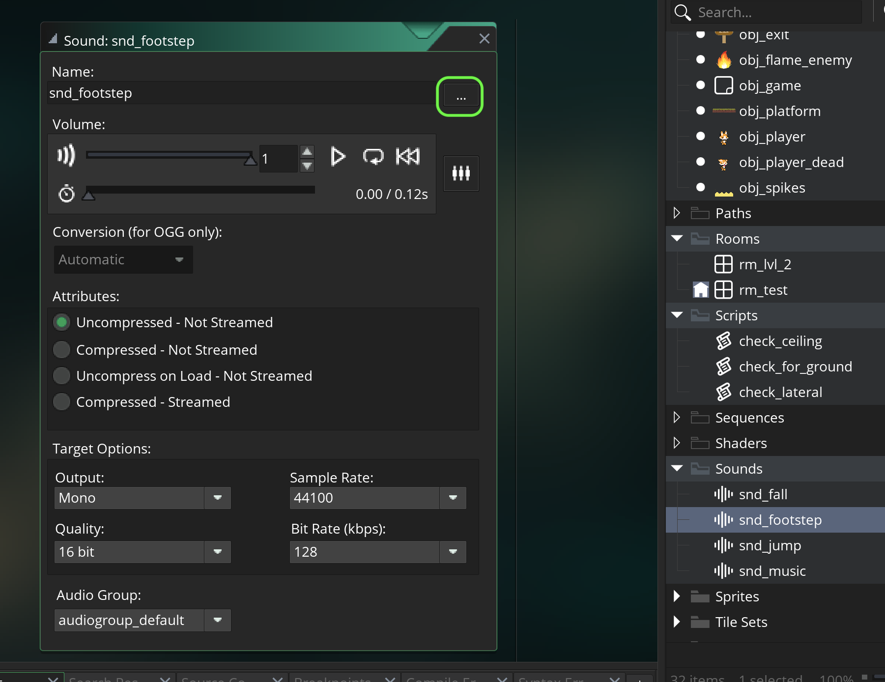

##### `Step 13.`\|`SPCRK`| :large_blue_diamond: :small_blue_diamond: :small_blue_diamond:  :small_blue_diamond: 

Open up **obj_player | End Step** and look for where we pick the run animation.  The footstep sound will only play when running.  Intead of calling the sound we will have a slight delay so that the footsteps don't play too close to each other.  In this sound I picked a 3 frame delay seems right.  When the sound is no longer playing call **alarm 5**.

##### `Step 14.`\|`SPCRK`| :large_blue_diamond: :small_blue_diamond: :small_blue_diamond: :small_blue_diamond:  :small_blue_diamond: 

Press the <kbd>Add Event</kbd> and select a **Alarm | Alarm 5** event. This event fire off quiet footsounds with a slight change in pitch and volume.

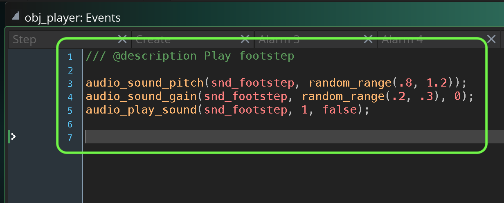

##### `Step 15.`\|`SPCRK`| :large_blue_diamond: :small_orange_diamond: 

Now *press* the <kbd>Play</kbd> button in the top menu bar to launch the game. Now we have a nice footstep sound.

https://user-images.githubusercontent.com/5504953/158837665-999c146c-f98c-4088-881f-06d964080a42.mp4

##### `Step 16.`\|`SPCRK`| :large_blue_diamond: :small_orange_diamond:   :small_blue_diamond: 

Now lets add a [health damage sound](https://freesound.org/people/Mrthenoronha/sounds/399904/).  Download the prior link or find your own sfx.  Make sure it is a single hit sound. Now create a new **Sound** asset and link the sound. Call it `snd_hit`.

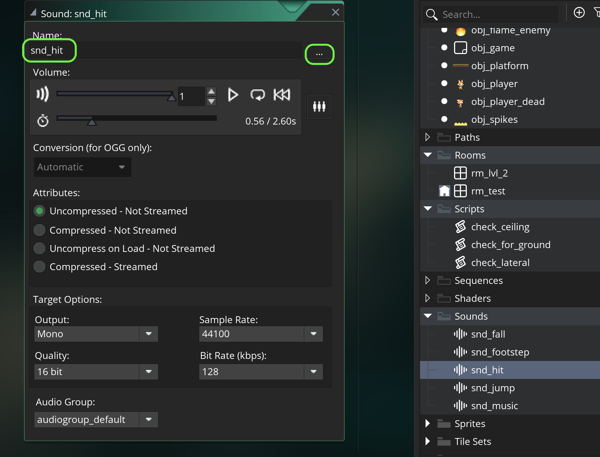

##### `Step 17.`\|`SPCRK`| :large_blue_diamond: :small_orange_diamond: :small_blue_diamond: :small_blue_diamond:

We can kill two birds with one stone by placing the sound in **obj_player | Alarm 0**.  This is called for both the spike damage and the fire enemy damage.

##### `Step 18.`\|`SPCRK`| :large_blue_diamond: :small_orange_diamond: :small_blue_diamond: :small_blue_diamond: :small_blue_diamond:

Now *press* the <kbd>Play</kbd> button in the top menu bar to launch the game. Now take damage and you should hear a sound reaction.

https://user-images.githubusercontent.com/5504953/158838128-fed51751-6cfb-47b0-abb0-44788fb7d0ee.mp4

##### `Step 19.`\|`SPCRK`| :large_blue_diamond: :small_orange_diamond: :small_blue_diamond: :small_blue_diamond: :small_blue_diamond: :small_blue_diamond:

Now lets add a [death sound](https://freesound.org/people/Fupicat/sounds/475347/).  Download the prior link or find your own sfx. Now create a new **Sound** asset and link the sound. Call it `snd_death`.

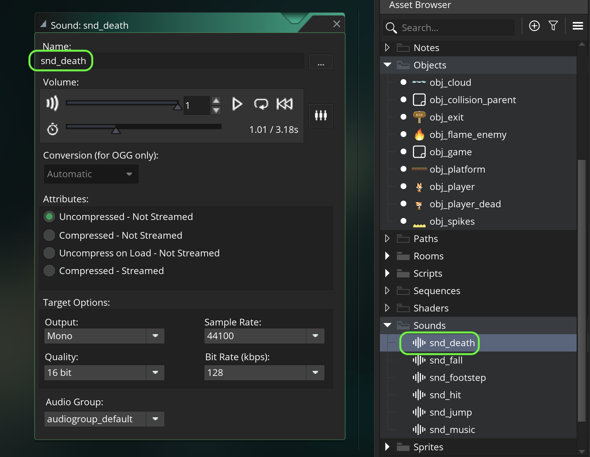

##### `Step 20.`\|`SPCRK`| :large_blue_diamond: :large_blue_diamond:

Now we switch to the death animation in Alarm 3 so lets trigger the sound there.

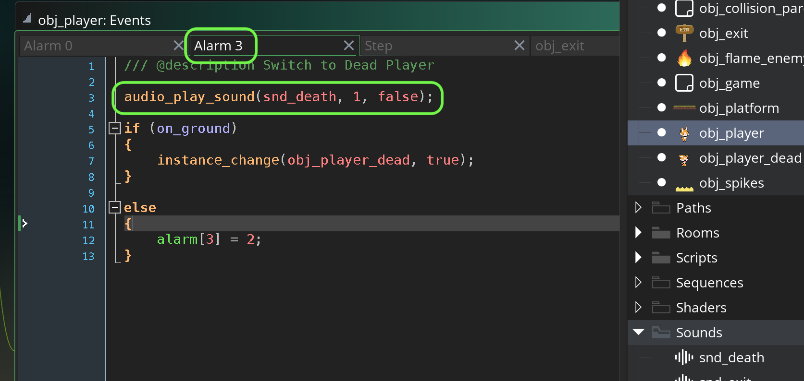

##### `Step 21.`\|`SPCRK`| :large_blue_diamond: :large_blue_diamond: :small_blue_diamond:

Now *press* the <kbd>Play</kbd> button in the top menu bar to launch the game. Now kill yourself to hear the sound.

https://user-images.githubusercontent.com/5504953/158843691-2d3e4c27-1e2e-4536-9774-33fb6df64907.mp4

##### `Step 22.`\|`SPCRK`| :large_blue_diamond: :large_blue_diamond: :small_blue_diamond: :small_blue_diamond:

Now lets add an [exit sound](https://freesound.org/people/DWOBoyle/sounds/143607/).  Download the prior link or find your own sfx. Now create a new **Sound** asset and link the sound. Call it `snd_exit`. Trigger the exit sound in the **obj_player | Collision | obj_exit**.  Make sure the sound only plays once as the player keep colliding.

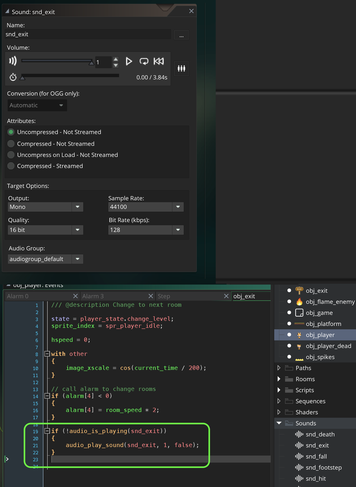

##### `Step 23.`\|`SPCRK`| :large_blue_diamond: :large_blue_diamond: :small_blue_diamond: :small_blue_diamond: :small_blue_diamond:

Now *press* the <kbd>Play</kbd> button in the top menu bar to launch the game. Go to the exit and hear the sound.  That is all for this walk through, now go make some interesting platforming levels!

___

| [previous](../rooms/README.md#user-content-change-rooms)| [home](../README.md#user-content-gms2-top-down-shooter) |
|---|---|
