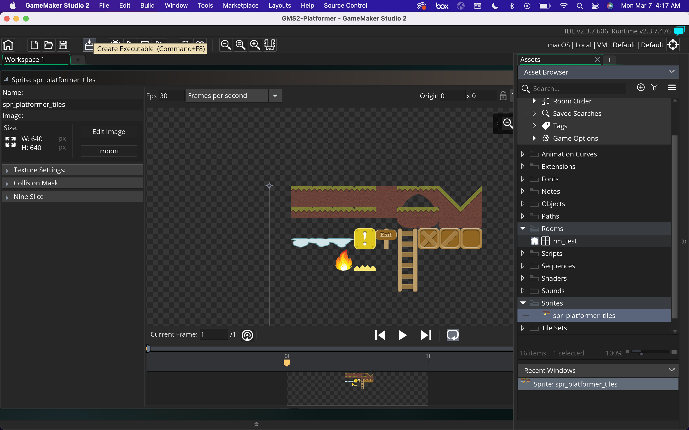
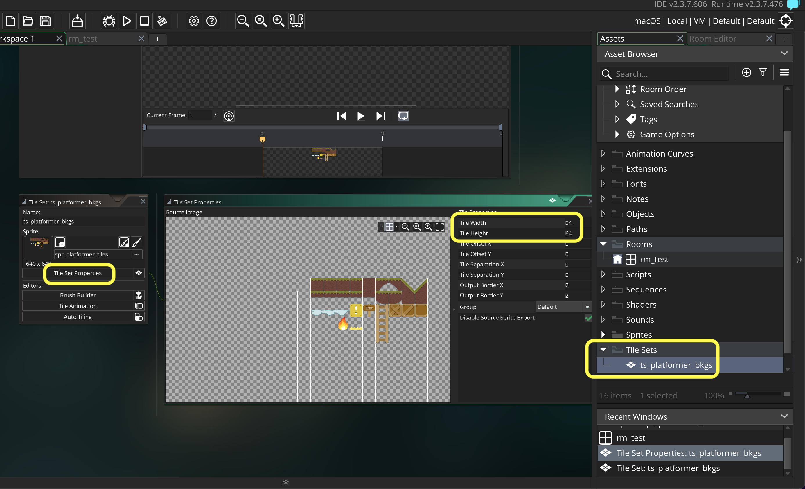
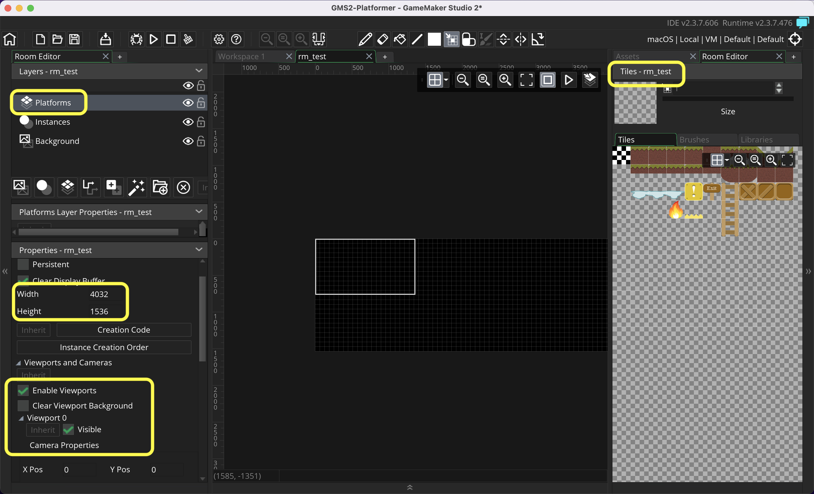

### Background Tiles

[previous](../setting-up/README.md#user-content-setting-up) • [home](../README.md#user-content-gms2-top-down-shooter) • [next](../)

Lets set up a playground so that we can test various elements of a platormer.  Lets start by putting down some tiles that we can get our collision detection system working.

 

---

##### `Step 1.`\|`SPCRK`|:small_blue_diamond:

Download [spr_platformer_tiles.png](images/spr_platformer_tiles.png). *Right click* on **Sprites** and select **New | Sprite** and name it `spr_platformer_tiles`. Press the <kbd>Import</kbd> button to bring in a basic set of tiles.  

##### `Step 2.`\|`FHIU`|:small_blue_diamond: :small_blue_diamond: 

*Right click* on **Tile Sets** and select **New | Tile Set** and name it `tls_platformer_bkg`. Assign **spr_platformer_tiles** to this **Tile Set**. Change the **Tile Width** and **Tile Height** to `64`.  This is the size I used when creating the tiles.

##### `Step 3.`\|`SPCRK`|:small_blue_diamond: :small_blue_diamond: :small_blue_diamond:

Open up **Room Test**.  Chnage the **Width** and **Height** of the room to `4032` wide by `1536` high.  Select `Enable Viewport` and open up **Viewport 0** and click on `Visible`.  Add a new **Tileset** layer and call it `Platforms`.  Assign the **tls_platformer_bkg** to this layer.

##### `Step 4.`\|`SPCRK`|:small_blue_diamond: :small_blue_diamond: :small_blue_diamond: :small_blue_diamond:

##### `Step 5.`\|`SPCRK`| :small_orange_diamond:

##### `Step 6.`\|`SPCRK`| :small_orange_diamond: :small_blue_diamond:

##### `Step 7.`\|`SPCRK`| :small_orange_diamond: :small_blue_diamond: :small_blue_diamond:

##### `Step 8.`\|`SPCRK`| :small_orange_diamond: :small_blue_diamond: :small_blue_diamond: :small_blue_diamond:

##### `Step 9.`\|`SPCRK`| :small_orange_diamond: :small_blue_diamond: :small_blue_diamond: :small_blue_diamond: :small_blue_diamond:

##### `Step 10.`\|`SPCRK`| :large_blue_diamond:

##### `Step 11.`\|`SPCRK`| :large_blue_diamond: :small_blue_diamond: 

##### `Step 12.`\|`SPCRK`| :large_blue_diamond: :small_blue_diamond: :small_blue_diamond: 

##### `Step 13.`\|`SPCRK`| :large_blue_diamond: :small_blue_diamond: :small_blue_diamond:  :small_blue_diamond: 

##### `Step 14.`\|`SPCRK`| :large_blue_diamond: :small_blue_diamond: :small_blue_diamond: :small_blue_diamond:  :small_blue_diamond: 

##### `Step 15.`\|`SPCRK`| :large_blue_diamond: :small_orange_diamond: 

##### `Step 16.`\|`SPCRK`| :large_blue_diamond: :small_orange_diamond:   :small_blue_diamond: 

##### `Step 17.`\|`SPCRK`| :large_blue_diamond: :small_orange_diamond: :small_blue_diamond: :small_blue_diamond:

##### `Step 18.`\|`SPCRK`| :large_blue_diamond: :small_orange_diamond: :small_blue_diamond: :small_blue_diamond: :small_blue_diamond:

##### `Step 19.`\|`SPCRK`| :large_blue_diamond: :small_orange_diamond: :small_blue_diamond: :small_blue_diamond: :small_blue_diamond: :small_blue_diamond:

##### `Step 20.`\|`SPCRK`| :large_blue_diamond: :large_blue_diamond:

##### `Step 21.`\|`SPCRK`| :large_blue_diamond: :large_blue_diamond: :small_blue_diamond:

___

| [previous](../setting-up/README.md#user-content-setting-up)| [home](../README.md#user-content-gms2-top-down-shooter) | [next](../)|
|---|---|---|
