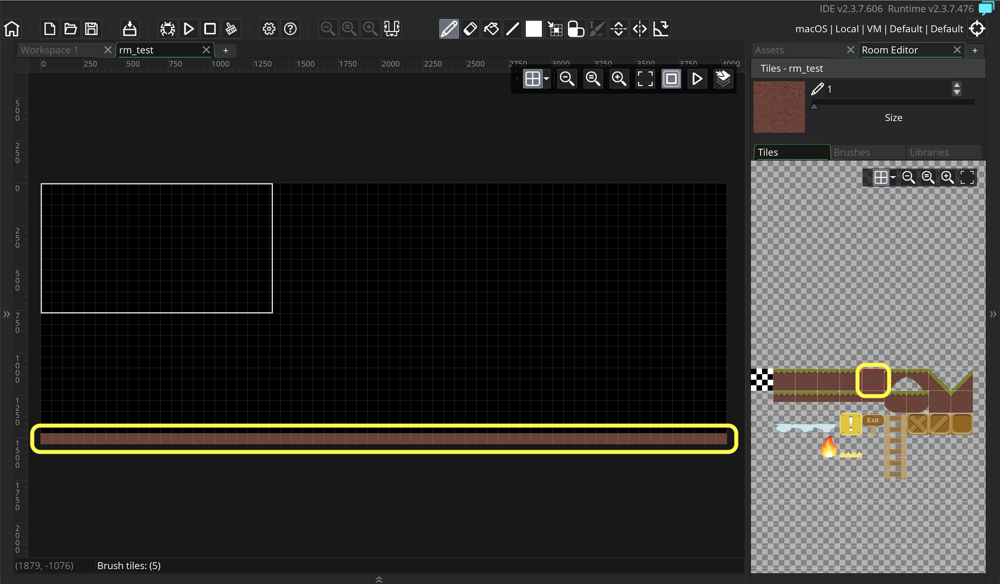
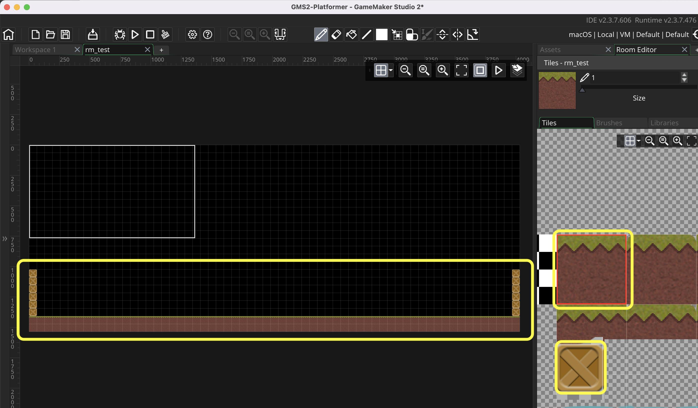
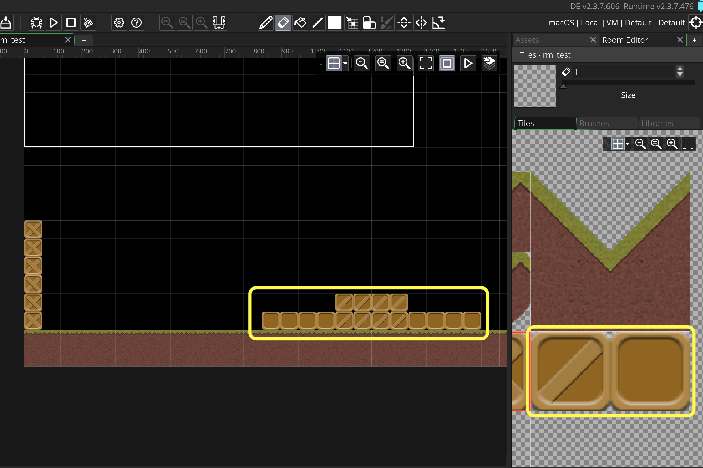
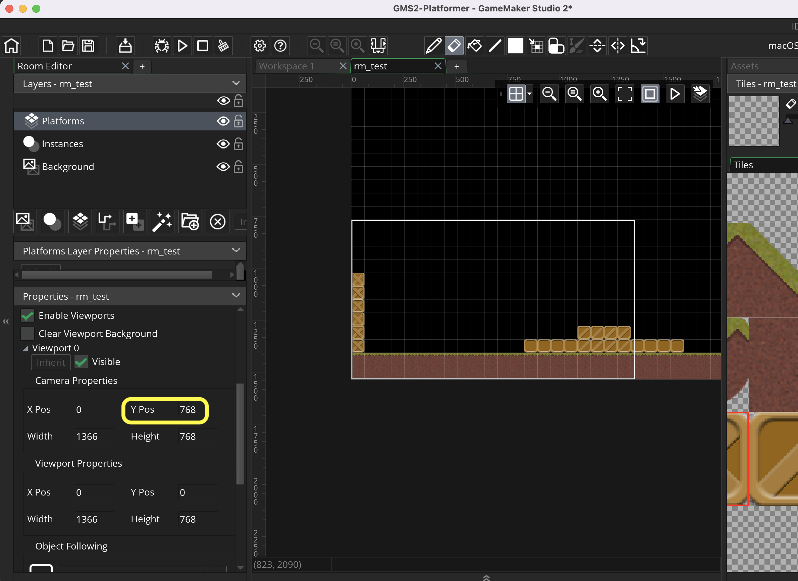
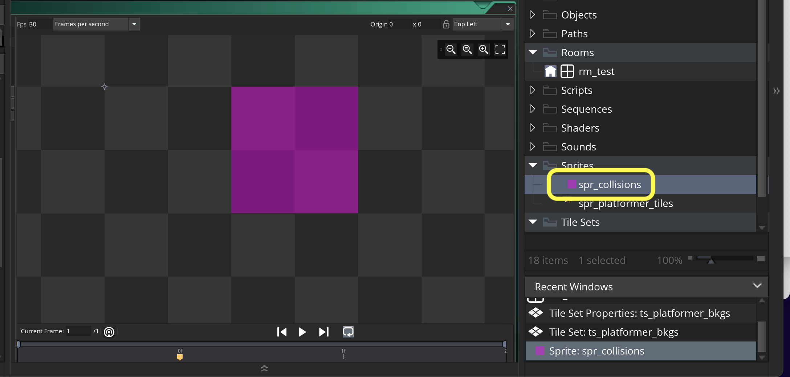
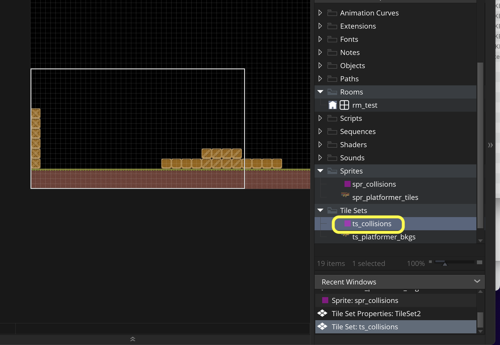
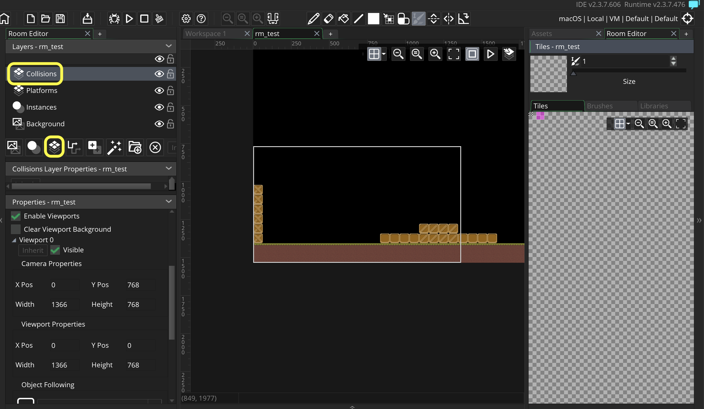
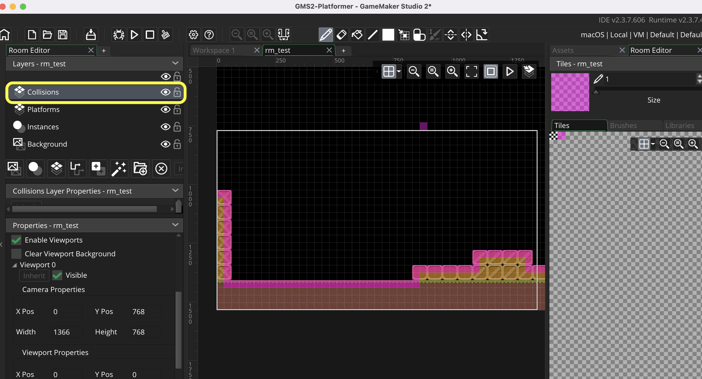
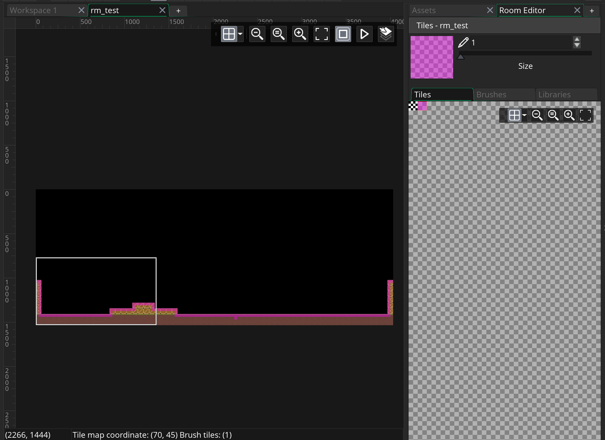
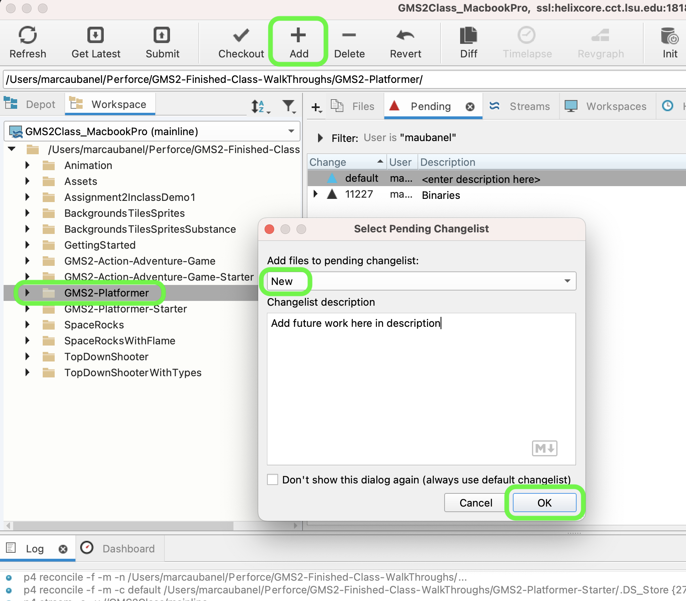

### Background Tiles

[previous](../setting-up/README.md#user-content-setting-up) • [home](../README.md#user-content-gms2-platformer) • [next](../setup-player/README.md#user-content-setup-player)

Lets set up a playground so that we can test various elements of a platormer.  Lets start by putting down some tiles that we can get our collision detection system working.

 

---

##### `Step 1.`\|`PLTFRMR`|:small_blue_diamond:

Open up **P4v**.  Select the top folder of the **GameMaker** project. Press the <kbd>Checkout</kbd> button.  Checkout out all files in P4V so that they are all writable (otherwise they will be read only and none of the changes will be saved). Select a **New** changelist and add a message describing the unit of work you will be performing. Press the <kbd>OK</kbd> button.

Open up the project you are working on in **GameMaker**. 

##### `Step 2.`\|`PLTFRMR`|:small_blue_diamond: :small_blue_diamond: 

Download [spr_platformer_tiles.png](images/spr_platformer_tiles.png). *Right click* on **Sprites** and select **New | Sprite** and name it `spr_platformer_tiles`. Press the <kbd>Import</kbd> button to bring in a basic set of tiles.  

##### `Step 3.`\|`PLTFRMR`|:small_blue_diamond: :small_blue_diamond: :small_blue_diamond:

*Right click* on **Tile Sets** and select **New | Tile Set** and name it `tls_platformer_bkg`. Assign **spr_platformer_tiles** to this **Tile Set**. Change the **Tile Width** and **Tile Height** to `64`.  This is the size I used when creating the tiles.

##### `Step 4.`\|`PLTFRMR`|:small_blue_diamond: :small_blue_diamond: :small_blue_diamond: :small_blue_diamond:

Open up **rm_test**.  Chnage the **Width** and **Height** of the room to `4032` wide by `1536` high.  Select `Enable Viewport` and open up **Viewport 0** and click on `Visible`.  Add a new **Tileset** layer and call it `Platforms`.  Assign the **tls_platformer_bkg** to this layer.

##### `Step 5.`\|`PLTFRMR`| :small_orange_diamond:

Select the new **Platforms** layer and select the solid ground tile.  Place it along the bottom of the room to establish a floor, so the player can't go beneath the bottom of the screen.

##### `Step 6.`\|`PLTFRMR`| :small_orange_diamond: :small_blue_diamond:

Lets establish a ground layer and select the full block of ground with grass on top.  This will tile on top of our ground layer.  Also add 6 boxes at either side of the level to prevent the player from leaving.

##### `Step 7.`\|`PLTFRMR`| :small_orange_diamond: :small_blue_diamond: :small_blue_diamond:

Lets build an area close to the start (the bottom left of the screen) with some jump platforms.  We should be able to single jump onto both of these platforms.

##### `Step 8.`\|`PLTFRMR`| :small_orange_diamond: :small_blue_diamond: :small_blue_diamond: :small_blue_diamond:

Now lets offset the camera so it starts at the bottom left of the level.  Open up **rm_test** and change the **Viewport 0 | YPos** to `768` which brings the starting window to the correct spot. 

##### `Step 9.`\|`PLTFRMR`| :small_orange_diamond: :small_blue_diamond: :small_blue_diamond: :small_blue_diamond: :small_blue_diamond:

Download [spr_collisions.png](images/spr_collisions.png). We will use this as our collision detection layer. We need some way to have a separate layer that tells players where they can and cannot move into.  The smaller these are the more expensive they get.  We made ours `32` by `32`.  *Right click* on **Sprites** and select **New | Sprite** and name it `spr_collisions`. Press the <kbd>Import</kbd> button to bring in a single collision tile.  

##### `Step 10.`\|`PLTFRMR`| :large_blue_diamond:

*Right click* on **Tile Sets** and select **New | Tile Set** and name it `tls_collisions`. Assign **spr_collisions** to this **Tile Set**. Change the **Tile Width** and **Tile Height** to `32`.  

##### `Step 11.`\|`PLTFRMR`| :large_blue_diamond: :small_blue_diamond: 

Open up **rm_test** and add another **Tile Set** layer and call is `Collisions`.  Assign tls_collisions.

##### `Step 12.`\|`PLTFRMR`| :large_blue_diamond: :small_blue_diamond: :small_blue_diamond: 

Select the **Collisions** layer and start to put the single pink tile to where you want the player to not enter.  So this would be the far left edge of the wall and the top edge of the floor.  This will be hidden when the game is ready is played, and is visually just showing us the collision volume so we can test our collision detection system.

##### `Step 13.`\|`PLTFRMR`| :large_blue_diamond: :small_blue_diamond: :small_blue_diamond:  :small_blue_diamond: 

Now continue and add collision volumes along the entire bottom section of the level including both side walls.

##### `Step 14.`\|`PLTFRMR`| :large_blue_diamond: :small_blue_diamond: :small_blue_diamond: :small_blue_diamond:  :small_blue_diamond: 

Select the **File | Save Project**, then press **File | Quit** (PC) **Game Maker | Quit** on Mac to make sure everything in the game is saved.

##### `Step 15.`\|`PLTFRMR`| :large_blue_diamond: :small_orange_diamond: 

Open up **P4V**.  Select the top folder and press the **Add** button.  We want to add all the new files we created during this last session.  Add these files to the last change list you used at the begining of the session. Make sure the message accurately represents what you have done. Press the <kbd>OK</kbd> button.

##### `Step 16.`\|`PLTFRMR`| :large_blue_diamond: :small_orange_diamond:   :small_blue_diamond: 

Now you can submit the changelist by pressing both <kbd>Submit</kbd> buttons.

<!--  -->

| [previous](../setting-up/README.md#user-content-setting-up)| [home](../README.md#user-content-gms2-platformer) | [next](../setup-player/README.md#user-content-setup-player)|
|---|---|---|
