### Jump Through Collisions

[previous](../flame/README.md#user-content-flame-enemy) • [home](../README.md#user-content-gms2-top-down-shooter) • [next](../rooms/README.md#user-content-change-rooms)

Lets do one final plaformer trope and that is a platform type you can jump through.  We will have a cloud and there will only be ground collision with no side or ceiling collision.

 

---

##### `Step 1.`\|`PLTFRMR`|:small_blue_diamond:

Download [spr_jump_cloud.png](images/spr_jump_cloud.png).  *Right click* on **Sprites** and select **New | Sprite** and name it `spr_cloud`. 

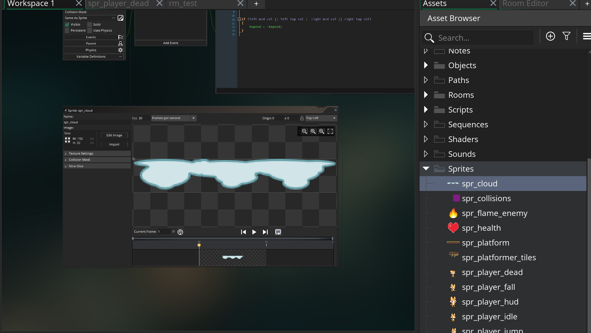

##### `Step 2.`\|`PLTFRMR`|:small_blue_diamond: :small_blue_diamond: 

*Right click* on **Objects** and select **New | Object** and name it `obj_cloud`. Set the **Sprite** to `spr_cloud`. Press the <kbd>Parent</kbd> button and select **obj_collision_parent**.

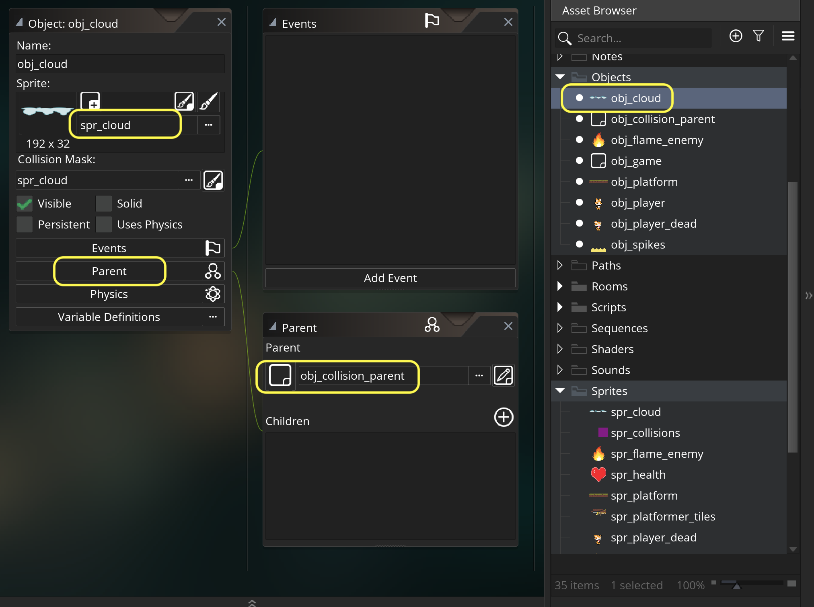

##### `Step 3.`\|`PLTFRMR`|:small_blue_diamond: :small_blue_diamond: :small_blue_diamond:

Open up **rm_test** and remove the three jump platforms.  We will replace them with the jump clouds.

##### `Step 4.`\|`PLTFRMR`|:small_blue_diamond: :small_blue_diamond: :small_blue_diamond: :small_blue_diamond:

Don't forget to remove the hidden collisions as well!

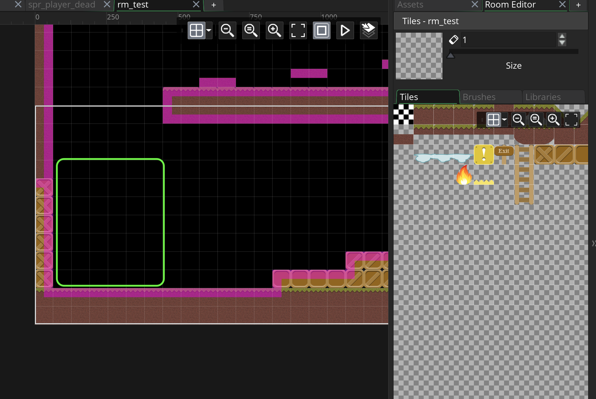

##### `Step 5.`\|`PLTFRMR`| :small_orange_diamond:

Now we need to add some cloud platforms one above the other so you can jump through them.

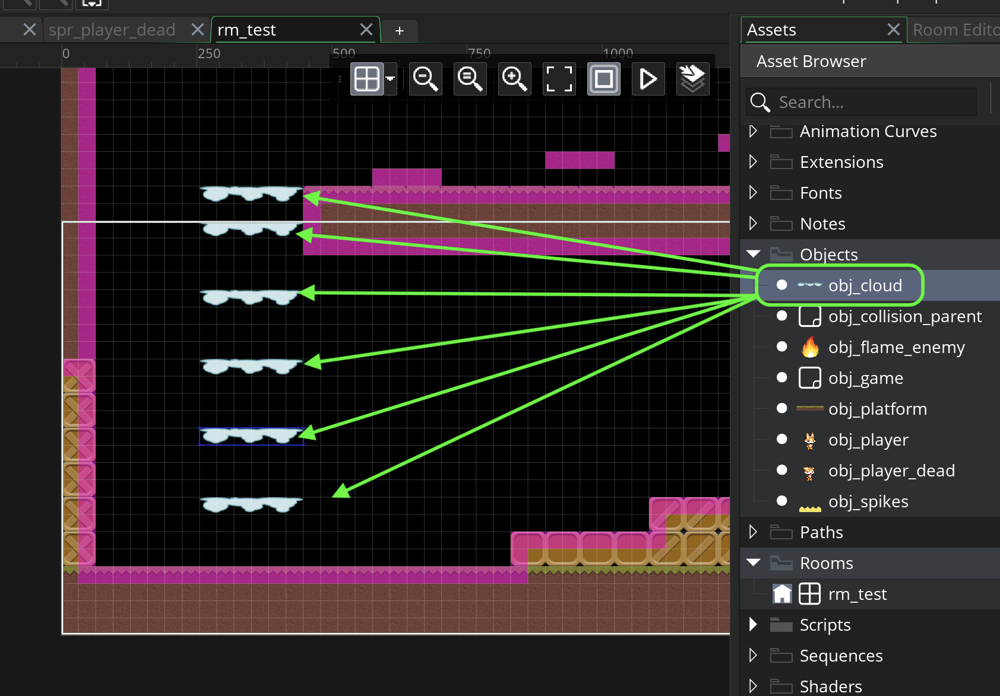

##### `Step 6.`\|`PLTFRMR`| :small_orange_diamond: :small_blue_diamond:

Open up **obj_collision_parent**. Press the <kbd>Add Event</kbd> and select a **Create** event. Add variable called `can_jump_through` and set the default to `false` so we don't mess with our previous working platforms.

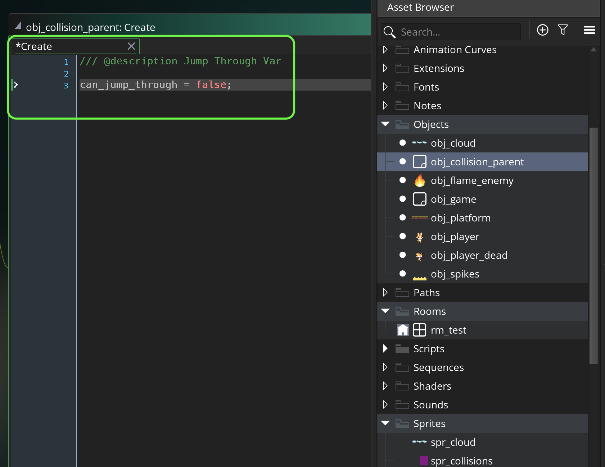

##### `Step 7.`\|`PLTFRMR`| :small_orange_diamond: :small_blue_diamond: :small_blue_diamond:

Now we need to open up **check_ceiling** and when we check the object `else if (left_check_obj || right_check_obj) and check to see if you can't jump through the platforms.  If you can't resolve the collision or otherwise let the person go through returning false.

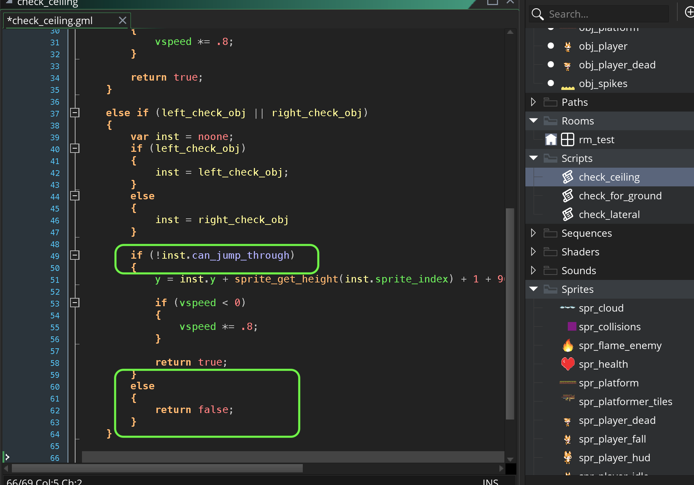

##### `Step 8.`\|`PLTFRMR`| :small_orange_diamond: :small_blue_diamond: :small_blue_diamond: :small_blue_diamond:

Open up **obj_cloud** and add and override the **Create** event.  We do not need to inherit the parent as we are setting the only variable it has `can_jump_trough` to `true`.

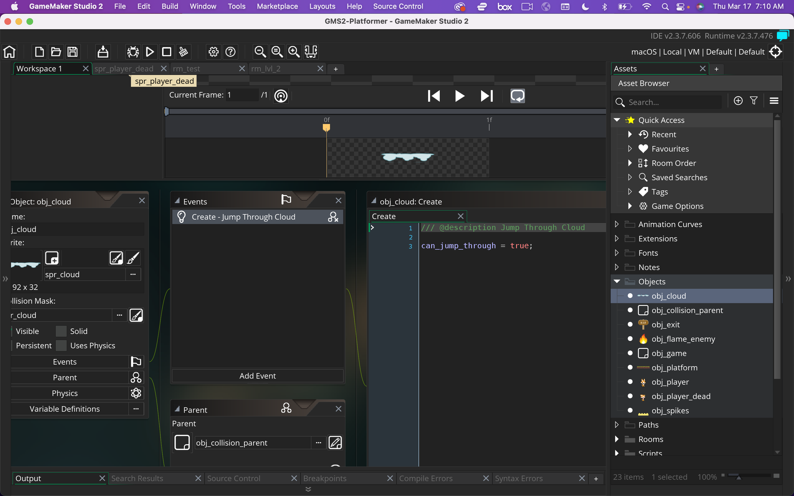

##### `Step 9.`\|`PLTFRMR`| :small_orange_diamond: :small_blue_diamond: :small_blue_diamond: :small_blue_diamond: :small_blue_diamond:

Now *press* the <kbd>Play</kbd> button in the top menu bar to launch the game. Now you can jump under the cloud but the side collisions push you out to the side.  Also check the old platform to see if it works.  Woops, we get a carsh bug!

https://user-images.githubusercontent.com/5504953/158473648-636322bf-ca87-481c-8fcf-eb3437c0d890.mp4

##### `Step 10.`\|`PLTFRMR`| :large_blue_diamond:

Why did we get this error?  We have a variable declared in the parent so **obj_platform** should inherit it.  Open up **obj_platform**. Woops, it already has a **Create** event so we have overriden the parent.  This is an easy fix, just add a `event_inherited()` to inherit the parents vars.  We don't need to adjust it as we want it to be the default of `false`.

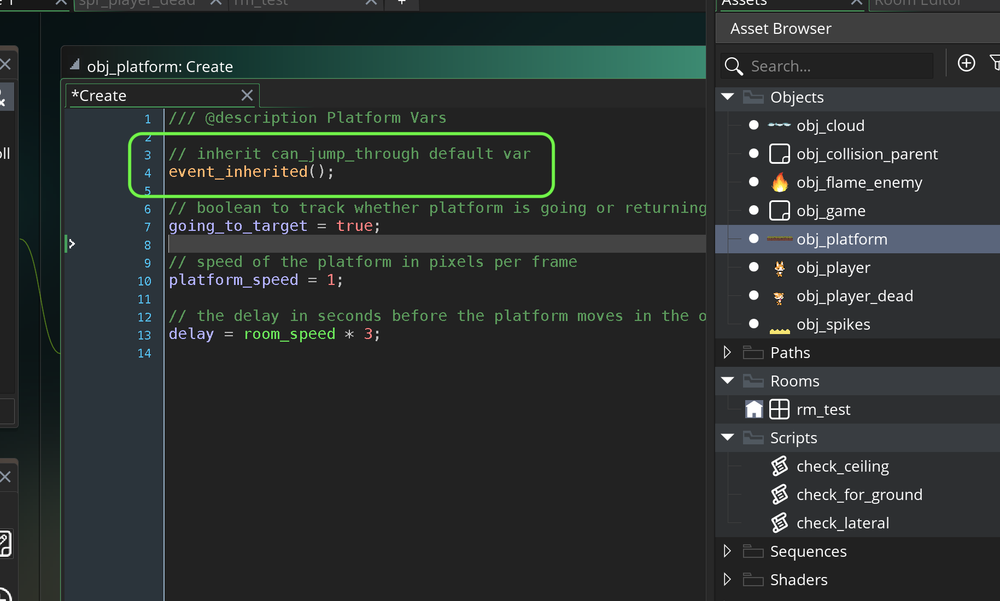

##### `Step 11.`\|`PLTFRMR`| :large_blue_diamond: :small_blue_diamond: 

Now *press* the <kbd>Play</kbd> button in the top menu bar to launch the game. Test it again and it still collides and this time with no error!

https://user-images.githubusercontent.com/5504953/158474701-90a60029-898d-4674-b63a-df88873f9a04.mp4

##### `Step 12.`\|`PLTFRMR`| :large_blue_diamond: :small_blue_diamond: :small_blue_diamond: 

Now lets fix the lateral collision. Open up the **check_lateral** script and add a check before adjusting for an object collision checking the `can_jump_through` variable. Do this for the left and the right direction.

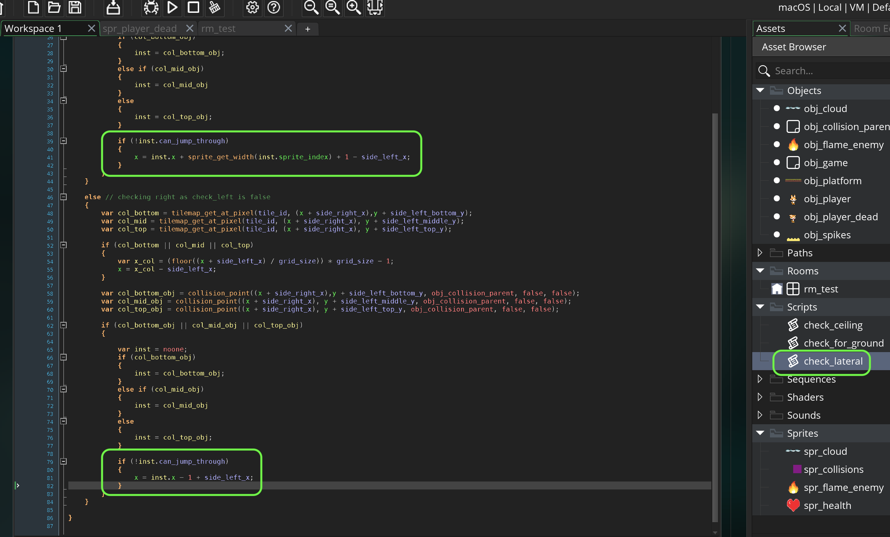

##### `Step 13.`\|`PLTFRMR`| :large_blue_diamond: :small_blue_diamond: :small_blue_diamond:  :small_blue_diamond: 

Now *press* the <kbd>Play</kbd> button in the top menu bar to launch the game. Now jump through the platforms.  The only issue is that is pulling the player up and not letting them jump above and falling down onto the platform.  

https://user-images.githubusercontent.com/5504953/158481370-5452445b-b0d7-4b69-8229-342778960015.mp4

##### `Step 14.`\|`PLTFRMR`| :large_blue_diamond: :small_blue_diamond: :small_blue_diamond: :small_blue_diamond:  :small_blue_diamond: 

Open up **check_for_ground** and before you adjust the object collision accept it if `can_jump_through` is false or if `can_jump_through` is `true` and the previous frame is higher than the platform.  We ust `yprevious` to get the last fraome position.  So we want the player to jump above the platform then land, so the previous frame must be **less** (or higher) than the current one.

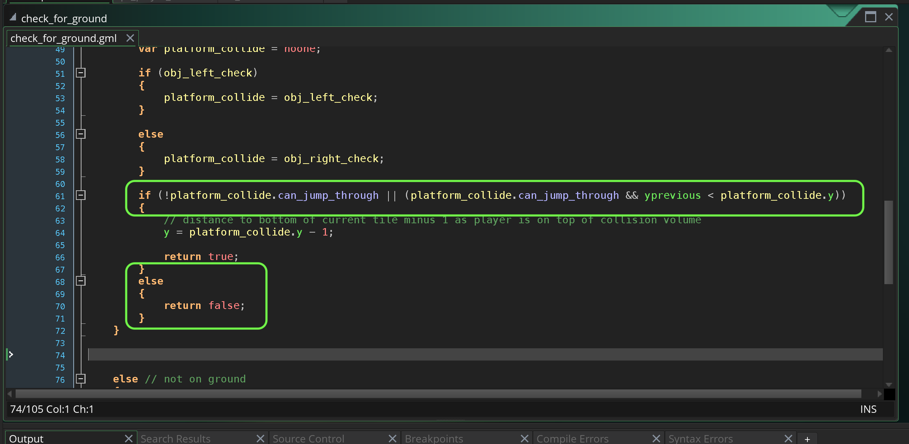

##### `Step 15.`\|`PLTFRMR`| :large_blue_diamond: :small_orange_diamond: 

Now I changed the layout in **rm_test** and separated them by 4 collision blocks and put some blocks at the bottom left.

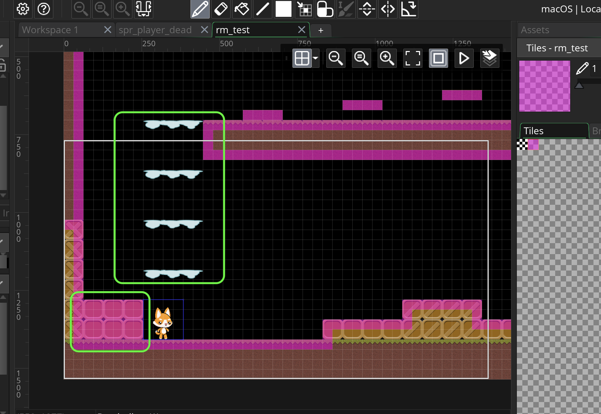

##### `Step 16.`\|`PLTFRMR`| :large_blue_diamond: :small_orange_diamond:   :small_blue_diamond: 

Now *press* the <kbd>Play</kbd> button in the top menu bar to launch the game. Now we have the jump platforms working the way we want!

https://user-images.githubusercontent.com/5504953/158481339-af0838df-bee2-4150-903f-8aa92867eba5.mp4

___

<!--  -->

| [previous](../flame/README.md#user-content-flame-enemy)| [home](../README.md#user-content-gms2-top-down-shooter) | [next](../rooms/README.md#user-content-change-rooms)|
|---|---|---|
