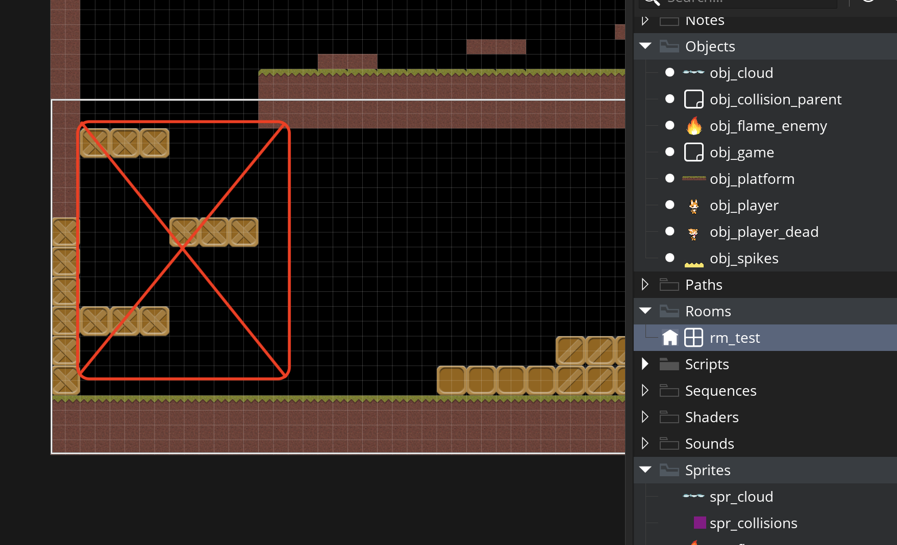

### Jump Through Collisions

[previous](../) • [home](../README.md#user-content-gms2-top-down-shooter) • [next](../)

Lets do one final plaformer trope and that is a platform type you can jump through.  We will have a cloud and there will only be ground collision with no side or ceiling collision.

 

---

##### `Step 1.`\|`SPCRK`|:small_blue_diamond:

Download [spr_jump_cloud.png](images/spr_jump_cloud.png).  *Right click* on **Sprites** and select **New | Sprite** and name it `spr_cloud`. 

##### `Step 2.`\|`FHIU`|:small_blue_diamond: :small_blue_diamond: 

*Right click* on **Objects** and select **New | Object** and name it `obj_cloud`. Set the **Sprite** to `spr_cloud`. Press the <kbd>Parent</kbd> button and select **obj_collision_parent**.

##### `Step 3.`\|`SPCRK`|:small_blue_diamond: :small_blue_diamond: :small_blue_diamond:

Open up **rm_test** and remove the three jump platforms.  We will replace them with the jump clouds.

##### `Step 4.`\|`SPCRK`|:small_blue_diamond: :small_blue_diamond: :small_blue_diamond: :small_blue_diamond:

Don't forget to remove the hidden collisions as well!

##### `Step 5.`\|`SPCRK`| :small_orange_diamond:

Now we need to add some cloud platforms one above the other so you can jump through them.

##### `Step 6.`\|`SPCRK`| :small_orange_diamond: :small_blue_diamond:

Open up **obj_collision_parent**. Press the <kbd>Add Event</kbd> and select a **Create** event. Add variable called `can_jump_through` and set the default to `false` so we don't mess with our previous working platforms.

##### `Step 7.`\|`SPCRK`| :small_orange_diamond: :small_blue_diamond: :small_blue_diamond:

Now we need

##### `Step 8.`\|`SPCRK`| :small_orange_diamond: :small_blue_diamond: :small_blue_diamond: :small_blue_diamond:

##### `Step 9.`\|`SPCRK`| :small_orange_diamond: :small_blue_diamond: :small_blue_diamond: :small_blue_diamond: :small_blue_diamond:

##### `Step 10.`\|`SPCRK`| :large_blue_diamond:

##### `Step 11.`\|`SPCRK`| :large_blue_diamond: :small_blue_diamond: 

##### `Step 12.`\|`SPCRK`| :large_blue_diamond: :small_blue_diamond: :small_blue_diamond: 

##### `Step 13.`\|`SPCRK`| :large_blue_diamond: :small_blue_diamond: :small_blue_diamond:  :small_blue_diamond: 

##### `Step 14.`\|`SPCRK`| :large_blue_diamond: :small_blue_diamond: :small_blue_diamond: :small_blue_diamond:  :small_blue_diamond: 

##### `Step 15.`\|`SPCRK`| :large_blue_diamond: :small_orange_diamond: 

##### `Step 16.`\|`SPCRK`| :large_blue_diamond: :small_orange_diamond:   :small_blue_diamond: 

##### `Step 17.`\|`SPCRK`| :large_blue_diamond: :small_orange_diamond: :small_blue_diamond: :small_blue_diamond:

##### `Step 18.`\|`SPCRK`| :large_blue_diamond: :small_orange_diamond: :small_blue_diamond: :small_blue_diamond: :small_blue_diamond:

##### `Step 19.`\|`SPCRK`| :large_blue_diamond: :small_orange_diamond: :small_blue_diamond: :small_blue_diamond: :small_blue_diamond: :small_blue_diamond:

##### `Step 20.`\|`SPCRK`| :large_blue_diamond: :large_blue_diamond:

##### `Step 21.`\|`SPCRK`| :large_blue_diamond: :large_blue_diamond: :small_blue_diamond:

___

| [previous](../)| [home](../README.md#user-content-gms2-top-down-shooter) | [next](../)|
|---|---|---|
