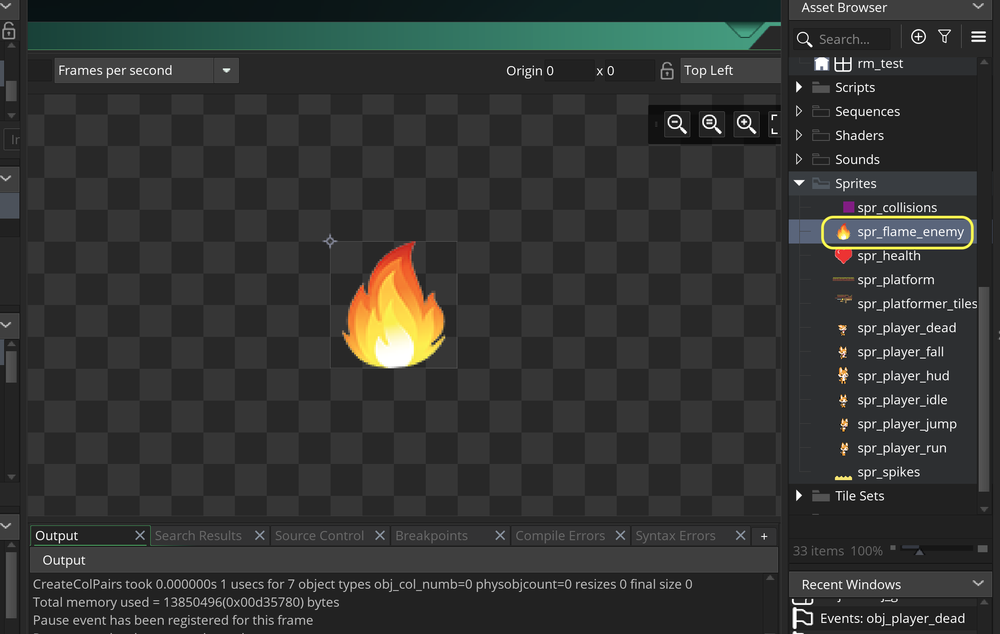
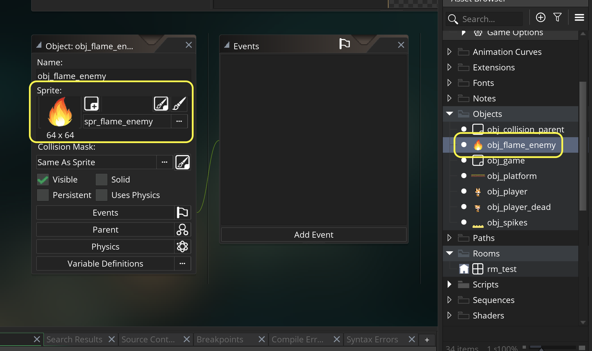
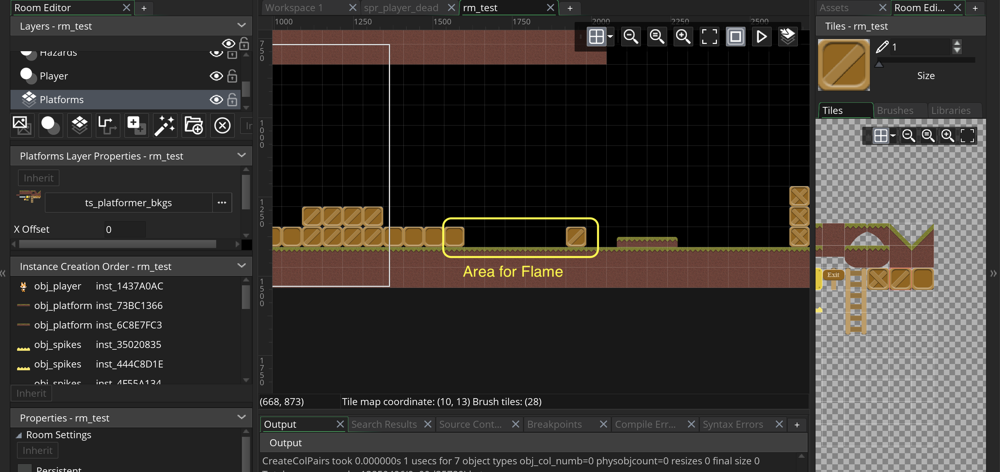
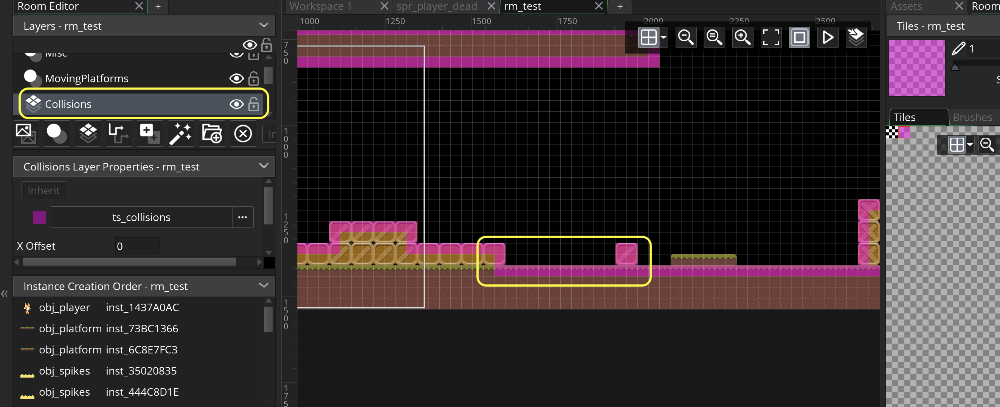
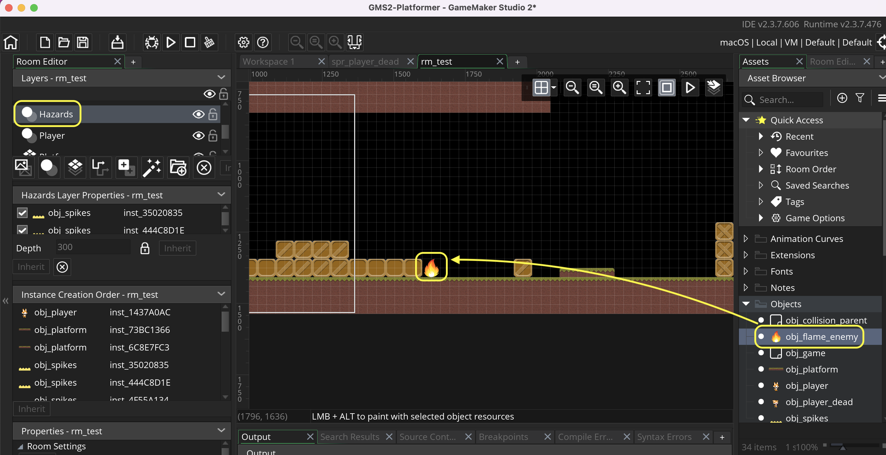
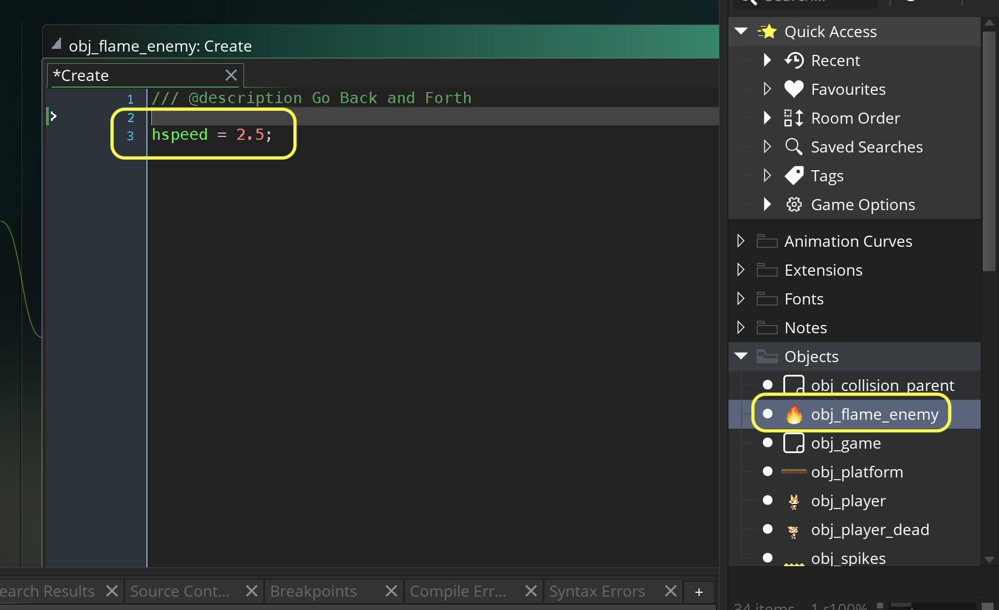
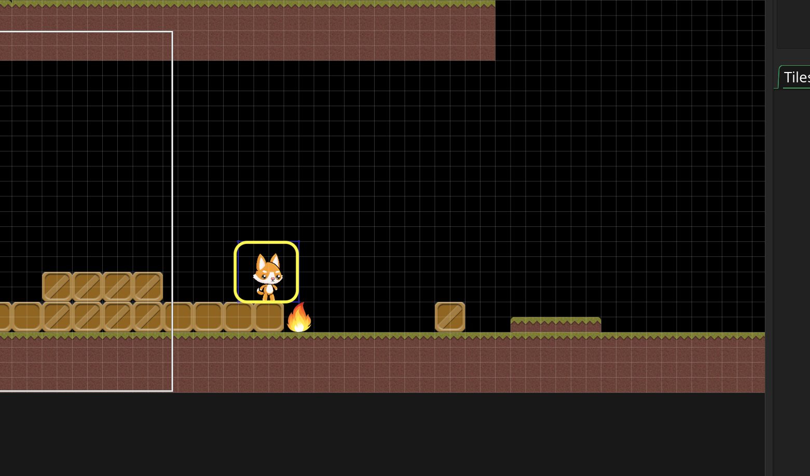
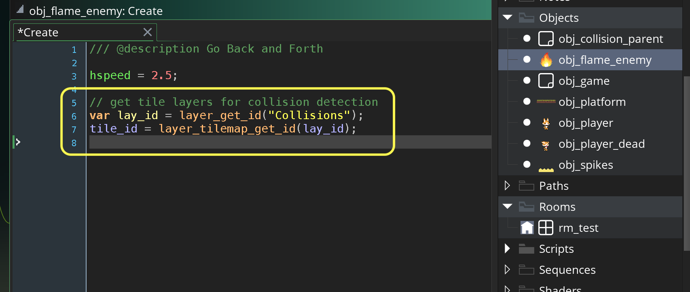
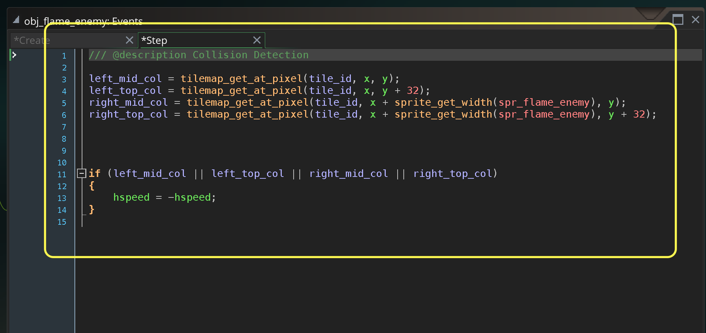
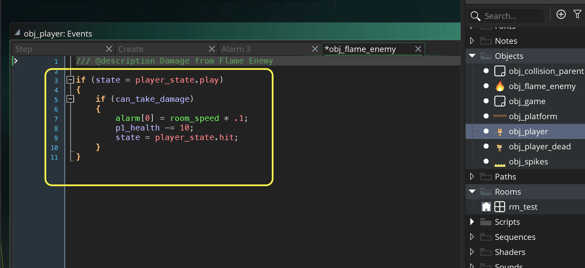

### Flame Enemy

[previous](../lives/README.md#user-content-lives) • [home](../README.md#user-content-gms2-top-down-shooter) • [next](../)

Now lets add a flame enemy that goes between two portions of the level.

 

---

##### `Step 1.`\|`SPCRK`|:small_blue_diamond:

Download [spr_flame_enemy.png](images/spr_flame_enemy.png) to add as our final enemy. *Right click* on **Sprites** and select **New | Sprite** and name it `spr_flame_enemy`. Press the <kbd>Import</kbd> button and import `spr_flame_enemy.png`.

##### `Step 2.`\|`FHIU`|:small_blue_diamond: :small_blue_diamond: 

*Right click* on **Objects** and select **New | Object** and name it `obj_flame_enemy`. Set the **Sprite** to `spr_flame_enemy`.

##### `Step 3.`\|`SPCRK`|:small_blue_diamond: :small_blue_diamond: :small_blue_diamond:

Go back to **rm_test** and select the **Platforms** layer and draw in an area for the flame to go back and forth in.

##### `Step 4.`\|`SPCRK`|:small_blue_diamond: :small_blue_diamond: :small_blue_diamond: :small_blue_diamond:

Turn on the collision layer to set colliders. Wherever there is a missing collision add one to the level.

##### `Step 5.`\|`SPCRK`| :small_orange_diamond:

Now select the **Hazards** layer and add **obj_flame_enemy** to this area where they can go back and forth.

##### `Step 6.`\|`SPCRK`| :small_orange_diamond: :small_blue_diamond:

Now open up **obj_flame_enemy** and press the <kbd>Add Event</kbd> and select a **Create** event. Make the flame go right.

##### `Step 7.`\|`SPCRK`| :small_orange_diamond: :small_blue_diamond: :small_blue_diamond:

In **rm_test** move the player to start next to the flame.

##### `Step 8.`\|`SPCRK`| :small_orange_diamond: :small_blue_diamond: :small_blue_diamond: :small_blue_diamond:

Now *press* the <kbd>Play</kbd> button in the top menu bar to launch the game. You should see the flame keep moving right.  But we want it to have collision detection so it stays in its zone.

https://user-images.githubusercontent.com/5504953/158081108-26470650-8152-45c8-8719-fc9b36e827c4.mp4

##### `Step 9.`\|`SPCRK`| :small_orange_diamond: :small_blue_diamond: :small_blue_diamond: :small_blue_diamond: :small_blue_diamond:

Open up **obj_flame_enemy | Create** event and lets add collision detection just like we did for the player.  First we need access to the tiles.

##### `Step 10.`\|`SPCRK`| :large_blue_diamond:

Open up **obj_flame_enemy** and Press the <kbd>Add Event</kbd> and select a **Step** event. Then we will reverse the `hspeed` whenever the flame collides with the boxes.

##### `Step 11.`\|`SPCRK`| :large_blue_diamond: :small_blue_diamond: 

Now *press* the <kbd>Play</kbd> button in the top menu bar to launch the game. Now the flame goes back and forth as we would like.

https://user-images.githubusercontent.com/5504953/158081243-8f2180e8-579c-40ca-ac5a-48dac0054c1f.mp4

##### `Step 12.`\|`SPCRK`| :large_blue_diamond: :small_blue_diamond: :small_blue_diamond: 

Open up **obj_player** and add a **Collision | obj_flame_enemy** event.  This will look like the collision with the spikes.  We will check that we are in `play` state and check if we can take damage.  If we can we will run **alarm 0**, take 10 points health damage and change to `hit` state.

##### `Step 13.`\|`SPCRK`| :large_blue_diamond: :small_blue_diamond: :small_blue_diamond:  :small_blue_diamond: 

Now *press* the <kbd>Play</kbd> button in the top menu bar to launch the game. Now take damage from the flame. You can adjust the collision volume on the flame to make it a bit less sensitive if you like!

https://user-images.githubusercontent.com/5504953/158081420-ed83b3a2-f1e8-452a-9583-55d431ab16e4.mp4

___

| [previous](../lives/README.md#user-content-lives)| [home](../README.md#user-content-gms2-top-down-shooter) | [next](../)|
|---|---|---|
