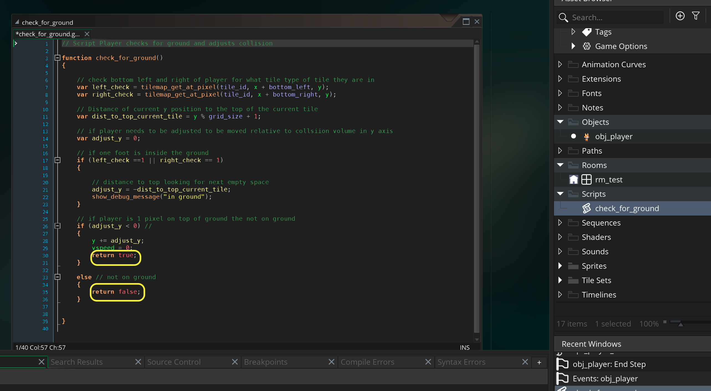
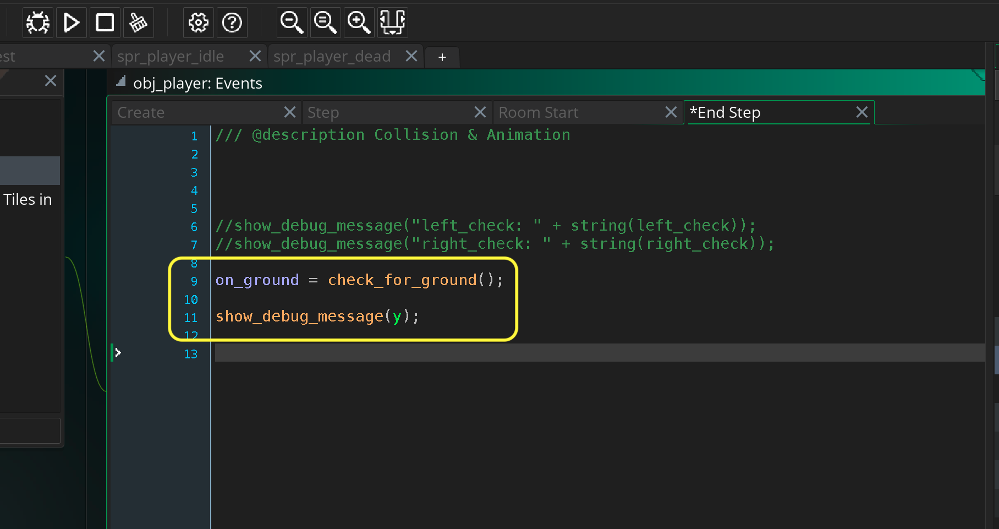
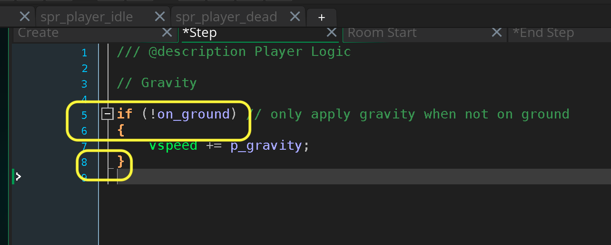
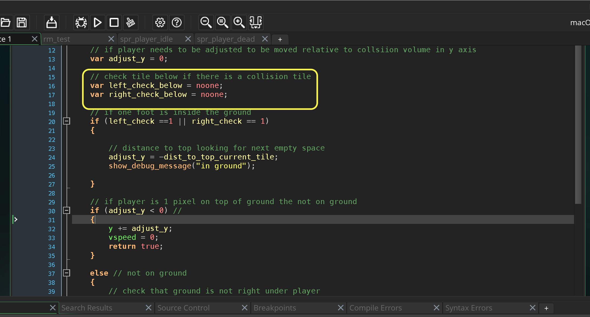
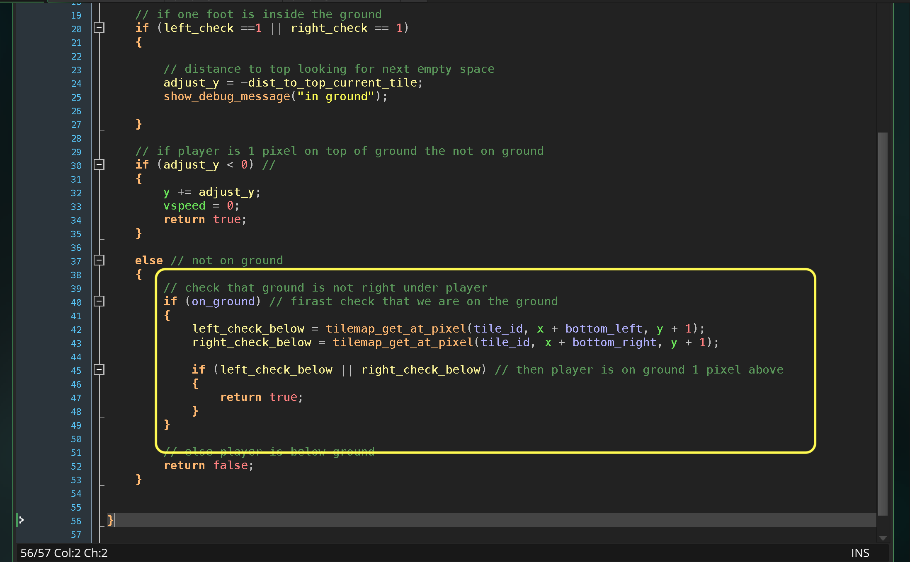
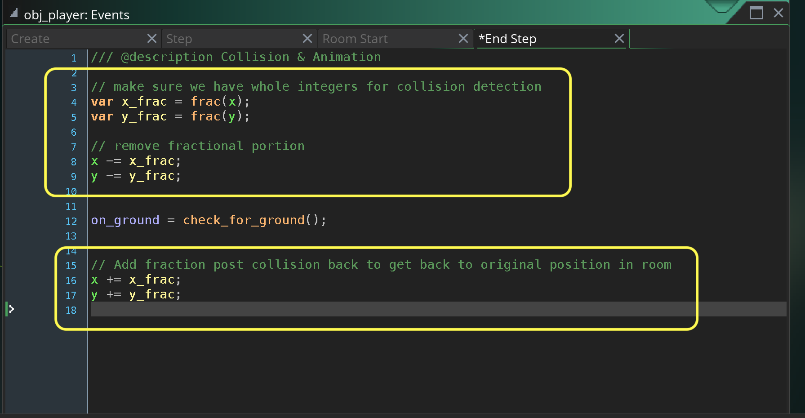

### Gravity and Ground Collision II

[previous](../gravity-collision/README.md#user-content-gravity-and-ground-collision) • [home](../README.md#user-content-gms2-platformer) • [next](../lateral-collision/README.md#user-content-lateral-movement-and-wall-collision)

Lets finish up our very first pass at the ground collision

 

---

##### `Step 1.`\|`PLTFRMR`|:small_blue_diamond:

Now since we have a lot of collision code lets separate each collision direction in a separate script.  Copy the script from the **end step** into a newly created script called `check_for_ground`. Leave the last `show_debug_message` in the **end step**.

Now we do not want to apply gravity every frame, only when we are in the air or not on the ground.  So this function will return `true` when we are on the ground and `false` when we are not.  Add this to the script you just pasted.

##### `Step 2.`\|`PLTFRMR`|:small_blue_diamond: :small_blue_diamond: 

Now go back to the **End Step** event and call the script (in place of where the code used to be).

##### `Step 3.`\|`PLTFRMR`|:small_blue_diamond: :small_blue_diamond: :small_blue_diamond:

Go to the **Step** event and only add gravity when the player is not on the ground.

##### `Step 4.`\|`PLTFRMR`|:small_blue_diamond: :small_blue_diamond: :small_blue_diamond: :small_blue_diamond:

Now *press* the <kbd>Play</kbd> button in the top menu bar to launch the game. Now you will notice that we are still getting it in ground every frame because our y position is not in integers it is in fractions.  You may notice the player does vibrate a little bit which reflects this y value that is always adjusting.

https://user-images.githubusercontent.com/5504953/157242235-c8149476-e047-4268-ba19-e5a16681393d.mp4

##### `Step 5.`\|`PLTFRMR`| :small_orange_diamond:

Now we don't want the player to be constantly going on ground and in air as when they are 1 pixel on top of the collision volume they are back to in air, even though they are in ground.  So lets add two temporary variables to track the ground one pixel below our feet. Reopen the **check_for_ground** script.

##### `Step 6.`\|`PLTFRMR`| :small_orange_diamond: :small_blue_diamond:

Now in th `else` statement lets check to see if they are one pixel from the ground.  Lets check both feet again but this time we are checking `y+1` which is one pixel below the feet.  If one of these hits ground then the player is still `on_ground` and we return `true`.

##### `Step 7.`\|`PLTFRMR`| :small_orange_diamond: :small_blue_diamond: :small_blue_diamond:

Now *press* the <kbd>Play</kbd> button in the top menu bar to launch the game. Now when the player falls it doesn't change every second frame between on_ground and not on_ground (!on_ground). It knows it is on ground because it is one pixel beneath the player. So we only see the message once in the debugger.

https://user-images.githubusercontent.com/5504953/157272153-507a999b-b475-4aa6-be77-1448ff9d08dd.mp4

##### `Step 8.`\|`PLTFRMR`| :small_orange_diamond: :small_blue_diamond: :small_blue_diamond: :small_blue_diamond:

Now there is two more things I would like to do before wrapping this part. Remove all the `show_debug_message()` strings and make sure the collision math is only using integers.  The `tilemap_get_at_pixel(tile_id, x + bottom_left, y + 1);` would sometimes return an incorrect response when the pixel was fractional.

So before we run any collision we will subtract the fractional value from both `x` and `y` using the functiopn: `frac(n)`

> This function returns the fractional part of n, that is, the part behind the decimal dot. It will return only the decimals behind the dot of a value, so frac(3.125) will return 0.125, frac(6.921) will return 0.921, etc... - [GameMaker Manual](https://manual.yoyogames.com/GameMaker_Language/GML_Reference/Maths_And_Numbers/Number_Functions/frac.htm)

So if **x** is `134.567` then we would save `.567` subtract it from **X** so it is now just `134`.  We would do our collision detection, then add the .`567` back to the returned number (it might have been changed by the collision algorithm). This is defensieve against any errors regarding fractional numbers.

##### `Step 9.`\|`PLTFRMR`| :small_orange_diamond: :small_blue_diamond: :small_blue_diamond: :small_blue_diamond: :small_blue_diamond:

Now *press* the <kbd>Play</kbd> button in the top menu bar to launch the game. Now it should be the same as before but with no messages being printed as they were removed.

https://user-images.githubusercontent.com/5504953/157274569-5499dfd5-ddf6-468a-85e3-38eb407d6eab.mp4

___

<!--  -->

| [previous](../gravity-collision/README.md#user-content-gravity-and-ground-collision)| [home](../README.md#user-content-gms2-platformer) | [next](../lateral-collision/README.md#user-content-lateral-movement-and-wall-collision)|
|---|---|---|
