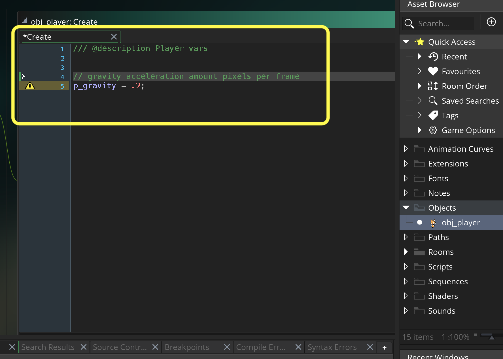
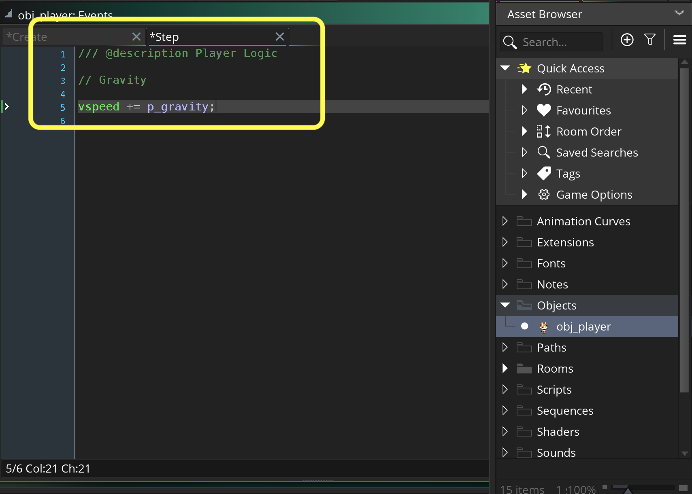
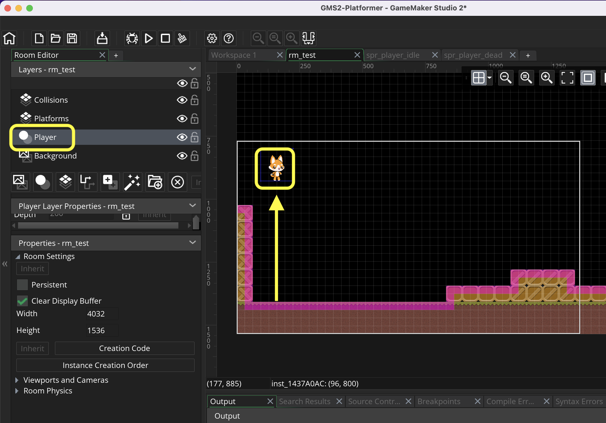
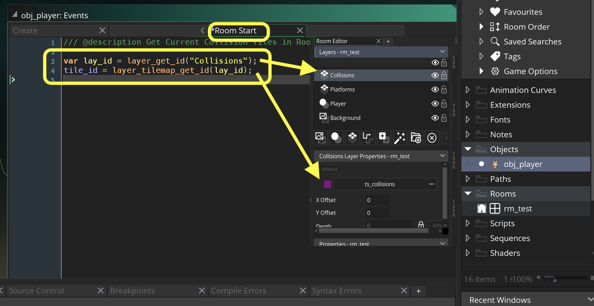
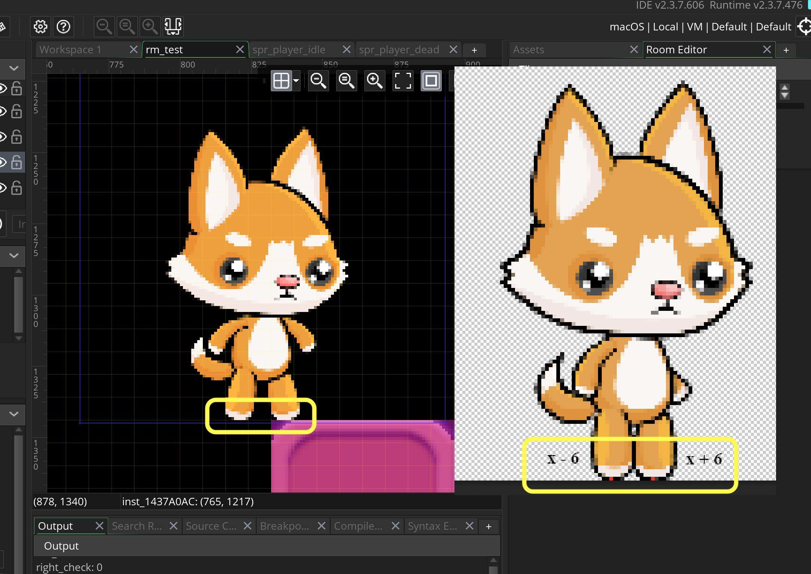

### Gravity and Ground Collision

[previous](../) • [home](../README.md#user-content-gms2-top-down-shooter) • [next](../)

Now we have a surface to run on and we have a player to animate along this surface.  First thing we will do is add gravity and collision detection so the player stays on the ground!

 

---

##### `Step 1.`\|`SPCRK`|:small_blue_diamond:

Press the <kbd>Add Event</kbd> and select a **Create** event. Add a variable to add an acceleration force downwards every frame to mimic gravity.  Now I feel that for this game a value of `0.2` pixels per frame will work fine and we will use a variable called `p_gravity`.

##### `Step 2.`\|`FHIU`|:small_blue_diamond: :small_blue_diamond: 

Press the <kbd>Add Event</kbd> and select a **Step | Step** event. We will then add a positive value to the `vspeed` to have a downwards acceleration, just like gravity!

##### `Step 3.`\|`SPCRK`|:small_blue_diamond: :small_blue_diamond: :small_blue_diamond:

Open up **rm_test** and select the **Player** layer and move the player to the top of the screen so we can see him fall down.

##### `Step 4.`\|`SPCRK`|:small_blue_diamond: :small_blue_diamond: :small_blue_diamond: :small_blue_diamond:

Now *press* the <kbd>Play</kbd> button in the top menu bar to launch the game. Now the player will just fall off the bottom of the screen, but the speed looks good.

https://user-images.githubusercontent.com/5504953/157145075-7ed01007-c584-40d8-bf72-6067500ea4e8.mp4

##### `Step 5.`\|`SPCRK`| :small_orange_diamond:

Press the <kbd>Add Event</kbd> and select a **Other | Room Start** event. Why the **Room Start** event?  This way every time the player changes to a new level/room it will check for the new collision link.  This will make sure that the player is always looking at the correct collision map in each room.

For collisions to work we have to know if the player is on top of the ground falling, or inside the ground and needs to be brought up. We need to know if the tile the player is in contains a collision volume.  For this we need to check for the presense of the **ts_collisions**.  We use two functions, the first being `layer_get_id(layer_name)`.

> This function can be used to get the unique ID value for a given layer. In the IDE, all layers have a name and a type, and to be able to edit or change them through code you must give the layer ID value. This function is used to retrieve this ID by using the name (a string) of the layer (as written in the IDE). - [GMS2 Manual](https://manual.yoyogames.com/GameMaker_Language/GML_Reference/Asset_Management/Rooms/General_Layer_Functions/layer_get_id.htm).

With this **ID** we can find out the tilesheet that is assigned to this tile layer. `layer_tilemap_get_id(layer)id)` returns the tilemap (if any) that is assigned to this layer.

> This function can be used to retrieve the unique ID value of the tile map element on a layer. You supply the layer ID (which you get when you create the layer using the layer name (as a string - this will have a performance impact) and the function will return the ID value associated with the tile map element on the layer. [GMS2 Manual](https://manual.yoyogames.com/GameMaker_Language/GML_Reference/Asset_Management/Rooms/Tile_Map_Layers/layer_tilemap_get_id.htm).

##### `Step 6.`\|`SPCRK`| :small_orange_diamond: :small_blue_diamond:

Now I want the player to be able to stand on the ledge with one foot.  I don't want the ground collision to be the center of the player as if they are half over the ledge I want them to still be **on ground** and not falling. So in this game we will have to check both feet.  It happens to be 6 pixels to the left and to the right that is the center position of each foot when the player is in idle mode (stopped on a ledge for example).

##### `Step 7.`\|`SPCRK`| :small_orange_diamond: :small_blue_diamond: :small_blue_diamond:

##### `Step 8.`\|`SPCRK`| :small_orange_diamond: :small_blue_diamond: :small_blue_diamond: :small_blue_diamond:

##### `Step 9.`\|`SPCRK`| :small_orange_diamond: :small_blue_diamond: :small_blue_diamond: :small_blue_diamond: :small_blue_diamond:

##### `Step 10.`\|`SPCRK`| :large_blue_diamond:

##### `Step 11.`\|`SPCRK`| :large_blue_diamond: :small_blue_diamond: 

##### `Step 12.`\|`SPCRK`| :large_blue_diamond: :small_blue_diamond: :small_blue_diamond: 

##### `Step 13.`\|`SPCRK`| :large_blue_diamond: :small_blue_diamond: :small_blue_diamond:  :small_blue_diamond: 

##### `Step 14.`\|`SPCRK`| :large_blue_diamond: :small_blue_diamond: :small_blue_diamond: :small_blue_diamond:  :small_blue_diamond: 

##### `Step 15.`\|`SPCRK`| :large_blue_diamond: :small_orange_diamond: 

##### `Step 16.`\|`SPCRK`| :large_blue_diamond: :small_orange_diamond:   :small_blue_diamond: 

##### `Step 17.`\|`SPCRK`| :large_blue_diamond: :small_orange_diamond: :small_blue_diamond: :small_blue_diamond:

##### `Step 18.`\|`SPCRK`| :large_blue_diamond: :small_orange_diamond: :small_blue_diamond: :small_blue_diamond: :small_blue_diamond:

##### `Step 19.`\|`SPCRK`| :large_blue_diamond: :small_orange_diamond: :small_blue_diamond: :small_blue_diamond: :small_blue_diamond: :small_blue_diamond:

##### `Step 20.`\|`SPCRK`| :large_blue_diamond: :large_blue_diamond:

##### `Step 21.`\|`SPCRK`| :large_blue_diamond: :large_blue_diamond: :small_blue_diamond:

___

| [previous](../)| [home](../README.md#user-content-gms2-top-down-shooter) | [next](../)|
|---|---|---|
