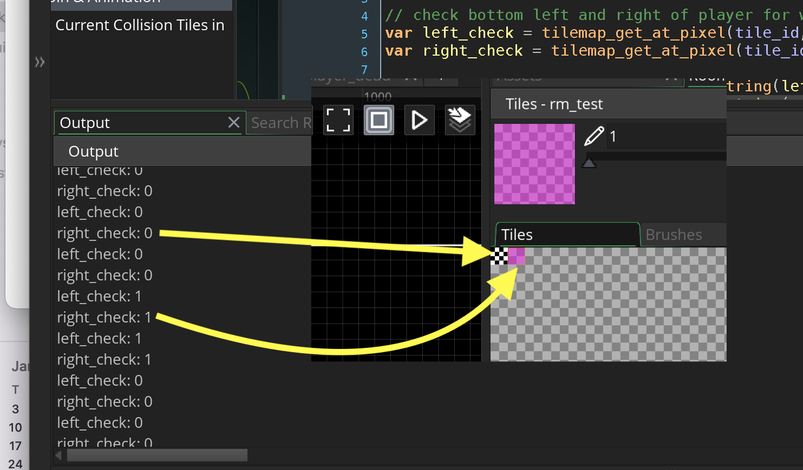
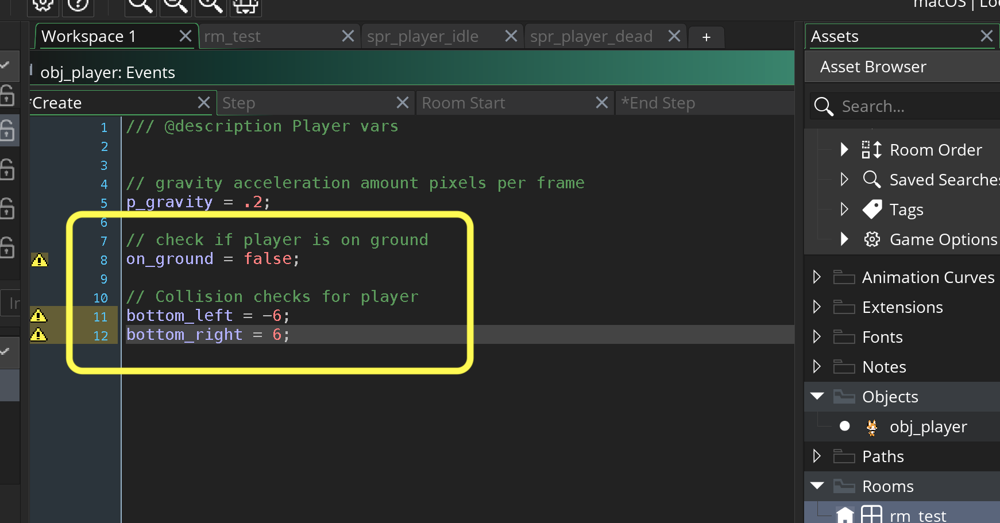
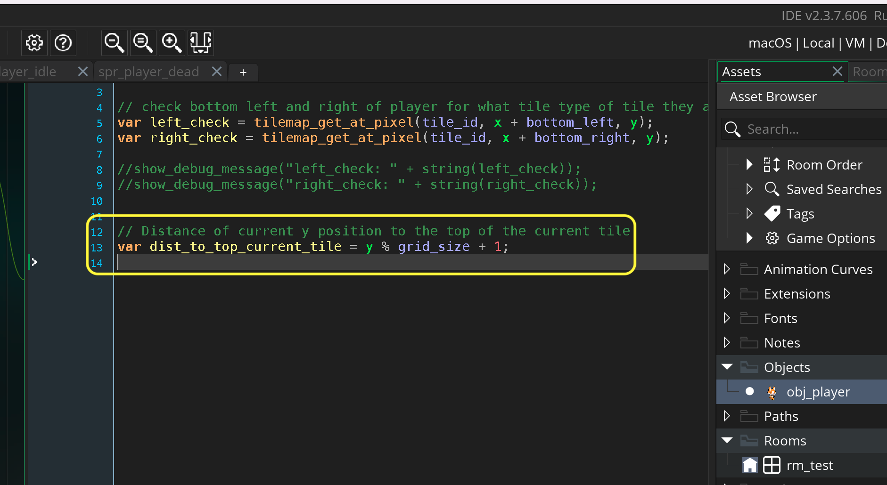

### Gravity and Ground Collision

[previous](../) • [home](../README.md#user-content-gms2-top-down-shooter) • [next](../)

Now we have a surface to run on and we have a player to animate along this surface.  First thing we will do is add gravity and collision detection so the player stays on the ground!

 

---

##### `Step 1.`\|`SPCRK`|:small_blue_diamond:

Press the <kbd>Add Event</kbd> and select a **Create** event. Add a variable to add an acceleration force downwards every frame to mimic gravity.  Now I feel that for this game a value of `0.2` pixels per frame will work fine and we will use a variable called `p_gravity`.

##### `Step 2.`\|`FHIU`|:small_blue_diamond: :small_blue_diamond: 

Press the <kbd>Add Event</kbd> and select a **Step | Step** event. We will then add a positive value to the `vspeed` to have a downwards acceleration, just like gravity!

##### `Step 3.`\|`SPCRK`|:small_blue_diamond: :small_blue_diamond: :small_blue_diamond:

Open up **rm_test** and select the **Player** layer and move the player to the top of the screen so we can see him fall down.

##### `Step 4.`\|`SPCRK`|:small_blue_diamond: :small_blue_diamond: :small_blue_diamond: :small_blue_diamond:

Now *press* the <kbd>Play</kbd> button in the top menu bar to launch the game. Now the player will just fall off the bottom of the screen, but the speed looks good.

https://user-images.githubusercontent.com/5504953/157145075-7ed01007-c584-40d8-bf72-6067500ea4e8.mp4

##### `Step 5.`\|`SPCRK`| :small_orange_diamond:

Press the <kbd>Add Event</kbd> and select a **Other | Room Start** event. Why the **Room Start** event?  This way every time the player changes to a new level/room it will check for the new collision link.  This will make sure that the player is always looking at the correct collision map in each room.

For collisions to work we have to know if the player is on top of the ground falling, or inside the ground and needs to be brought up. We need to know if the tile the player is in contains a collision volume.  For this we need to check for the presense of the **ts_collisions**.  We use two functions, the first being `layer_get_id(layer_name)`.

> This function can be used to get the unique ID value for a given layer. In the IDE, all layers have a name and a type, and to be able to edit or change them through code you must give the layer ID value. This function is used to retrieve this ID by using the name (a string) of the layer (as written in the IDE). - [GMS2 Manual](https://manual.yoyogames.com/GameMaker_Language/GML_Reference/Asset_Management/Rooms/General_Layer_Functions/layer_get_id.htm).

With this **ID** we can find out the tilesheet that is assigned to this tile layer. `layer_tilemap_get_id(layer)id)` returns the tilemap (if any) that is assigned to this layer.

> This function can be used to retrieve the unique ID value of the tile map element on a layer. You supply the layer ID (which you get when you create the layer using the layer name (as a string - this will have a performance impact) and the function will return the ID value associated with the tile map element on the layer. [GMS2 Manual](https://manual.yoyogames.com/GameMaker_Language/GML_Reference/Asset_Management/Rooms/Tile_Map_Layers/layer_tilemap_get_id.htm).

##### `Step 6.`\|`SPCRK`| :small_orange_diamond: :small_blue_diamond:

Now I want the player to be able to stand on the ledge with one foot.  I don't want the ground collision to be the center of the player as if they are half over the ledge I want them to still be **on ground** and not falling. So in this game we will have to check both feet.  It happens to be 6 pixels to the left and to the right that is the center position of each foot when the player is in idle mode (stopped on a ledge for example).

##### `Step 7.`\|`SPCRK`| :small_orange_diamond: :small_blue_diamond: :small_blue_diamond:

Now first we need to adjust the origin of all of our sprites.  The most important thing is to detect if we are on the ground and we are not rotating the sprite.  So we want the origin to be in the middle bottom as we will be checking for ground every frame. We want them to be at the bottom center of the feet. Change the **Origin** to `bottom center` for **spr_player_run**, **spr_player_jump**, **spr_player_idle**, **spr_player_fall** and **spr_player_dead**.

##### `Step 8.`\|`SPCRK`| :small_orange_diamond: :small_blue_diamond: :small_blue_diamond: :small_blue_diamond:

Press the <kbd>Add Event</kbd> and select a **Step | End Step** event. We need to do all of our collision checking in the **End Step** as the physics of the player is updated between the step and the end step event.

Now we can check 6 pixels to the left and to the right to see if either foot is colliding with a collision tile.  We us the `tilemape_get_at_pixel(tilemap_element_id, x, y)` function to know if there is a collision tile at those two very locations.

> IMPORTANT! If the tiles in the tile map have been unchanged (ie: they are not rotated or flipped etc...), then the return value of the tile set data will be exactly equal to the index of the tile on the tile set. So you can create "collision maps" of tiles using one tile at index 1 in the tile set - for example - then use this function to check for 1 or 0 (an empty tile) to calculate collisions. - [GMS2 Manual](https://manual.yoyogames.com/GameMaker_Language/GML_Reference/Asset_Management/Rooms/Tile_Map_Layers/tilemap_get_at_pixel.htm)

Now we are not rotating these tiles so we will get the index back of where in the tilesheet we are getting a value from. We will print out the result and look at the console window for what we get back.

##### `Step 9.`\|`SPCRK`| :small_orange_diamond: :small_blue_diamond: :small_blue_diamond: :small_blue_diamond: :small_blue_diamond:

Now *press* the <kbd>Play</kbd> button in the top menu bar to launch the game. Stop the game and look at the bottom console.  You will see that it goes from `0` for both feet (there is no tilesheet in that pixel) or `1` showing that we are seeing the first index in our tilesheet which is our collision.

##### `Step 10.`\|`SPCRK`| :large_blue_diamond:

When the player leaves the room the value returned in `-1` indicating that there are no tiles of any sort in that area.

##### `Step 11.`\|`SPCRK`| :large_blue_diamond: :small_blue_diamond: 

Open up the **Create** event on **obj_player** and add a **boolean** to track if the player is on the ground or not.  Then lets take the left and right foot ground check and turn them into two variables `bottom_left` and `bottom_right`.

##### `Step 12.`\|`SPCRK`| :large_blue_diamond: :small_blue_diamond: :small_blue_diamond: 

Now instead of hard coding the left and right foot lets add the variable so we can adjust it easily in the create event.

##### `Step 13.`\|`SPCRK`| :large_blue_diamond: :small_blue_diamond: :small_blue_diamond:  :small_blue_diamond: 

So when the player is updated and is below the ground we need to move them back on top.  How do we know how many pxiels they are from the top of the current cel?

##### `Step 14.`\|`SPCRK`| :large_blue_diamond: :small_blue_diamond: :small_blue_diamond: :small_blue_diamond:  :small_blue_diamond: 

We can use the **modulus** function to get this.  This gives us the remainder of a division.  We represent modulus with the `%` sign.  So if we take the modulus of `6` by `2` (`6/2`) the answer is `0`.  As  6/2 is 3 with a remainder 0 (2 goes into 6 three times).  If we take the modulus of `6` by `4` the answer is `2`.  As 4 goes into 6 one time with a remainder of `2`.

So if we take the modulus of the current y position of the player and take the collision grid size modulus we will get the value we want. So if the player is at `1414` and we take the modulus of `32` we get a value of `6`.  So the player is `6` pixels from the top of the tile grid. If we take `1414 - 6` it is `1408`.  So we the 44th collision tile (1408/32 = 44).

If we want to be on top of the ground we will have to remove one more pixel and the player will be on top of the ground at pixel `1407`.

##### `Step 15.`\|`SPCRK`| :large_blue_diamond: :small_orange_diamond: 

Now go back to the **Create** event and create a variable that holds the size of our collision volume.  It is `32` by `32` so we will make it so!

##### `Step 16.`\|`SPCRK`| :large_blue_diamond: :small_orange_diamond:   :small_blue_diamond: 

Now go back to the **End Step** and take the modulus of the `grid_size` and add `1` to get one pixel on top of this tile.

##### `Step 17.`\|`SPCRK`| :large_blue_diamond: :small_orange_diamond: :small_blue_diamond: :small_blue_diamond:

##### `Step 18.`\|`SPCRK`| :large_blue_diamond: :small_orange_diamond: :small_blue_diamond: :small_blue_diamond: :small_blue_diamond:

##### `Step 19.`\|`SPCRK`| :large_blue_diamond: :small_orange_diamond: :small_blue_diamond: :small_blue_diamond: :small_blue_diamond: :small_blue_diamond:

##### `Step 20.`\|`SPCRK`| :large_blue_diamond: :large_blue_diamond:

##### `Step 21.`\|`SPCRK`| :large_blue_diamond: :large_blue_diamond: :small_blue_diamond:

___

| [previous](../)| [home](../README.md#user-content-gms2-top-down-shooter) | [next](../)|
|---|---|---|
