### Ground Hazards

[previous](../moving-platforms-ii/README.md#user-content-moving-platforms-ii) • [home](../README.md#user-content-gms2-top-down-shooter) • [next](../health-bar/README.md#user-content-health-bar)

Lets add some ground hazards to the game.  Lets rationalize whey we have the moving platform. Lets have it move over ground that damages the player.  So we will need to add health to the player and display it in the HUD as well.

 

---

##### `Step 1.`\|`SPCRK`|:small_blue_diamond:

OK, let import some artwork for the spikes that the player should not fall on at [spr_spikes.png](images/spr_spikes.png).  *Right click* on **Sprites** and select **New | Sprite** and name it `spr_spikes`. Press the <kbd>Import</kbd> and select the above image file.

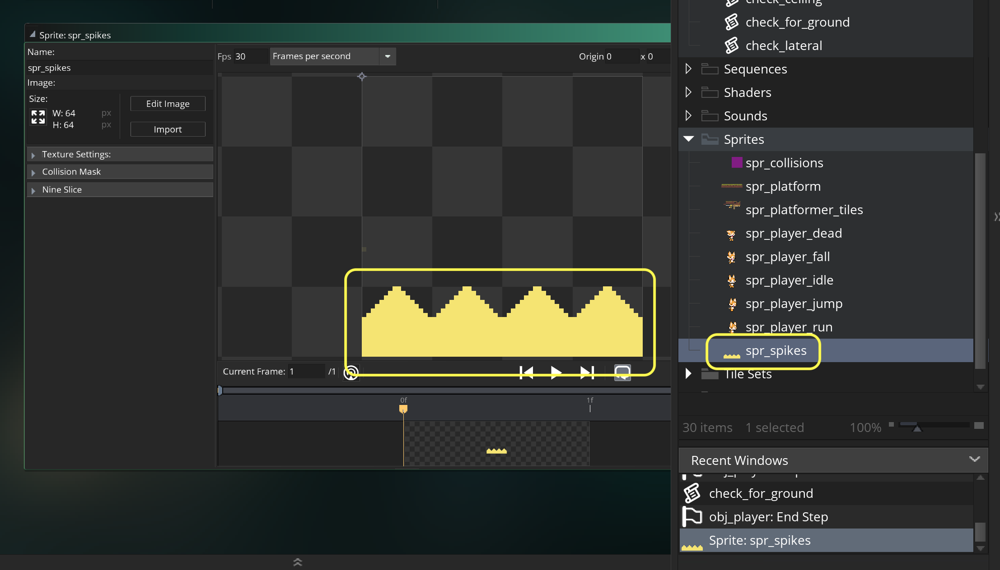

##### `Step 2.`\|`FHIU`|:small_blue_diamond: :small_blue_diamond: 

*Right click* on **Objects** and select **New | Object** and name it `obj_spikes`. Set the **Sprite** to `spr_spikes`.

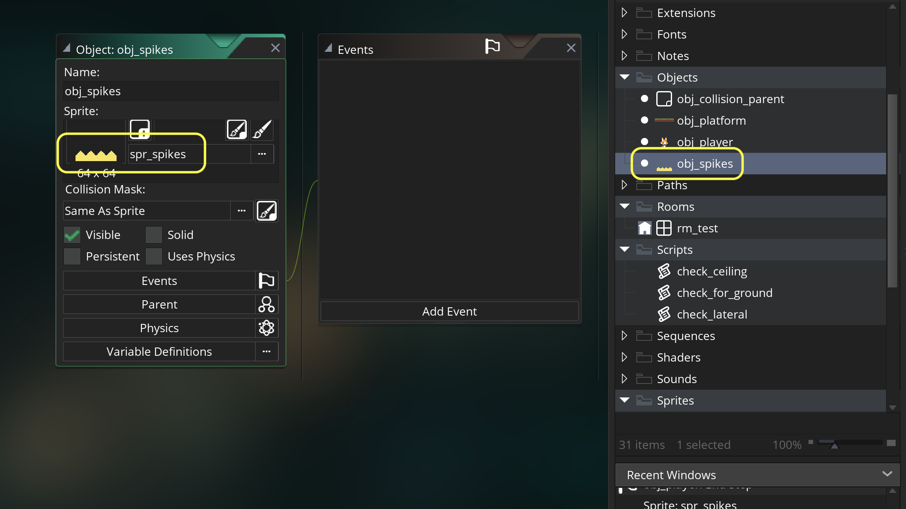

##### `Step 3.`\|`SPCRK`|:small_blue_diamond: :small_blue_diamond: :small_blue_diamond:

Now we need to damage the player when they hit the spikes.  We will create a `p1_health` variable to store the health of the player.  We will also create a state machine called `player_states` with two states `play` and `hit`.  For this we use an **enumerator**.  This is a constant (can't be changed at runtime) and globally accessible.  It is the same things as putting `player_states.play `as `0` and `player_state.hit` as `1`. It allows us to use words to describe a list as opposed to simple numbers (but those words get turned into numbers when compiled).

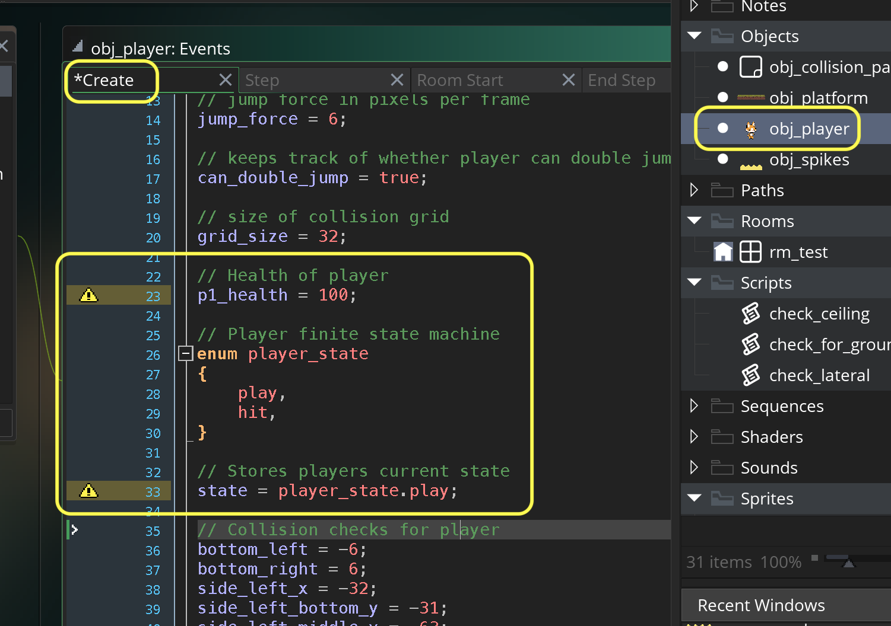

##### `Step 4.`\|`SPCRK`|:small_blue_diamond: :small_blue_diamond: :small_blue_diamond: :small_blue_diamond:

Press the <kbd>Add Event</kbd> and select a **Collision | obj_spikes** event. Then lets do 5 points damage and switch state to hit. We put a protection of checking the state to be in play so we only do one bit of damage and not 5 points every frame (the player would die almost instantly if every frame gave 5 points of damage).

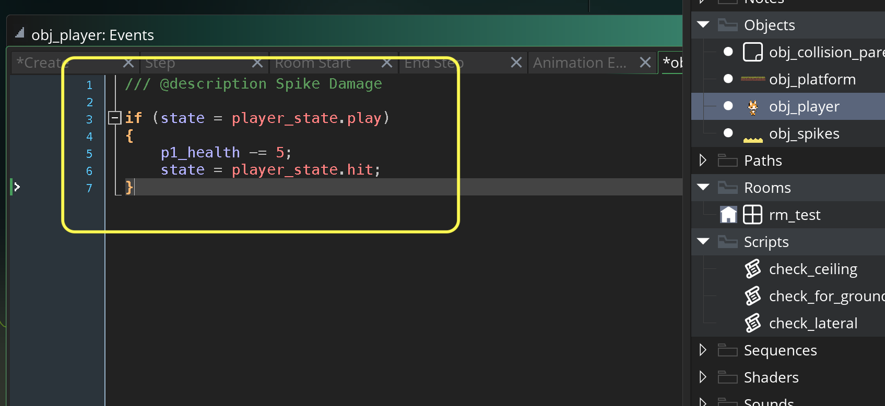

##### `Step 5.`\|`SPCRK`| :small_orange_diamond:

Now add a new **Instance** layer called `Hazards`.  Add a row of spikes joining the two platforms that has the moving platform.  This gives a reason to take the platform to avoid the spikes.

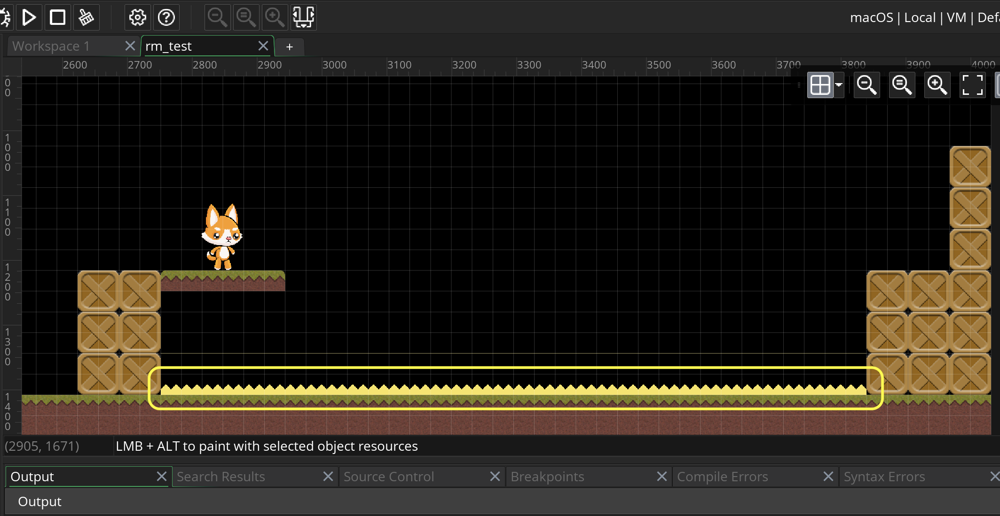

##### `Step 6.`\|`SPCRK`| :small_orange_diamond: :small_blue_diamond:

Now lets add a game controller to display the GUI.  *Right click* on **Objects** and select **New | Object** and name it `obj_game`. Leave the sprite alone.  Press the <kbd>Add Event</kbd> and select a **Draw | Draw GUI** event. Now check that the player exists and draw the health.

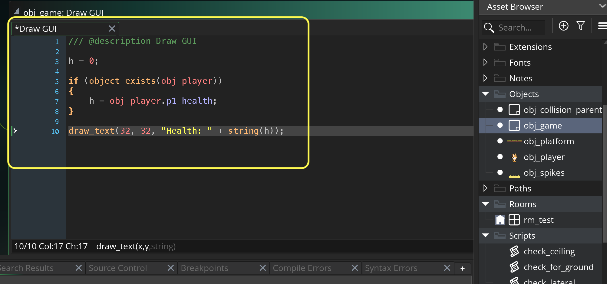

##### `Step 7.`\|`SPCRK`| :small_orange_diamond: :small_blue_diamond: :small_blue_diamond:

Create a new **Instance** layer in **rm_test** called `Misc`.  Drag a copy of **obj_game** to this layer.

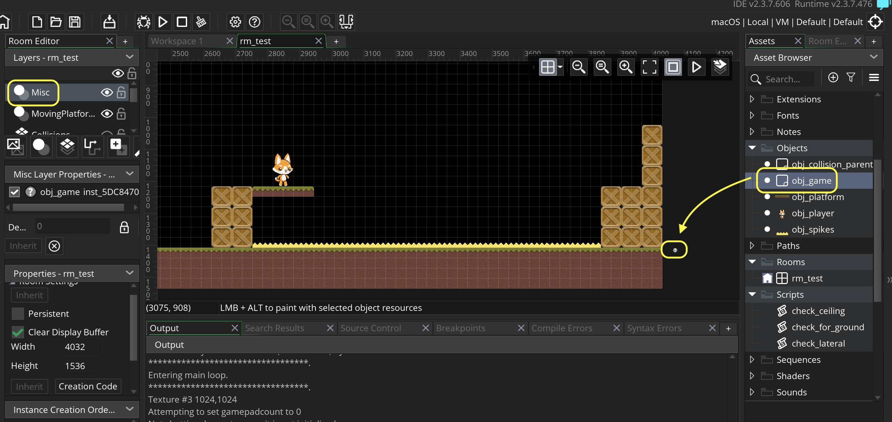

##### `Step 8.`\|`SPCRK`| :small_orange_diamond: :small_blue_diamond: :small_blue_diamond: :small_blue_diamond:

Now *press* the <kbd>Play</kbd> button in the top menu bar to launch the game. Now fall on the spikes.  They do 5 points of damage but then nothing happens as your state changes and you can still control the player.

https://user-images.githubusercontent.com/5504953/158066042-c7c6ad18-00ce-4bf2-bc23-98b09cf8515a.mp4

##### `Step 9.`\|`SPCRK`| :small_orange_diamond: :small_blue_diamond: :small_blue_diamond: :small_blue_diamond: :small_blue_diamond:

Now I would like the player to get sent upwards when they collide with the spikes.  I don't want to have it happen when 1 pixel overlaps so I will set an alarm to delay the force upwards.

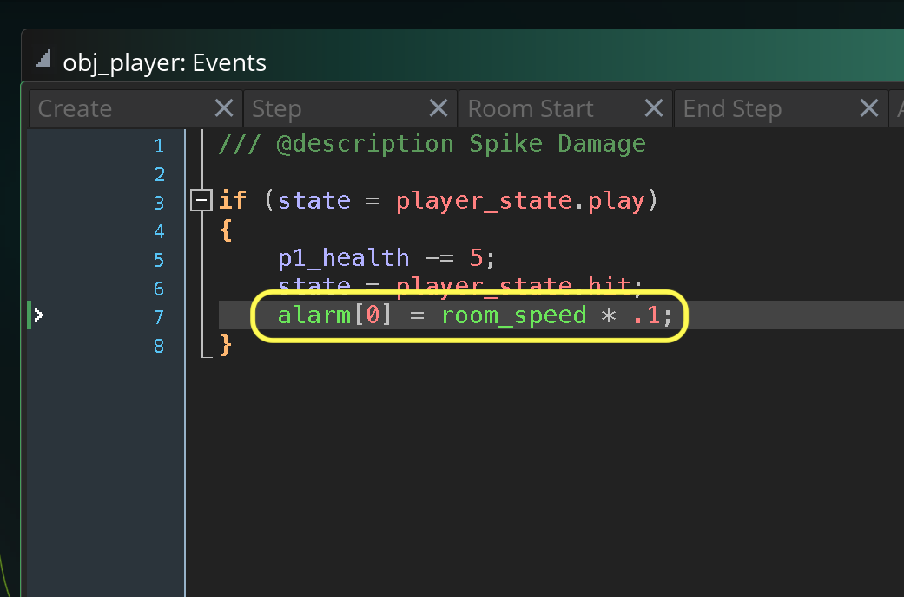

##### `Step 10.`\|`SPCRK`| :large_blue_diamond:

Press the <kbd>Add Event</kbd> and select a **Alarm | Alarm 0** event. Now send the player upwards like they have jumped.  Also lets for dramtic effect half the speed of the jump animation to accentuate the damage. Now lets set the `hspeed` to `0` as the player is not controlling them and they might go off a platform or something else.

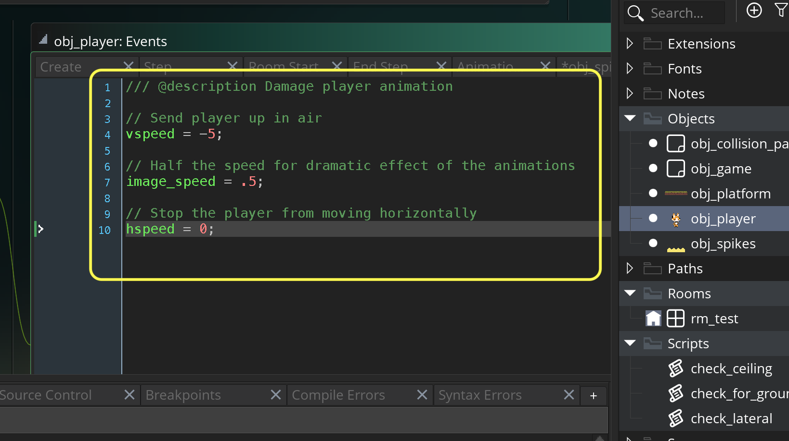

##### `Step 11.`\|`SPCRK`| :large_blue_diamond: :small_blue_diamond: 

Now open up **obj_player | Step** event.  We don't want you to control the player while they are taking damage.  We want to give the user a brief pause before giving back control. So put a check to see if the player is in `play` state first before processing inputs.

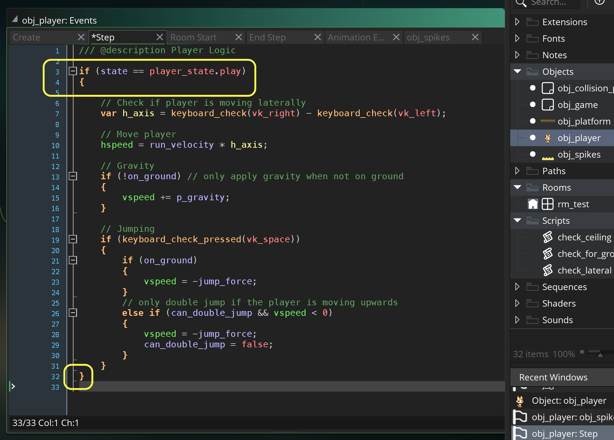

##### `Step 12.`\|`SPCRK`| :large_blue_diamond: :small_blue_diamond: :small_blue_diamond: 

Now in **obj_player | Step** event add some logic after the `play` state to deal with the `hit` state. We need to add a `vspeed` to simulate gravity as the gravity is not running due to the state.  Also, lets flash the player so that they are not opaque.  We get the sine of time.  Remember sine returns a value between -1 and 1.  So we add 1.2 so we get a value of .2 to 2.2.  We then devide it by 4 which would give us a range of .05 to .55.  This will flash a mostly transparent player.

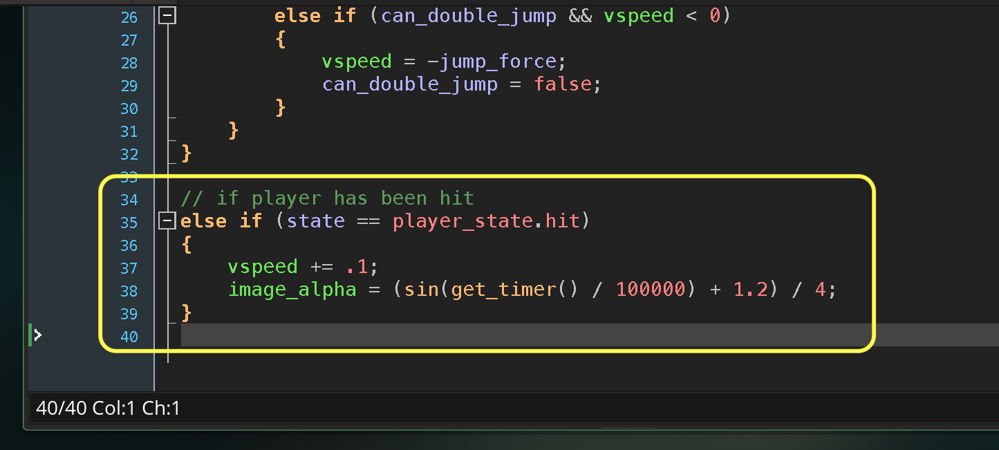

##### `Step 13.`\|`SPCRK`| :large_blue_diamond: :small_blue_diamond: :small_blue_diamond:  :small_blue_diamond: 

Now *press* the <kbd>Play</kbd> button in the top menu bar to launch the game. Now get damaged and the player pops and and flashes.  Now we need to return to player control then give you time to get back to safety before inflicting damage again.

ADD EXPORTDAMAGEPLAYER VIDEO

##### `Step 14.`\|`SPCRK`| :large_blue_diamond: :small_blue_diamond: :small_blue_diamond: :small_blue_diamond:  :small_blue_diamond: 

Now we want to give the player a chance to get back to safety with control before allowing them to take damage again.  Lets add a variable to control this. Open up **obj_player | Create** and call it `can_take_damage`.

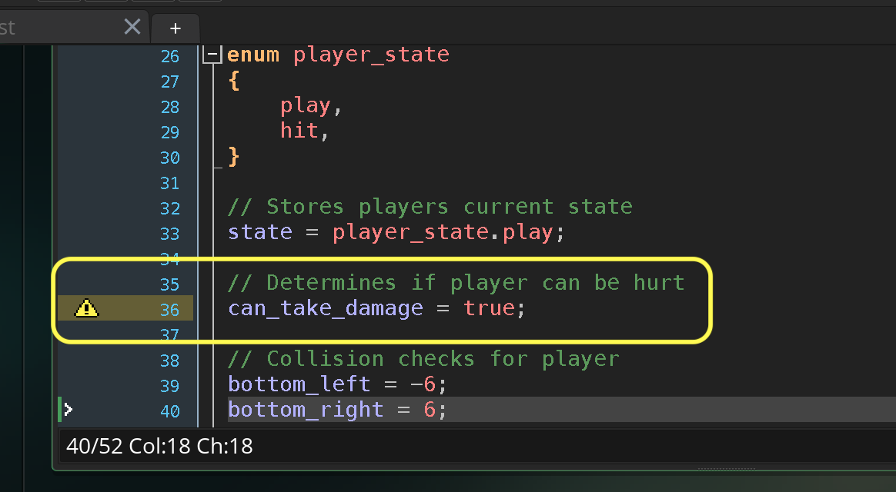

##### `Step 15.`\|`SPCRK`| :large_blue_diamond: :small_orange_diamond: 

Open up **obj_player | Step** event and add a call to an alarm to give control back to player but have a safe no damage time to get out.  Check to see that the alarm is not set yet (< 0) otherwise we will not have an alarm as in a step event it will keep being set forward.

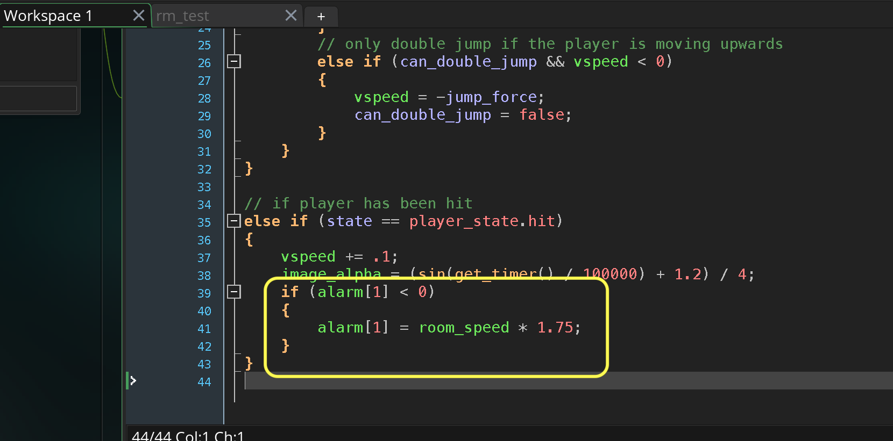

##### `Step 16.`\|`SPCRK`| :large_blue_diamond: :small_orange_diamond:   :small_blue_diamond: 

Press the <kbd>Add Event</kbd> and select a **Alarm | Alarm 1** event. Set `can_take_damage` to `false`.  Change the `state` back to `play` so the player can move the player again.  Change the `image_alpha` to `.4` so the player knows they are invincible for a moment. 

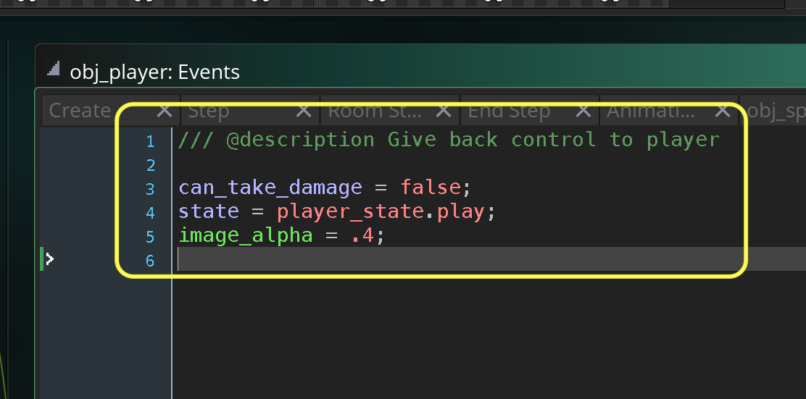

##### `Step 17.`\|`SPCRK`| :large_blue_diamond: :small_orange_diamond: :small_blue_diamond: :small_blue_diamond:

Now *press* the <kbd>Play</kbd> button in the top menu bar to launch the game. Now we have time to escape.  The next step is to go back to normal play state where you can take damage again.

ADD DamageSpikes video

##### `Step 18.`\|`SPCRK`| :large_blue_diamond: :small_orange_diamond: :small_blue_diamond: :small_blue_diamond: :small_blue_diamond:

Open up **obj_player | Create** and add a variable to give you time to get out of harms way.  Add a 3 second delay to `damage_delay` variable.

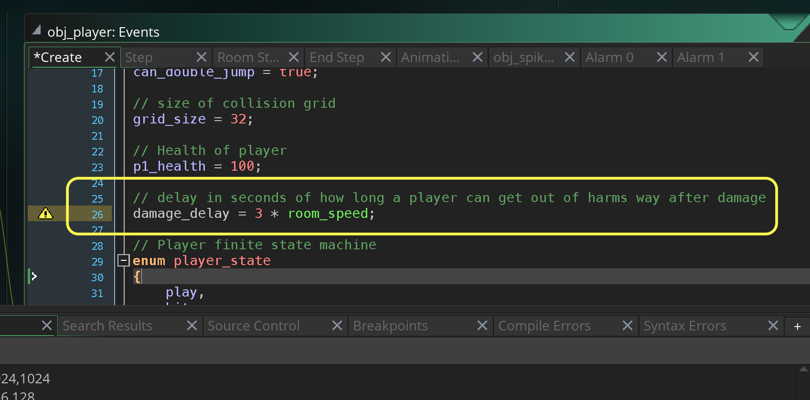

##### `Step 19.`\|`SPCRK`| :large_blue_diamond: :small_orange_diamond: :small_blue_diamond: :small_blue_diamond: :small_blue_diamond: :small_blue_diamond:

Open up **obj_player | Alarm 1** and call a second alarm to allow player to take damage again.

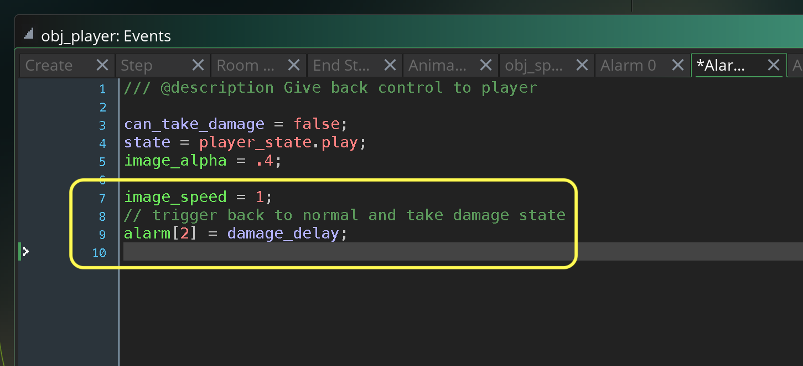

##### `Step 20.`\|`SPCRK`| :large_blue_diamond: :large_blue_diamond:

Press the <kbd>Add Event</kbd> and select a **Alarm | Alarm 2** event. Now set `image_alpha` back to `1` and allow damage again.

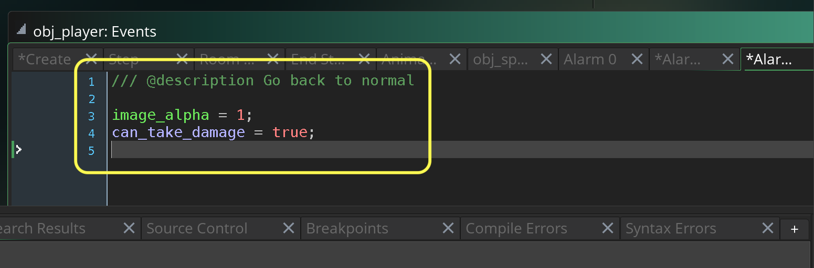

##### `Step 21.`\|`SPCRK`| :large_blue_diamond: :large_blue_diamond: :small_blue_diamond:

Now *press* the <kbd>Play</kbd> button in the top menu bar to launch the game. Now we have the full cycle working.  You have the player and they can take damage.

ADD FullTakingDamage MOVIE

___

| [previous](../moving-platforms-ii/README.md#user-content-moving-platforms-ii)| [home](../README.md#user-content-gms2-top-down-shooter) | [next](../health-bar/README.md#user-content-health-bar)|
|---|---|---|
