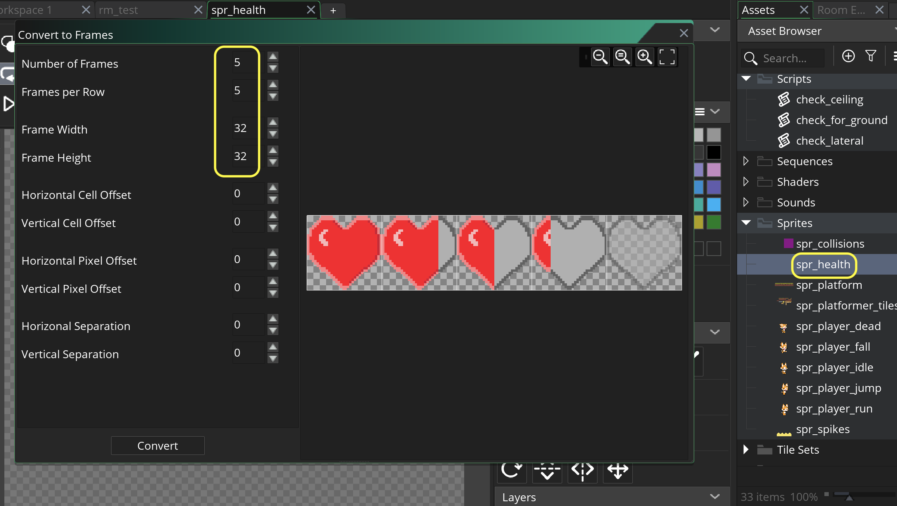
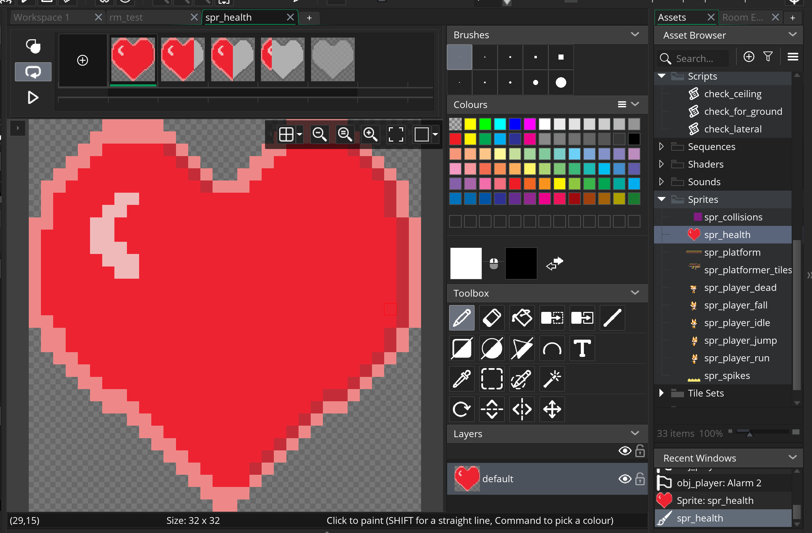
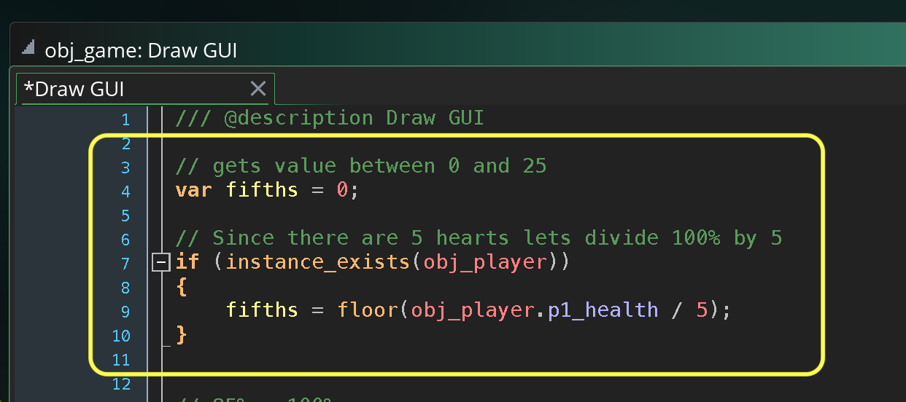
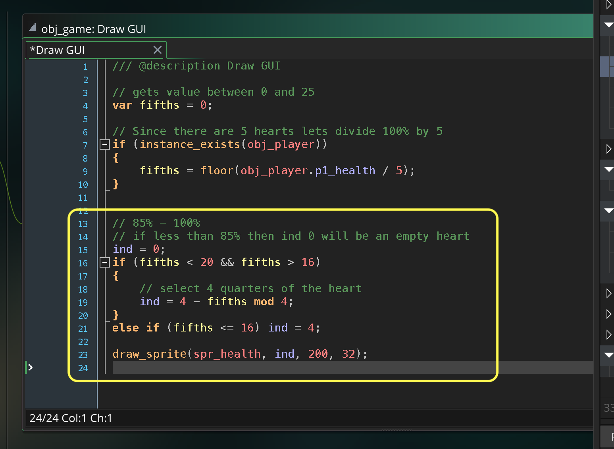
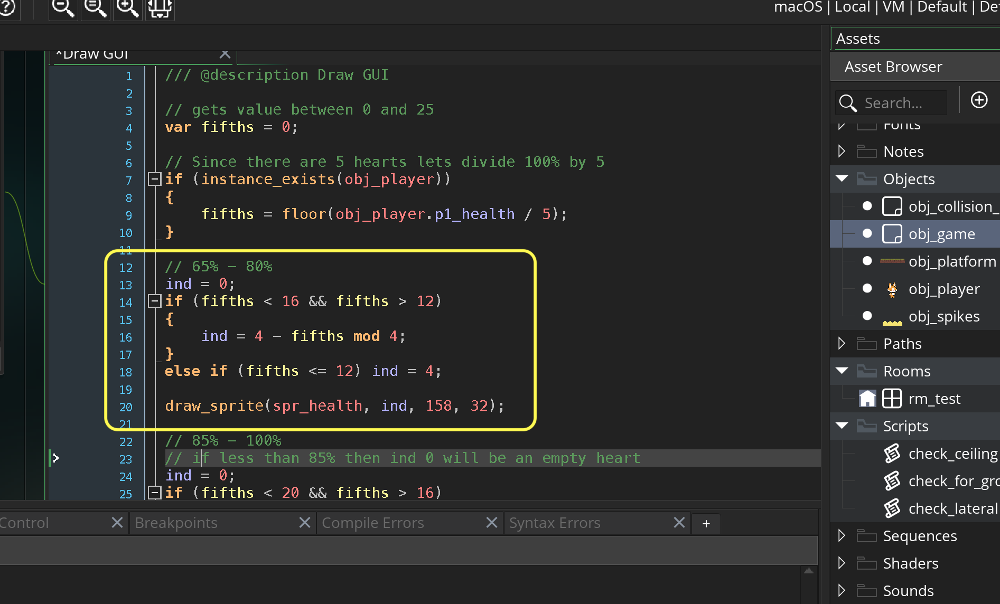
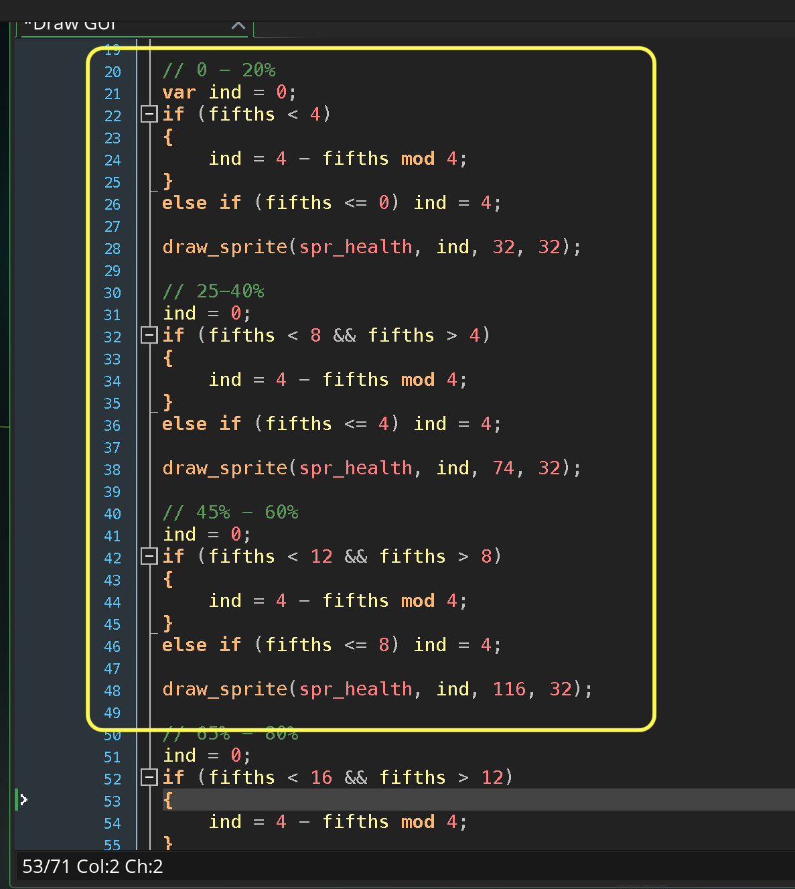

### Health Bar

[previous](../ground-hazards/README.md#user-content-ground-hazards) • [home](../README.md#user-content-gms2-top-down-shooter) • [next](../lives/README.md#user-content-lives)

Instead of using the built in health bar that we have been using lets do something more original.  Lets use 5 hearts with 4 pieces repreensting the player's health.

 

---

##### `Step 1.`\|`SPCRK`|:small_blue_diamond:

Download [spr_health_strip5.png](images/spr_health_strip5.png). *Right click* on **Sprites** and select **New | Sprite** and name it `spr_health`. Press **Edit Image** and select **Image | Import Strip Image**. You have a heart with 4 quarters as well as an empty one.  Change **Number of Frames** and **Frames per Row** to `5` as there are 5 `32` by `32` hearts.

##### `Step 2.`\|`FHIU`|:small_blue_diamond: :small_blue_diamond: 

Now you should have a strip of hearts called `spr_health`.

##### `Step 3.`\|`SPCRK`|:small_blue_diamond: :small_blue_diamond: :small_blue_diamond:

Now open up **obj_game | draw** and erase the entire script.  Lets start over. Now lets divide the player health by 5 and take the floor of the number so that we have an integer in return.

##### `Step 4.`\|`SPCRK`|:small_blue_diamond: :small_blue_diamond: :small_blue_diamond: :small_blue_diamond:

With the `fifth` variable of the result of health / 20 we will render the last heart with a result of 16 to 20.  Then we take the reverse remainder to pick which image_index to pick.  We need to also select index 4 when the heart is empty.

##### `Step 5.`\|`SPCRK`| :small_orange_diamond:

Now *press* the <kbd>Play</kbd> button in the top menu bar to launch the game. Now play the game and take damage.  You see the heart goes from a full health all the way to none for the fifth heart.

https://user-images.githubusercontent.com/5504953/158066446-252f35a3-5d11-4595-a89e-e1ad975b2fa0.mp4

##### `Step 6.`\|`SPCRK`| :small_orange_diamond: :small_blue_diamond:

Now lets do the same thing for 65% to 80%.  We will look at values beetween 15 and 13.

##### `Step 7.`\|`SPCRK`| :small_orange_diamond: :small_blue_diamond: :small_blue_diamond:

Now *press* the <kbd>Play</kbd> button in the top menu bar to launch the game. Now play the game and take damage.  Look at the last two hearts working.

https://user-images.githubusercontent.com/5504953/158066461-06814c85-7693-4bcd-b454-1eb5ac7650fb.mp4

##### `Step 8.`\|`SPCRK`| :small_orange_diamond: :small_blue_diamond: :small_blue_diamond: :small_blue_diamond:

We just repeat the same formula to finish the first three hearts. Now we should have a range between `0` and `100` health.

##### `Step 9.`\|`SPCRK`| :small_orange_diamond: :small_blue_diamond: :small_blue_diamond: :small_blue_diamond: :small_blue_diamond:

Now *press* the <kbd>Play</kbd> button in the top menu bar to launch the game. Now you should be able to go from `100` per cent health to `0`. 

https://user-images.githubusercontent.com/5504953/158066479-c48a4074-eb8f-472a-a3b0-051da639244d.mp4

___

| [previous](../ground-hazards/README.md#user-content-ground-hazards)| [home](../README.md#user-content-gms2-top-down-shooter) | [next](../lives/README.md#user-content-lives)|
|---|---|---|
