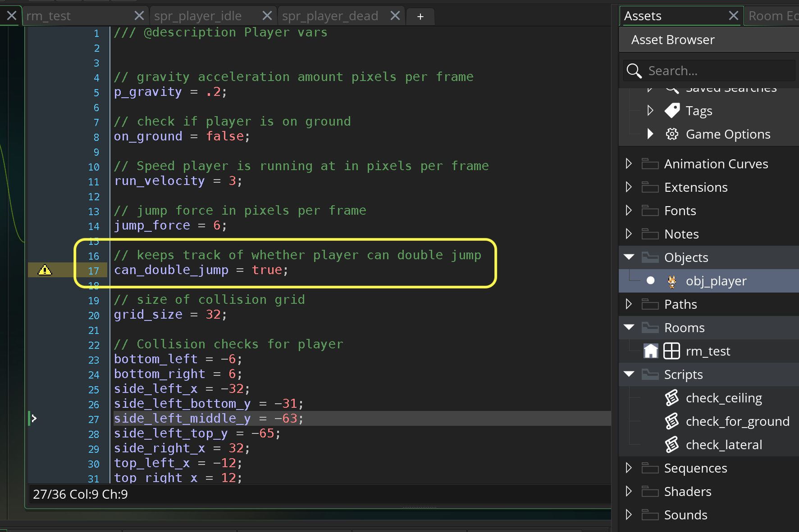
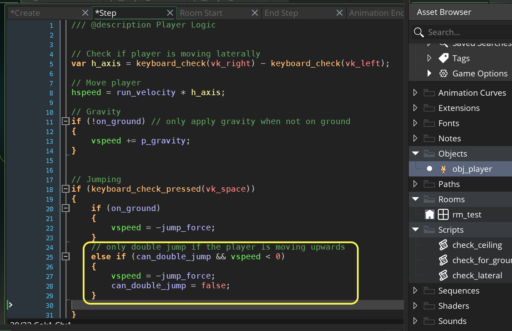
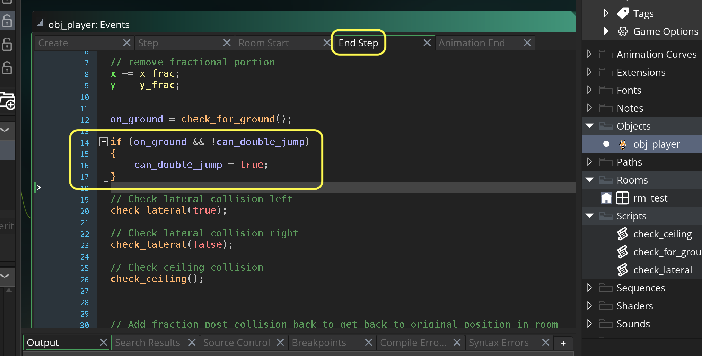
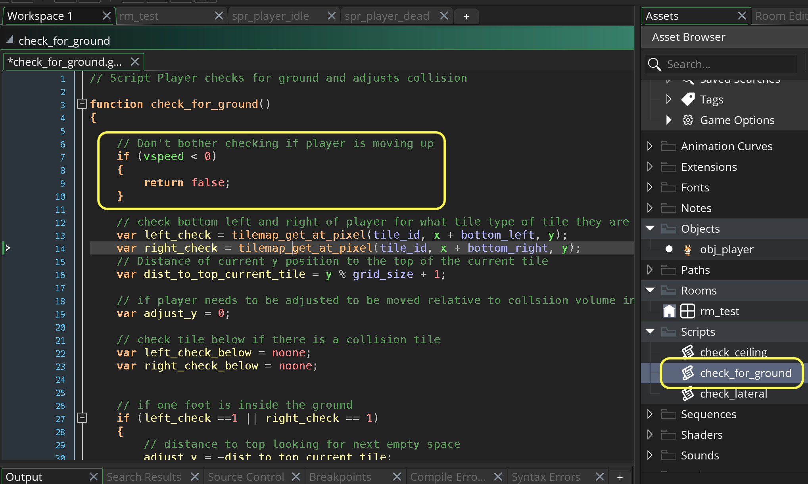
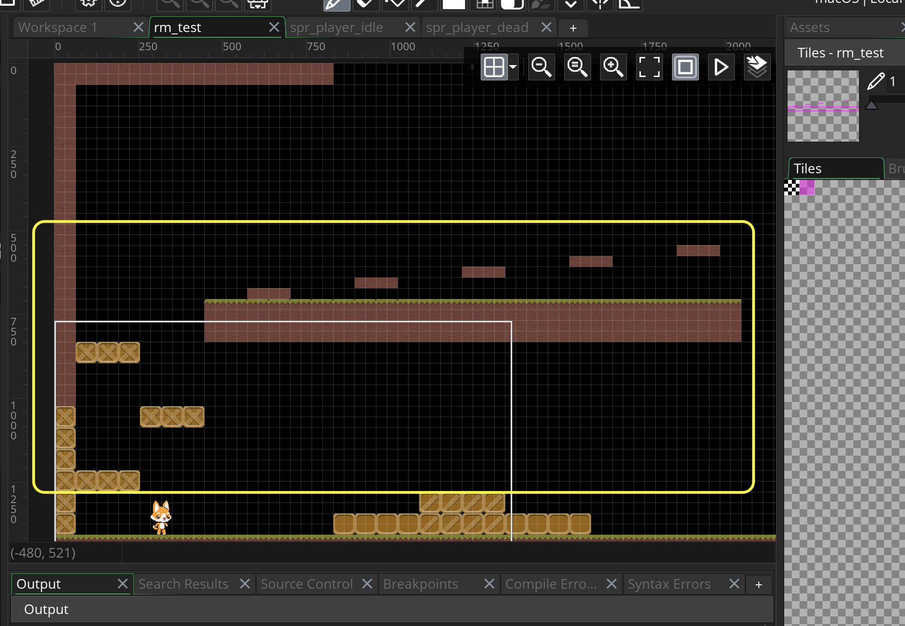
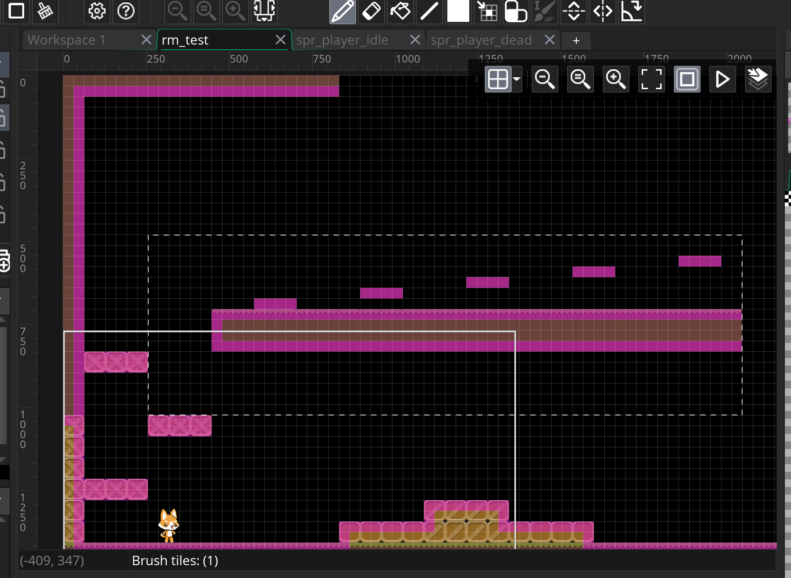
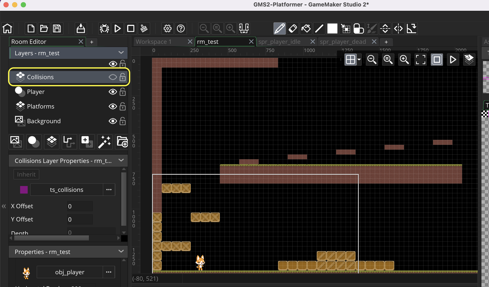

### Jumping and Ceiling Collision II

[previous](../jumping-ceiling/README.md#user-content-jumping-and-ceiling-collision) • [home](../README.md#user-content-gms2-top-down-shooter) • [next](../moving-platforms/README.md#user-content-moving-platforms)

I think every platformer needs double jumping.  Lets add this plus an area to gets the collision and jumping in this test level.

 

---

##### `Step 1.`\|`SPCRK`|:small_blue_diamond:

Open up **obj_player | Create** event and add a variable to restrict the double jump to a single time.  

##### `Step 2.`\|`FHIU`|:small_blue_diamond: :small_blue_diamond: 

Now we want to add the double jump.  Open up **obj_player | Step** event and add after the ground jump a check to see if `can_double_jump` is `true` **AND** that the player is moving up - as I don't want the player to be able to double jump when they are falling.  We then apply another upwards force and turn `can_double_jump` to `false` preventing a second air jump.

##### `Step 3.`\|`SPCRK`|:small_blue_diamond: :small_blue_diamond: :small_blue_diamond:

Now we need to set the double jump back to true so the player can double jump again next time.  The best place to do this is when the player collides with the floor.  Go the the **obj_player | End Step** and look for `on_ground` as well as `can_double_jump` being `false`.  If both of these are `true` then set `can_double_jump` to `true` to reset this switch.

##### `Step 4.`\|`SPCRK`|:small_blue_diamond: :small_blue_diamond: :small_blue_diamond: :small_blue_diamond:

Now *press* the <kbd>Play</kbd> button in the top menu bar to launch the game. Now you can double jump!

https://user-images.githubusercontent.com/5504953/157655536-341dd4ac-2567-459d-ab37-95710f65e5cc.mp4

##### `Step 5.`\|`SPCRK`| :small_orange_diamond:

Now *press* the <kbd>Play</kbd> button in the top menu bar to launch the game and look for collision issues. I see one major problem when I am moving diagonally upwards and feel I am not going to make the jump the ground collision lifts me up.

https://user-images.githubusercontent.com/5504953/157655783-289450c0-fe11-4472-86a3-06c6daf81a1c.mp4

##### `Step 6.`\|`SPCRK`| :small_orange_diamond: :small_blue_diamond:

So what is happening is that the player is moving up diagonally and the ground feelers are entering the collision zone while moving up.  Now we want the lateral collision to run but instead it lifts the player up on the platform.  This is an easy fix.  Open up `check_for_ground` and send false if the player is moving up.

##### `Step 7.`\|`SPCRK`| :small_orange_diamond: :small_blue_diamond: :small_blue_diamond:

Now that the player can double jump we can add an area above to check collisions and jumping.  I made some jump platforms to an area where we can test the ground, side and jump collisions.  It has a collision volume at each height and room to get to them from the left and the right side.

##### `Step 8.`\|`SPCRK`| :small_orange_diamond: :small_blue_diamond: :small_blue_diamond: :small_blue_diamond:

Add collision tiles to the new area.

##### `Step 9.`\|`SPCRK`| :small_orange_diamond: :small_blue_diamond: :small_blue_diamond: :small_blue_diamond: :small_blue_diamond:

Now lets play the game as we would normally.  Open up **rm_test** and turn off the **eyball** on the **Collision** layer in the room.  This will hide the collision from us seeing them but will not affect our collision code.

##### `Step 10.`\|`SPCRK`| :large_blue_diamond:

Now *press* the <kbd>Play</kbd> button in the top menu bar to launch the game. Try and test the collision thoroughly.

https://user-images.githubusercontent.com/5504953/157655400-f3263f7d-d63e-47fd-8513-64a74faef70c.mp4

___

| [previous](../jumping-ceiling/README.md#user-content-jumping-and-ceiling-collision)| [home](../README.md#user-content-gms2-top-down-shooter) | [next](../moving-platforms/README.md#user-content-moving-platforms)|
|---|---|---|
