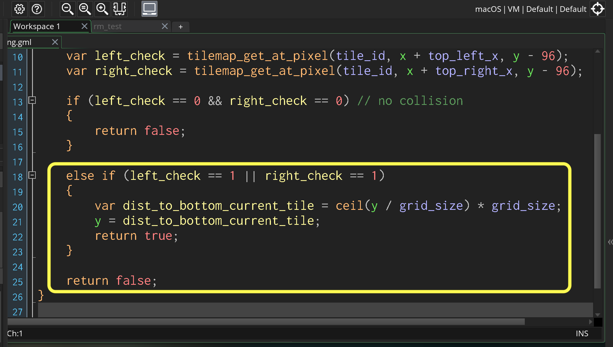

### Jumping and Ceiling Collision

[previous](../lateral-collision-ii/README.md#user-content-lateral-movement-and-wall-collision-ii) • [home](../README.md#user-content-gms2-platformer) • [next](../jumping-ceiling-ii/README.md#user-content-jumping-and-ceiling-collision-ii)

Now it is not much of a platformer without being able to jump.  lets add the ability to jump and also add ceiling collision so the player can't pentrate the top of a tile.

 

---

##### `Step 1.`\|`PLTFRMR`|:small_blue_diamond:

##### `Step 2.`\|`PLTFRMR`|:small_blue_diamond: :small_blue_diamond: 

Open up **obj_player | Create** event.  Lets add a variable that holds how much force will be applied on the player for jumping in pixels. 

##### `Step 3.`\|`PLTFRMR`|:small_blue_diamond: :small_blue_diamond: :small_blue_diamond:

Move the **Step** event and add to the bottom a check for the space bar and add an upwards force so the player jumps.

##### `Step 4.`\|`PLTFRMR`|:small_blue_diamond: :small_blue_diamond: :small_blue_diamond: :small_blue_diamond:

Now *press* the <kbd>Play</kbd> button in the top menu bar to launch the game. Press the jump button.  Notice though that you do not collide with ceilings.

https://user-images.githubusercontent.com/5504953/157585633-337765c2-efb2-4b5f-9a5d-006cff9f1373.mp4

##### `Step 5.`\|`PLTFRMR`| :small_orange_diamond:

Now open up the jump animation.  Make sure the first two frames is the inbetween of going from standing to jumping.  It loops from the 2nd frame onwards just like the fall animation.

https://user-images.githubusercontent.com/5504953/157586295-98232f42-187d-4b56-b78a-ab9f8ee03b40.mp4

##### `Step 6.`\|`PLTFRMR`| :small_orange_diamond: :small_blue_diamond:

Open up the **obj_player | Animation End** and a loop from the second frame onwards.  We can use the same logic as for the fall animation just add this logic for both the fall and the jump animation.

##### `Step 7.`\|`PLTFRMR`| :small_orange_diamond: :small_blue_diamond: :small_blue_diamond:

Open up **obj_player | End Step** event and add to the bottom a check for not being on the ground and with a negative `vspeed` (moving updwards).  We will then switch to the `spr_player_jump` animation.

##### `Step 8.`\|`PLTFRMR`| :small_orange_diamond: :small_blue_diamond: :small_blue_diamond: :small_blue_diamond:

Now *press* the <kbd>Play</kbd> button in the top menu bar to launch the game. Now you will see different animations for jumping versus falling.

https://user-images.githubusercontent.com/5504953/157645417-7015e161-9ba0-4b32-a8ea-45145b51d978.mp4

##### `Step 9.`\|`PLTFRMR`| :small_orange_diamond: :small_blue_diamond: :small_blue_diamond: :small_blue_diamond: :small_blue_diamond:

The top feelers will be a bit further apart from the feet.  The ears are sticking up so we will use the middle of the ear as the point for checking for ceiling.  This is +-12 pixels from the center. We are only making the player 96 pixels high so the ears will clip behind the platforms.

##### `Step 10.`\|`PLTFRMR`| :large_blue_diamond:

Open up **obj_polayer | Create** event and add two variables for the x offsets of the collision.

##### `Step 11.`\|`PLTFRMR`| :large_blue_diamond: :small_blue_diamond: 

*Right click* on **Scripts** and select **New | Script** and name it `check_ceiling`. The first thing we will check for is if we are falling downwards.  If we are falling down, there is no point in checking for ceiling collisions.

##### `Step 12.`\|`PLTFRMR`| :large_blue_diamond: :small_blue_diamond: :small_blue_diamond: 

Now lets check to see if either of the two top feelers are colliding with a collision tile.

##### `Step 13.`\|`PLTFRMR`| :large_blue_diamond: :small_blue_diamond: :small_blue_diamond:  :small_blue_diamond: 

Now if there are no collisions then return a false.  There is nothing else to do.

##### `Step 14.`\|`PLTFRMR`| :large_blue_diamond: :small_blue_diamond: :small_blue_diamond: :small_blue_diamond:  :small_blue_diamond: 

Now we do the same thing as the other collisions by taking the ceiling of the current y position (we are checking the feet so dpon't need to add 96 then subtract 96 to check the ceiling feelers). We then multiply it by 32 and it will return the next pixel in the grid square below.

##### `Step 15.`\|`PLTFRMR`| :large_blue_diamond: :small_orange_diamond: 

Now lets change that into code.  Open up `check_ceiling` and add a check to see if there is a collision then adjust the player to the cell beneath the one they are in.

##### `Step 16.`\|`PLTFRMR`| :large_blue_diamond: :small_orange_diamond:   :small_blue_diamond: 

Place a collision platfrom one grid piece above the player's head.

Now *press* the <kbd>Play</kbd> button in the top menu bar to launch the game. Now the player collides.  But the player gets "stuck" on the ceiling as it takes a while for gravity to reverse the upwards force especially on a short jump.

https://user-images.githubusercontent.com/5504953/157647158-262fc276-8544-4d88-9927-c4d32d63a591.mp4

##### `Step 17.`\|`PLTFRMR`| :large_blue_diamond: :small_orange_diamond: :small_blue_diamond: :small_blue_diamond:

I think I would like to keep a bit of ceiling friction.  Sliding the head along the ceiling is kind of fun.  What we will do is have that collision slow down the player by 20% each collision frame, making gravity take over much faster.

##### `Step 18.`\|`PLTFRMR`| :large_blue_diamond: :small_orange_diamond: :small_blue_diamond: :small_blue_diamond: :small_blue_diamond:

Open up **obj_player | End Step** and call `check_ceiling()` after you have checked the lateral collisions.

##### `Step 19.`\|`PLTFRMR`| :large_blue_diamond: :small_orange_diamond: :small_blue_diamond: :small_blue_diamond: :small_blue_diamond: :small_blue_diamond:

Now *press* the <kbd>Play</kbd> button in the top menu bar to launch the game. Jump into the ceiling again.  Now it looks and feels a lot better!

https://user-images.githubusercontent.com/5504953/157653357-9763e7ea-6929-4a0c-bc9e-c37b03f66a16.mp4

<!--  -->

| [previous](../lateral-collision-ii/README.md#user-content-lateral-movement-and-wall-collision-ii)| [home](../README.md#user-content-gms2-platformer) | [next](../jumping-ceiling-ii/README.md#user-content-jumping-and-ceiling-collision-ii)|
|---|---|---|
