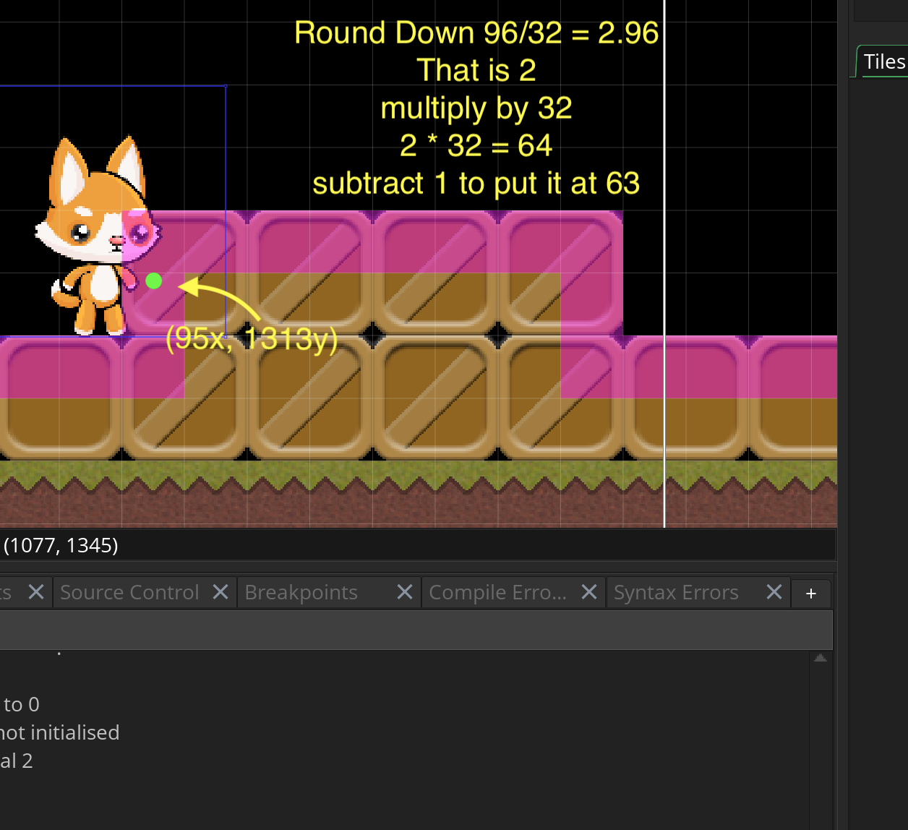
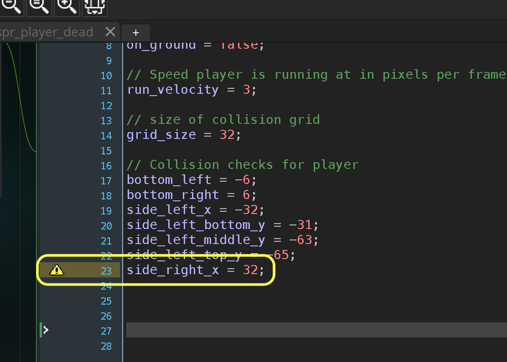
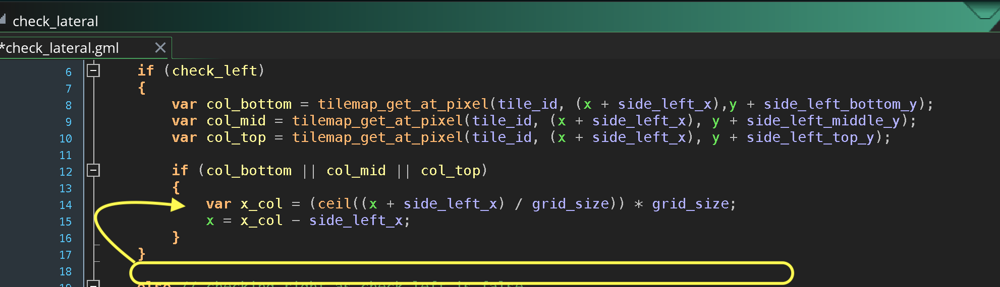
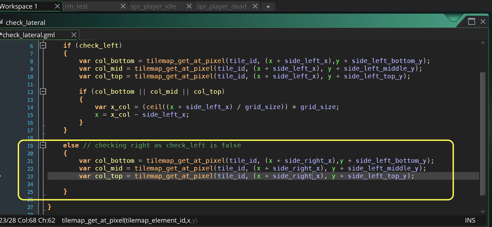
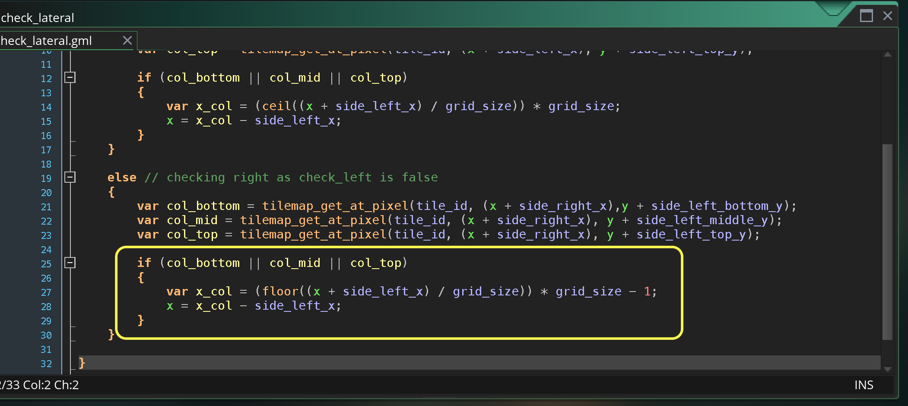

### Lateral Movement and Wall Collision II

[previous](../lateral-collision/README.md#user-content-lateral-movement-and-wall-collision) • [home](../README.md#user-content-gms2-top-down-shooter) • [next](../)

Lets add the collision for moving right.

 

---

##### `Step 1.`\|`SPCRK`|:small_blue_diamond:

Now the collision on the right will be similar to the collision on the left.  Since the player's right hand side is colliding it will hit the collision volume's left side.  So we round down (`floor()`) the collision then multiply by `32` to get the begining of the cell.  We subtract 1 as we need the player to be one pixel outside the collision volume.

##### `Step 2.`\|`FHIU`|:small_blue_diamond: :small_blue_diamond: 

We can reuse the left Y positions as they are the same for looking right the feelers will be at the same height.  Lets just add the x offset which is 32 pixels from the right or origin (center) of our player sprite. Open **obj_player | Create** event and add this new variable.

##### `Step 3.`\|`SPCRK`|:small_blue_diamond: :small_blue_diamond: :small_blue_diamond:

Open up the `check_lateral` script and move the left collision movement inside the `if` statement.  I put it in the wrong place and to check right we will need to fix this.

##### `Step 4.`\|`SPCRK`|:small_blue_diamond: :small_blue_diamond: :small_blue_diamond: :small_blue_diamond:

Now we will add an `else` when `check_left` is `false`.  We will then try three feelers to the right of the player to see if they are colliding with an object on the right.

##### `Step 5.`\|`SPCRK`| :small_orange_diamond:

Now we adjust the player leftwards to the end of the cell prior to the one that the feeler is in.  So we round down (`floor(n)`) then multiply by `32` then subtract `1` to get to the edge on the left hand side of the collision volume.

##### `Step 6.`\|`SPCRK`| :small_orange_diamond: :small_blue_diamond:

##### `Step 7.`\|`SPCRK`| :small_orange_diamond: :small_blue_diamond: :small_blue_diamond:

##### `Step 8.`\|`SPCRK`| :small_orange_diamond: :small_blue_diamond: :small_blue_diamond: :small_blue_diamond:

##### `Step 9.`\|`SPCRK`| :small_orange_diamond: :small_blue_diamond: :small_blue_diamond: :small_blue_diamond: :small_blue_diamond:

##### `Step 10.`\|`SPCRK`| :large_blue_diamond:

##### `Step 11.`\|`SPCRK`| :large_blue_diamond: :small_blue_diamond: 

##### `Step 12.`\|`SPCRK`| :large_blue_diamond: :small_blue_diamond: :small_blue_diamond: 

##### `Step 13.`\|`SPCRK`| :large_blue_diamond: :small_blue_diamond: :small_blue_diamond:  :small_blue_diamond: 

##### `Step 14.`\|`SPCRK`| :large_blue_diamond: :small_blue_diamond: :small_blue_diamond: :small_blue_diamond:  :small_blue_diamond: 

##### `Step 15.`\|`SPCRK`| :large_blue_diamond: :small_orange_diamond: 

##### `Step 16.`\|`SPCRK`| :large_blue_diamond: :small_orange_diamond:   :small_blue_diamond: 

##### `Step 17.`\|`SPCRK`| :large_blue_diamond: :small_orange_diamond: :small_blue_diamond: :small_blue_diamond:

##### `Step 18.`\|`SPCRK`| :large_blue_diamond: :small_orange_diamond: :small_blue_diamond: :small_blue_diamond: :small_blue_diamond:

##### `Step 19.`\|`SPCRK`| :large_blue_diamond: :small_orange_diamond: :small_blue_diamond: :small_blue_diamond: :small_blue_diamond: :small_blue_diamond:

##### `Step 20.`\|`SPCRK`| :large_blue_diamond: :large_blue_diamond:

##### `Step 21.`\|`SPCRK`| :large_blue_diamond: :large_blue_diamond: :small_blue_diamond:

___

| [previous](../lateral-collision/README.md#user-content-lateral-movement-and-wall-collision)| [home](../README.md#user-content-gms2-top-down-shooter) | [next](../)|
|---|---|---|
