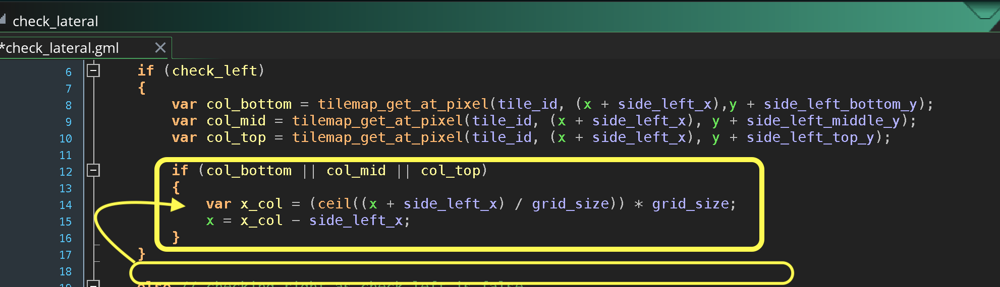

### Lateral Movement and Wall Collision II

[previous](../lateral-collision/README.md#user-content-lateral-movement-and-wall-collision) • [home](../README.md#user-content-gms2-top-down-shooter) • [next](../jumping-ceiling/README.md#user-content-jumping-and-ceiling-collision)

Lets add the collision for moving right.

 

---

##### `Step 1.`\|`PLTFRMR`|:small_blue_diamond:

Now the collision on the right will be similar to the collision on the left.  Since the player's right hand side is colliding it will hit the collision volume's left side.  So we round down (`floor()`) the collision then multiply by `32` to get the begining of the cell.  We subtract 1 as we need the player to be one pixel outside the collision volume.

##### `Step 2.`\|`PLTFRMR`|:small_blue_diamond: :small_blue_diamond: 

We can reuse the left Y positions as they are the same for looking right the feelers will be at the same height.  Lets just add the x offset which is 32 pixels from the right or origin (center) of our player sprite. Open **obj_player | Create** event and add this new variable.

##### `Step 3.`\|`PLTFRMR`|:small_blue_diamond: :small_blue_diamond: :small_blue_diamond:

Open up the `check_lateral` script and move the left collision movement inside the `if` statement.  I put it in the wrong place and to check right we will need to fix this.

##### `Step 4.`\|`PLTFRMR`|:small_blue_diamond: :small_blue_diamond: :small_blue_diamond: :small_blue_diamond:

Now we will add an `else` when `check_left` is `false`.  We will then try three feelers to the right of the player to see if they are colliding with an object on the right.

##### `Step 5.`\|`PLTFRMR`| :small_orange_diamond:

Now we adjust the player leftwards to the end of the cell prior to the one that the feeler is in.  So we round down (`floor(n)`) then multiply by `32` then subtract `1` to get to the edge on the left hand side of the collision volume.

##### `Step 6.`\|`PLTFRMR`| :small_orange_diamond: :small_blue_diamond:

Now we need to go the **obj_player | End Step** and add a call to check the right hand side of the collision.  We call the same function `check_lateral` but pass it `false` so it checks the right hand side.

##### `Step 7.`\|`PLTFRMR`| :small_orange_diamond: :small_blue_diamond: :small_blue_diamond:

Now create a mirror of the same collisions on the left to test the four zones (first three with collisions and the player should be able to pass under the fourth). 

Now *press* the <kbd>Play</kbd> button in the top menu bar to launch the game. Check all the collision feelers and it should work correctly.

https://user-images.githubusercontent.com/5504953/157450269-d54a530b-382b-4a18-9ba4-387abef01eef.mp4

___

<!--  -->

| [previous](../lateral-collision/README.md#user-content-lateral-movement-and-wall-collision)| [home](../README.md#user-content-gms2-top-down-shooter) | [next](../jumping-ceiling/README.md#user-content-jumping-and-ceiling-collision)|
|---|---|---|
