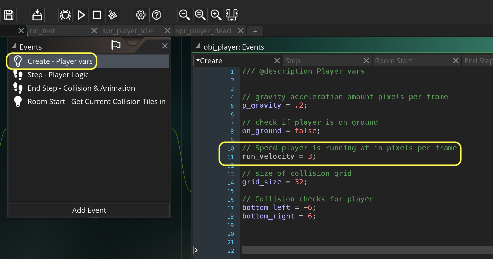
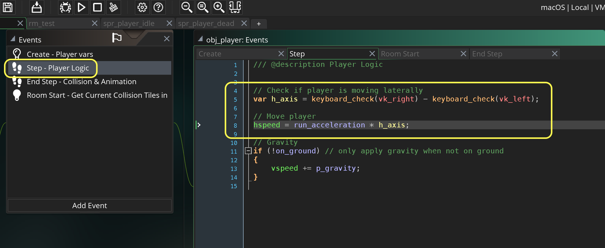
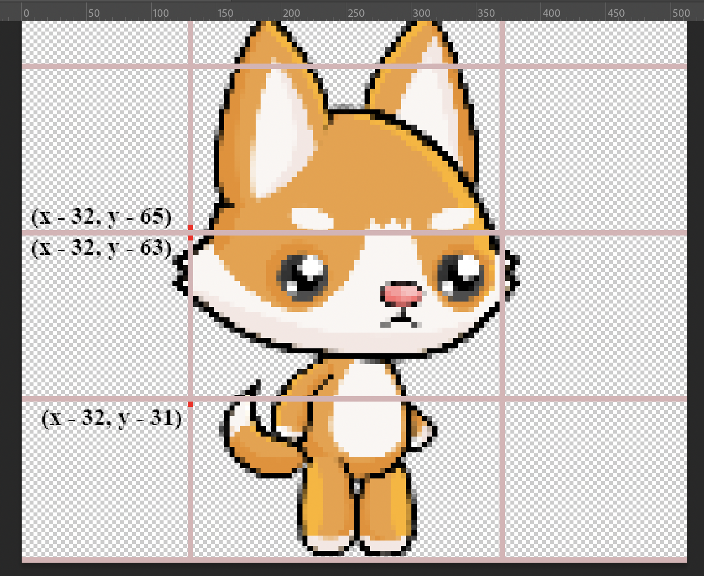

### Lateral Movement and Wall Collision

[previous](../gravity-collision-ii/README.md#user-content-gravity-and-ground-collision-ii) • [home](../README.md#user-content-gms2-top-down-shooter) • [next](../)

Now we have the player falling but no lateral movement.  We can't move the player left to right.  We also have no left and right collision.  Lets remedy that!

 

---

##### `Step 1.`\|`SPCRK`|:small_blue_diamond:

Lets add a variable to **obj_player | Create** event to track the speed the player runs at.

##### `Step 2.`\|`FHIU`|:small_blue_diamond: :small_blue_diamond: 

Now we can subtract the `vk_left` key from the `vk_right` key which is subtracting two booleans.  So if the player is holding the left arrow it will be `-1` (0 - 1).  If the player is holding the right key it will be `1` (1 - 0).  If the player is holding no or both keys it will be `0` (0 - 0 or 1 - 1).  So we can now multiply this by our `run_velocity` and it will move either left or right or stay in the same spot.

##### `Step 3.`\|`SPCRK`|:small_blue_diamond: :small_blue_diamond: :small_blue_diamond:

Now *press* the <kbd>Play</kbd> button in the top menu bar to launch the game. Now run laterally and you can move left and right.  You can also move up to the platforms as the ground collision is doing its job.

https://user-images.githubusercontent.com/5504953/157279964-41c29a59-09d1-48e9-b663-824291ab4184.mp4

##### `Step 4.`\|`SPCRK`|:small_blue_diamond: :small_blue_diamond: :small_blue_diamond: :small_blue_diamond:

We have done collision detection for the feet.  Now we need to do collision detection for the sides.  We want it to check three collision zones to the left.  Now since the feet narrow and the dog's head is so large we want our side feelers to be further out so in this case it will be `x - 32` pixels away.  On the **y** axis we will be checking three 32 pixels collision zones.  The top of the bottom zone at `-31`, the top of the middle zone at `-63` and the bottom of the top zone at `-65`.  This way our side feelers will not be in the way of the ground or ceiling checks making sure that we are not doing both a ground or ceiling as well as a lateral when not wanted.  

##### `Step 5.`\|`SPCRK`| :small_orange_diamond:

##### `Step 6.`\|`SPCRK`| :small_orange_diamond: :small_blue_diamond:

##### `Step 7.`\|`SPCRK`| :small_orange_diamond: :small_blue_diamond: :small_blue_diamond:

##### `Step 8.`\|`SPCRK`| :small_orange_diamond: :small_blue_diamond: :small_blue_diamond: :small_blue_diamond:

##### `Step 9.`\|`SPCRK`| :small_orange_diamond: :small_blue_diamond: :small_blue_diamond: :small_blue_diamond: :small_blue_diamond:

##### `Step 10.`\|`SPCRK`| :large_blue_diamond:

##### `Step 11.`\|`SPCRK`| :large_blue_diamond: :small_blue_diamond: 

##### `Step 12.`\|`SPCRK`| :large_blue_diamond: :small_blue_diamond: :small_blue_diamond: 

##### `Step 13.`\|`SPCRK`| :large_blue_diamond: :small_blue_diamond: :small_blue_diamond:  :small_blue_diamond: 

##### `Step 14.`\|`SPCRK`| :large_blue_diamond: :small_blue_diamond: :small_blue_diamond: :small_blue_diamond:  :small_blue_diamond: 

##### `Step 15.`\|`SPCRK`| :large_blue_diamond: :small_orange_diamond: 

##### `Step 16.`\|`SPCRK`| :large_blue_diamond: :small_orange_diamond:   :small_blue_diamond: 

##### `Step 17.`\|`SPCRK`| :large_blue_diamond: :small_orange_diamond: :small_blue_diamond: :small_blue_diamond:

##### `Step 18.`\|`SPCRK`| :large_blue_diamond: :small_orange_diamond: :small_blue_diamond: :small_blue_diamond: :small_blue_diamond:

##### `Step 19.`\|`SPCRK`| :large_blue_diamond: :small_orange_diamond: :small_blue_diamond: :small_blue_diamond: :small_blue_diamond: :small_blue_diamond:

##### `Step 20.`\|`SPCRK`| :large_blue_diamond: :large_blue_diamond:

##### `Step 21.`\|`SPCRK`| :large_blue_diamond: :large_blue_diamond: :small_blue_diamond:

___

| [previous](../gravity-collision-ii/README.md#user-content-gravity-and-ground-collision-ii)| [home](../README.md#user-content-gms2-top-down-shooter) | [next](../)|
|---|---|---|
