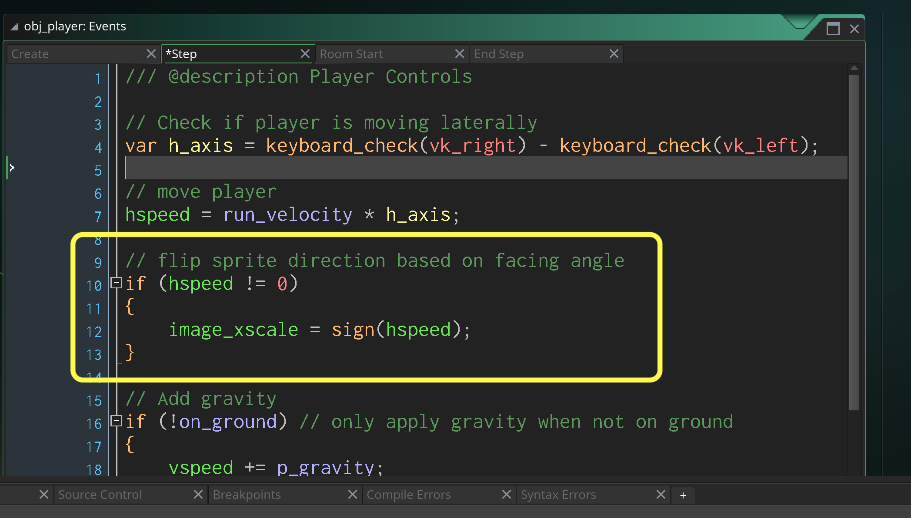
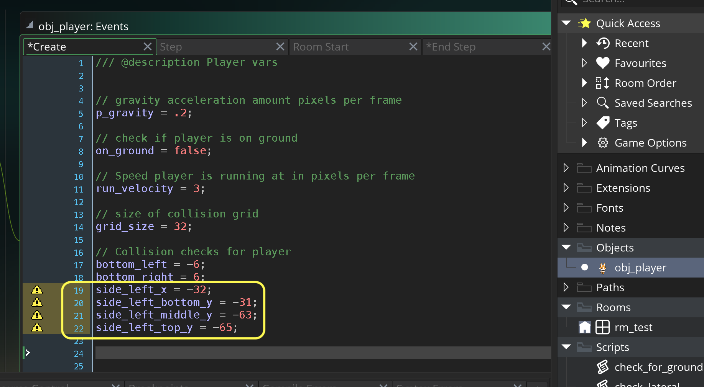
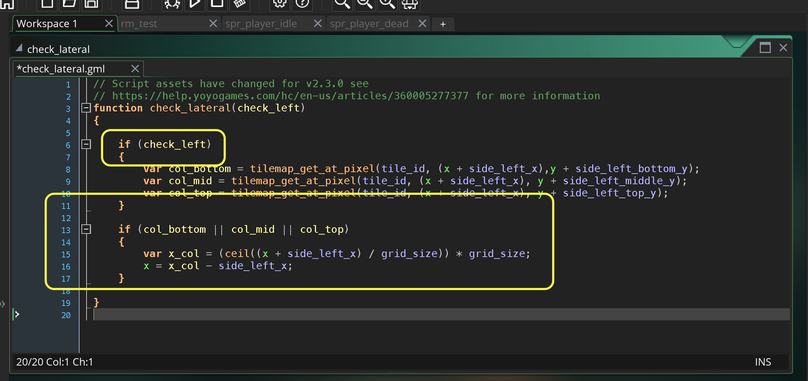
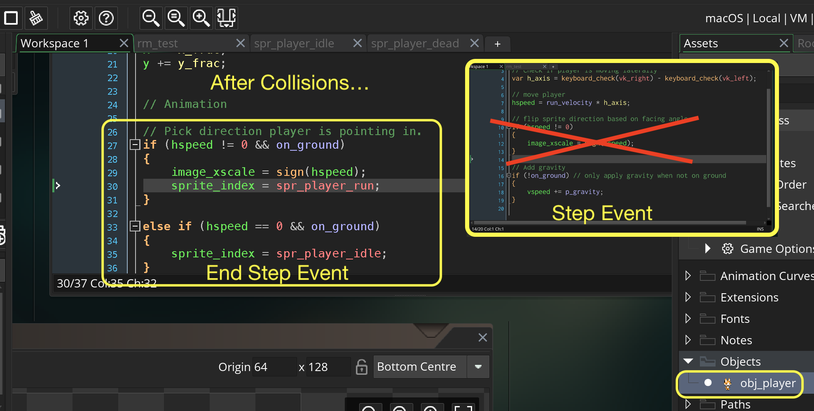

### Lateral Movement and Wall Collision

[previous](../gravity-collision-ii/README.md#user-content-gravity-and-ground-collision-ii) • [home](../README.md#user-content-gms2-top-down-shooter) • [next](../lateral-collision-ii/README.md#user-content-lateral-movement-and-wall-collision-ii)

Now we have the player falling but no lateral movement.  We can't move the player left to right.  We also have no left and right collision.  Lets remedy that!

 

---

##### `Step 1.`\|`SPCRK`|:small_blue_diamond:

Lets add a variable to **obj_player | Create** event to track the speed the player runs at.

##### `Step 2.`\|`FHIU`|:small_blue_diamond: :small_blue_diamond: 

Now we can subtract the `vk_left` key from the `vk_right` key which is subtracting two booleans.  So if the player is holding the left arrow it will be `-1` (0 - 1).  If the player is holding the right key it will be `1` (1 - 0).  If the player is holding no or both keys it will be `0` (0 - 0 or 1 - 1).  So we can now multiply this by our `run_velocity` and it will move either left or right or stay in the same spot.

##### `Step 3.`\|`SPCRK`|:small_blue_diamond: :small_blue_diamond: :small_blue_diamond:

Now *press* the <kbd>Play</kbd> button in the top menu bar to launch the game. Now run laterally and you can move left and right.  You can also move up to the platforms as the ground collision is doing its job.

https://user-images.githubusercontent.com/5504953/157279964-41c29a59-09d1-48e9-b663-824291ab4184.mp4

##### `Step 4.`\|`SPCRK`|:small_blue_diamond: :small_blue_diamond: :small_blue_diamond: :small_blue_diamond:
 
Now lets have the player face in the direction they are supposed to point in. If the player is not moving laterally we will leave the last direction.  If the player is moving then set the `image_xscale` to the `sign (hspeed)`.  This sets it to -1 or 1.  The sign will return `-1` for any negative number (player moving left) and +1 for when `hspeed` is any number above `0`.  This will flip the orientation of the sprite at +1 for right and -1 for left.

##### `Step 5.`\|`SPCRK`| :small_orange_diamond:

We have done collision detection for the feet.  Now we need to do collision detection for the sides.  We want it to check three collision zones to the left.  Now since the feet narrow and the dog's head is so large we want our side feelers to be further out so in this case it will be `x - 32` pixels away.  On the **y** axis we will be checking three 32 pixels collision zones.  The top of the bottom zone at `-31`, the top of the middle zone at `-63` and the bottom of the top zone at `-65`.  This way our side feelers will not be in the way of the ground or ceiling checks making sure that we are not doing both a ground or ceiling as well as a lateral when not wanted.  

##### `Step 6.`\|`SPCRK`| :small_orange_diamond: :small_blue_diamond:

So lets add these offsets above for our side wall feelers for the player in the **obj_player | Create** event.

##### `Step 7.`\|`SPCRK`| :small_orange_diamond: :small_blue_diamond: :small_blue_diamond:

*Right click* on **Scripts** and select **New | Script** and name it `check_lateral`. This function will work for both left and right.  Lets start with getting left working.  This will take one parameter a boolean called `check_left` that wil tell the function whether to check left or right.

Set the **Sprite** to `spr_foo`.We will use the same function `tilemap_get_at_pixel` to look and see if one of our player's side feelers is inside a collision tile.

##### `Step 8.`\|`SPCRK`| :small_orange_diamond: :small_blue_diamond: :small_blue_diamond: :small_blue_diamond:

The math is fairlty straight forward to get the player out of the collision area.  We find out which tile they are in and then go the begining of the next tile.  So if we divide the **x** position by the collision **grid_size** (32) we get a fraction.  We found it up (using `ceil(n)`). We then multiply it by the tile size and it gets to the beginning of the next tile.  In this illustration tile 1 goes from 0 to 31, second from 32 to 63 and the begining of the third tile is `64`. 

##### `Step 9.`\|`SPCRK`| :small_orange_diamond: :small_blue_diamond: :small_blue_diamond: :small_blue_diamond: :small_blue_diamond:

Go back to `check_lateral` **Script** and add a check to make sure that you are only checking the left feelers if `check_left` is true when passed to the function. Then after check to see if there is a collision in any of the feelers (will cover bottom 96 pixels) and if there is we will move the player to the right edge of the neighbouring tile.

##### `Step 10.`\|`SPCRK`| :large_blue_diamond:

Now we need to call the function.  So open **obj_player | End Step** event and a call to the `check_lateral(check_left)` function right after you check for the ground collision.

##### `Step 11.`\|`SPCRK`| :large_blue_diamond: :small_blue_diamond: 

Now *press* the <kbd>Play</kbd> button in the top menu bar to launch the game. Run into the left wall, notice that the collision is working!

https://user-images.githubusercontent.com/5504953/157436945-8f8f2100-2bfa-4053-b3cf-88ae178405e0.mp4

##### `Step 12.`\|`SPCRK`| :large_blue_diamond: :small_blue_diamond: :small_blue_diamond: 

Now we want the camera to follow the player around the level.  Open up **rm_test** and in **Properties** expand **viewport 0**.  Then change the **Object Following** to `obj_player` and set the **Horizontal Border** and **Vertical Border** to `200`.

##### `Step 13.`\|`SPCRK`| :large_blue_diamond: :small_blue_diamond: :small_blue_diamond:  :small_blue_diamond: 

Now we need to test all 3 feelers.  The player should not pass through a collision volume in the first three neighbouring collision tiles but fit under the fourth.  Lets set up a temporary area to test the three lateral left collisions.

https://user-images.githubusercontent.com/5504953/157440491-dd1465bb-d0b9-4337-a818-e5ef2a7c90c4.mp4

##### `Step 14.`\|`SPCRK`| :large_blue_diamond: :small_blue_diamond: :small_blue_diamond: :small_blue_diamond:  :small_blue_diamond: 

Now *press* the <kbd>Play</kbd> button in the top menu bar to launch the game. Test all four collision zones to make sure that the bottom three ones stop the player and that there is not a hole in our collision detection.

https://user-images.githubusercontent.com/5504953/157440757-4015332d-77d0-404d-a763-bc6da0a71cec.mp4

##### `Step 15.`\|`SPCRK`| :large_blue_diamond: :small_orange_diamond: 

Lets alter the animation logic so that the player switches between running and idling.  They both only run if the player is on the ground and the player idles when it is not moving horizontally and is running when moving.  Lets alter this logic in **obj_player | End Step** event at the bottom **after** the collision detection.

##### `Step 16.`\|`SPCRK`| :large_blue_diamond: :small_orange_diamond:   :small_blue_diamond: 

Now *press* the <kbd>Play</kbd> button in the top menu bar to launch the game. Now run around and the player changes between the run and idle animation.  

https://user-images.githubusercontent.com/5504953/157441926-71430fa2-ed5f-4151-8b37-3d8ff3cd4040.mp4

##### `Step 17.`\|`SPCRK`| :large_blue_diamond: :small_orange_diamond: :small_blue_diamond: :small_blue_diamond:

Now the player is not running the falling animation when falling off of a platform.  Lets add one more animation state when th eplayer is not on the ground and is moving downwards.

##### `Step 18.`\|`SPCRK`| :large_blue_diamond: :small_orange_diamond: :small_blue_diamond: :small_blue_diamond: :small_blue_diamond:

Now *press* the <kbd>Play</kbd> button in the top menu bar to launch the game. Now the player enters the fall animation when falling from a platform.

https://user-images.githubusercontent.com/5504953/157442325-4af6193a-9685-49d0-b991-76eec8ad5121.mp4

##### `Step 19.`\|`SPCRK`| :large_blue_diamond: :small_orange_diamond: :small_blue_diamond: :small_blue_diamond: :small_blue_diamond: :small_blue_diamond:

I notice one issue in the fall animation.  It has two frames where it transitions from the standing to the falling state.  So it doesn't loop from frame 0 until the end.  The loop point is at frame 3 (image_index 2).  So lets play this once then skip this frame from then onwards.

https://user-images.githubusercontent.com/5504953/157443315-352e5262-2fe0-4958-9ff0-60540784edcb.mp4

##### `Step 20.`\|`SPCRK`| :large_blue_diamond: :large_blue_diamond:

Press the <kbd>Add Event</kbd> and select a **Other | Animation End** event. So it will play the entire animation once then at the end skip to frame 3 (image_index 2).  And will do this only if the `spr_player_fall` animation is running.

##### `Step 21.`\|`SPCRK`| :large_blue_diamond: :large_blue_diamond: :small_blue_diamond:

Now *press* the <kbd>Play</kbd> button in the top menu bar to launch the game. Woah, that looks a lot better.

https://user-images.githubusercontent.com/5504953/157444312-ec887f32-0f0d-49c2-9711-715a037fbf17.mp4

___

| [previous](../gravity-collision-ii/README.md#user-content-gravity-and-ground-collision-ii)| [home](../README.md#user-content-gms2-top-down-shooter) | [next](../lateral-collision-ii/README.md#user-content-lateral-movement-and-wall-collision-ii)|
|---|---|---|
