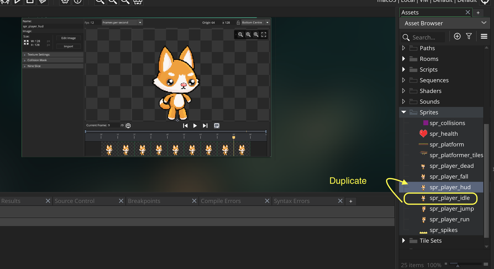
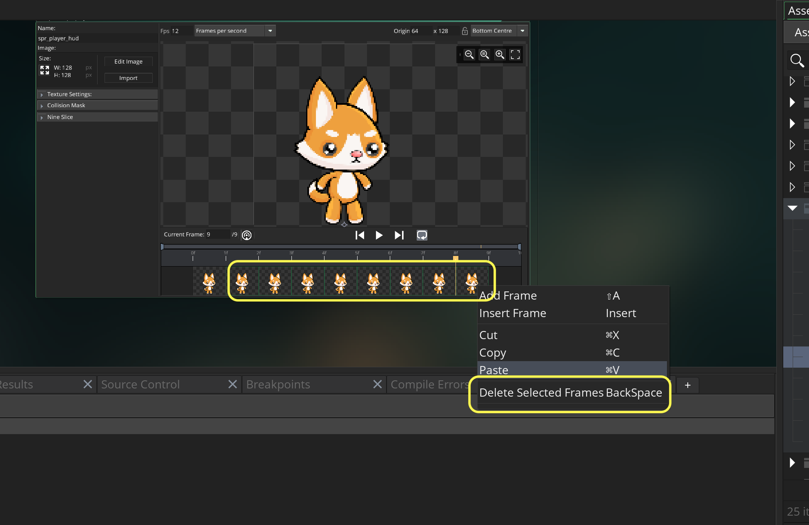
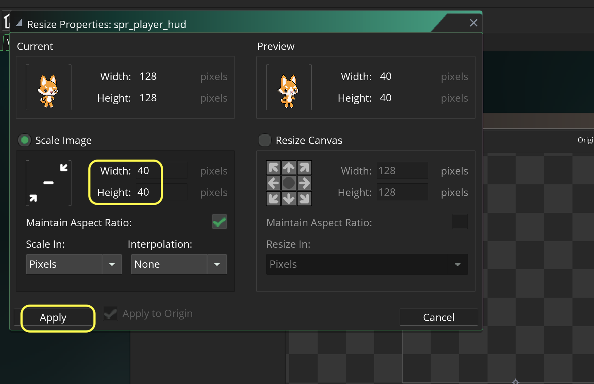
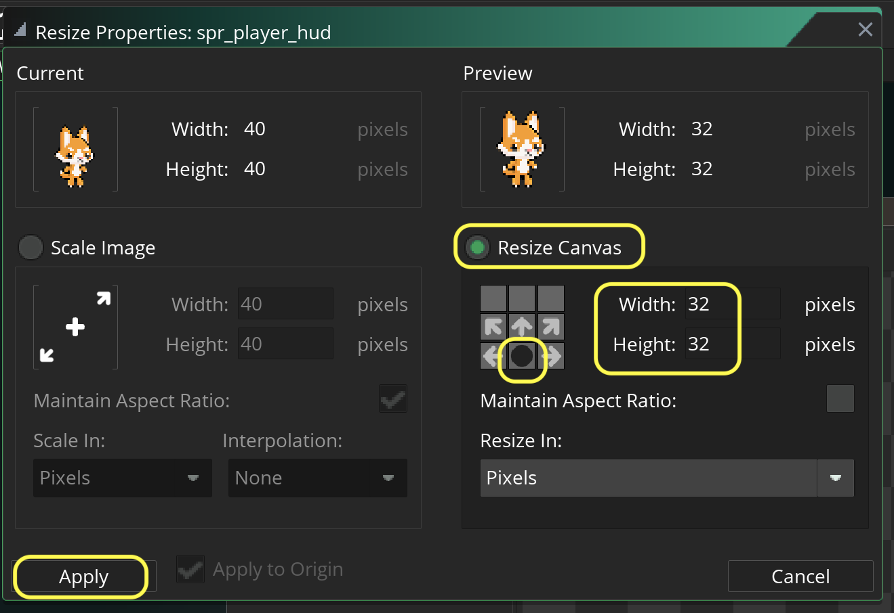
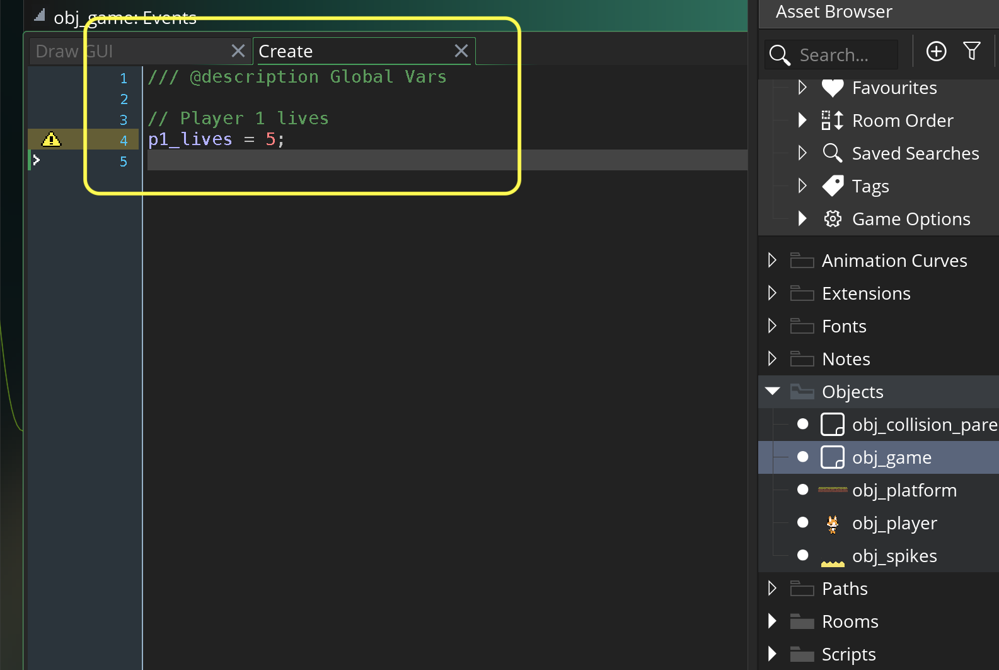

### Lives

[previous](../health-bar/README.md#user-content-health-bar) • [home](../README.md#user-content-gms2-top-down-shooter) • [next](../)

Lets add lives to the game so that the player has finite chances to finish your levels.  We will not use hearts as we ar using this for health so we will use little pictures of the dog.

 

---

##### `Step 1.`\|`SPCRK`|:small_blue_diamond:

OK, lets get smaller version of our player sprite. Right click on **spr_player_idle** and select **Duplicate**.  Call this new sprite `spr_player_hud`.

##### `Step 2.`\|`FHIU`|:small_blue_diamond: :small_blue_diamond: 

This is for the hud so we don't need animation. Select all but 1 frame and delete them.

##### `Step 3.`\|`SPCRK`|:small_blue_diamond: :small_blue_diamond: :small_blue_diamond:

Press the <kbd>Resize</kbd> button then change the **Width** and **Height** to `40`.  Press the <kbd>Apply</kbd> button.

##### `Step 4.`\|`SPCRK`|:small_blue_diamond: :small_blue_diamond: :small_blue_diamond: :small_blue_diamond:

Press the <kbd>Resize</kbd> button again and this time select **Resize Canvas**. Set the **Width** and **Height** to `32` and push the bottom center arrow to keep the bottom of the sprite (the feet are at the bottom and we don't want them cut off). Press the <kbd>Apply</kbd> button.

##### `Step 5.`\|`SPCRK`| :small_orange_diamond:

Open up **obj_game**.  This object is best to hold variables for the entire game. Press the <kbd>Add Event</kbd> and select a **Create** event. 

##### `Step 6.`\|`SPCRK`| :small_orange_diamond: :small_blue_diamond:

##### `Step 7.`\|`SPCRK`| :small_orange_diamond: :small_blue_diamond: :small_blue_diamond:

##### `Step 8.`\|`SPCRK`| :small_orange_diamond: :small_blue_diamond: :small_blue_diamond: :small_blue_diamond:

##### `Step 9.`\|`SPCRK`| :small_orange_diamond: :small_blue_diamond: :small_blue_diamond: :small_blue_diamond: :small_blue_diamond:

##### `Step 10.`\|`SPCRK`| :large_blue_diamond:

##### `Step 11.`\|`SPCRK`| :large_blue_diamond: :small_blue_diamond: 

##### `Step 12.`\|`SPCRK`| :large_blue_diamond: :small_blue_diamond: :small_blue_diamond: 

##### `Step 13.`\|`SPCRK`| :large_blue_diamond: :small_blue_diamond: :small_blue_diamond:  :small_blue_diamond: 

##### `Step 14.`\|`SPCRK`| :large_blue_diamond: :small_blue_diamond: :small_blue_diamond: :small_blue_diamond:  :small_blue_diamond: 

##### `Step 15.`\|`SPCRK`| :large_blue_diamond: :small_orange_diamond: 

##### `Step 16.`\|`SPCRK`| :large_blue_diamond: :small_orange_diamond:   :small_blue_diamond: 

##### `Step 17.`\|`SPCRK`| :large_blue_diamond: :small_orange_diamond: :small_blue_diamond: :small_blue_diamond:

##### `Step 18.`\|`SPCRK`| :large_blue_diamond: :small_orange_diamond: :small_blue_diamond: :small_blue_diamond: :small_blue_diamond:

##### `Step 19.`\|`SPCRK`| :large_blue_diamond: :small_orange_diamond: :small_blue_diamond: :small_blue_diamond: :small_blue_diamond: :small_blue_diamond:

##### `Step 20.`\|`SPCRK`| :large_blue_diamond: :large_blue_diamond:

##### `Step 21.`\|`SPCRK`| :large_blue_diamond: :large_blue_diamond: :small_blue_diamond:

___

| [previous](../health-bar/README.md#user-content-health-bar)| [home](../README.md#user-content-gms2-top-down-shooter) | [next](../)|
|---|---|---|
