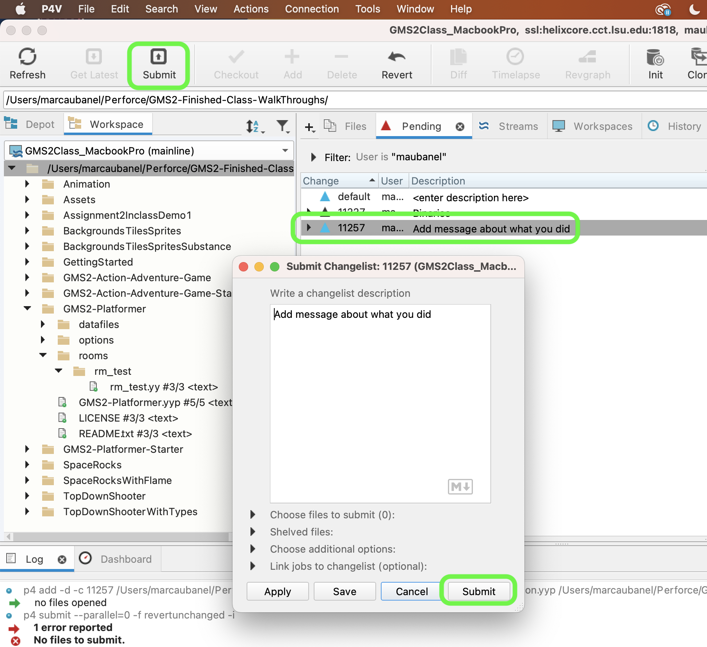

### Lives

[previous](../health-bar/README.md#user-content-health-bar) • [home](../README.md#user-content-gms2-platformer) • [next](../flame/README.md#user-content-flame-enemy)

Lets add lives to the game so that the player has finite chances to finish your levels.  We will not use hearts as we ar using this for health so we will use little pictures of the dog.

 

---

##### `Step 1.`\|`PLTFRMR`|:small_blue_diamond:

Open up **P4v**.  Select the top folder of the **GameMaker** project. Press the <kbd>Checkout</kbd> button.  Checkout out all files in P4V so that they are all writable (otherwise they will be read only and none of the changes will be saved). Select a **New** changelist and add a message describing the unit of work you will be performing. Press the <kbd>OK</kbd> button.

Open up the project you are working on in **GameMaker**. 

##### `Step 2.`\|`PLTFRMR`|:small_blue_diamond: :small_blue_diamond: 

OK, lets get smaller version of our player sprite. Right click on **spr_player_idle** and select **Duplicate**.  Call this new sprite `spr_player_hud`.

##### `Step 3.`\|`PLTFRMR`|:small_blue_diamond: :small_blue_diamond: :small_blue_diamond:

This is for the hud so we don't need animation. Select all but 1 frame and delete them.

##### `Step 4.`\|`PLTFRMR`|:small_blue_diamond: :small_blue_diamond: :small_blue_diamond: :small_blue_diamond:

Press the <kbd>Resize</kbd> button then change the **Width** and **Height** to `40`.  Press the <kbd>Apply</kbd> button.

##### `Step 5.`\|`PLTFRMR`| :small_orange_diamond:

Press the <kbd>Resize</kbd> button again and this time select **Resize Canvas**. Set the **Width** and **Height** to `32` and push the bottom center arrow to keep the bottom of the sprite (the feet are at the bottom and we don't want them cut off). Press the <kbd>Apply</kbd> button.

##### `Step 6.`\|`PLTFRMR`| :small_orange_diamond: :small_blue_diamond:

Open up **obj_game**.  This object is best to hold variables for the entire game. Press the <kbd>Add Event</kbd> and select a **Create** event. Add a variable called `p1_lives` and set it to `5`.

##### `Step 7.`\|`PLTFRMR`| :small_orange_diamond: :small_blue_diamond: :small_blue_diamond:

Now open up **obj_game | Draw GUI** and add to the bottom a loop that draws all the player sprites. We need a distance between sprites with a margin, so we will separate the player icon by 40 pixels.  We also need to increment our **x** position with that.  We will use the `draw_sprite(sprite, subimg, x, y)` to draw the player to the screen.

##### `Step 8.`\|`PLTFRMR`| :small_orange_diamond: :small_blue_diamond: :small_blue_diamond: :small_blue_diamond:

Now *press* the <kbd>Play</kbd> button in the top menu bar to launch the game. Now you should see 5 lives under the health!

##### `Step 9.`\|`PLTFRMR`| :small_orange_diamond: :small_blue_diamond: :small_blue_diamond: :small_blue_diamond: :small_blue_diamond:

Lets run the death animation when the player loses all its health.  Open up **obj_player | Create** event and add `dead` to `player_state`.

##### `Step 10.`\|`PLTFRMR`| :large_blue_diamond:

At the bottom of the **obj_player | Step** event in the `play` section add a check for health.  If it is less or equal to `0` then run an alarm to switch states in a third of a second and change the state to `dead` so player cannot move the player anymore. If the player has more lives left subtract one.

##### `Step 11.`\|`PLTFRMR`| :large_blue_diamond: :small_blue_diamond: 

*Right click* on **Objects** and select **New | Object** and name it `obj_player_dead`. Set the **Sprite** to `spr_player_dead`.

##### `Step 12.`\|`PLTFRMR`| :large_blue_diamond: :small_blue_diamond: :small_blue_diamond: 

Press the <kbd>Add Event</kbd> and select a **Alarm | Alarm 3** event.  Change the `state` to `player_state.dead`.  Then the player can no longer move the player.

##### `Step 13.`\|`PLTFRMR`| :large_blue_diamond: :small_blue_diamond: :small_blue_diamond:  :small_blue_diamond: 

Now *press* the <kbd>Play</kbd> button in the top menu bar to launch the game and notice that the player dies when you run out of health.  But the animation just keeps playing and playing.

https://user-images.githubusercontent.com/5504953/158077134-ba1763e4-820e-4c06-8d2a-ce6dc1908039.mp4

##### `Step 14.`\|`PLTFRMR`| :large_blue_diamond: :small_blue_diamond: :small_blue_diamond: :small_blue_diamond:  :small_blue_diamond: 

Open up **obj_player_dead**.  Press the <kbd>Add Event</kbd> and select a **Create** event. Also, reset to the first from of the animation. Now make the player opaque and slow the motion down for dramatic effect!

##### `Step 15.`\|`PLTFRMR`| :large_blue_diamond: :small_orange_diamond: 

Now in **obj_player_dead** press the <kbd>Add Event</kbd> and select a **Other | Animation End** event. When you reach the final frame, hold on it.

##### `Step 16.`\|`PLTFRMR`| :large_blue_diamond: :small_orange_diamond:   :small_blue_diamond: 

Now *press* the <kbd>Play</kbd> button in the top menu bar to launch the game. Now when the player dies the animation comes to an end.

https://user-images.githubusercontent.com/5504953/158078385-48a121db-3519-431d-808b-f1ddb1bbc739.mp4

##### `Step 17.`\|`PLTFRMR`| :large_blue_diamond: :small_orange_diamond: :small_blue_diamond: :small_blue_diamond:

Now we are going to move the player back to where they started the level.  Open up **rm_test** and get the **x** and **y** coordinates of where the players start.  Open up **obj_game | create** and add two variables to record the fist level's x and y value for hte player.

##### `Step 18.`\|`PLTFRMR`| :large_blue_diamond: :small_orange_diamond: :small_blue_diamond: :small_blue_diamond: :small_blue_diamond:

Open up **obj_player_dead | Animation End** event and call an alarm to either start again at the begining of the level or restart the entire game.

##### `Step 19.`\|`PLTFRMR`| :large_blue_diamond: :small_orange_diamond: :small_blue_diamond: :small_blue_diamond: :small_blue_diamond: :small_blue_diamond:

Press the <kbd>Add Event</kbd> and select a **Alarm | Alarm 0** event. If ther are lives left, transform this instance back to **obj_player** and put it at the begining of the level.  Otherwise restart the entire game.

##### `Step 20.`\|`PLTFRMR`| :large_blue_diamond: :large_blue_diamond:

Now *press* the <kbd>Play</kbd> button in the top menu bar to launch the game. Now this works perfectly except that when the player chnages back their animations are still frozen.  This is a bug!

https://user-images.githubusercontent.com/5504953/158079190-d6208230-8543-4f35-afbb-751c76bc8405.mp4

##### `Step 21.`\|`PLTFRMR`| :large_blue_diamond: :large_blue_diamond: :small_blue_diamond:

Open up **obj_player | Alarm 0** event and put the `image_speed` back to `1`.

##### `Step 22.`\|`PLTFRMR`| :large_blue_diamond: :large_blue_diamond: :small_blue_diamond: :small_blue_diamond:

I have some concerns about the player being in the air when they are hit.  So in **obj_player | Alarm 3** we add a check to see if they are on the ground.  If not we call the alarm again in 2 frames.  This allows the player to fall to the ground before switching to the death animation.  

Also in **obj_player_dead | Create** event we will make sure the player is no longer moving so we will set their speed to `0`.

##### `Step 23.`\|`PLTFRMR`| :large_blue_diamond: :large_blue_diamond: :small_blue_diamond: :small_blue_diamond:

Set the lives to `2` and player health to `10` so we can quickly test the work. Now *press* the <kbd>Play</kbd> button in the top menu bar to launch the game. Now we restart the level when there is more than one life and the game when the last life is spent.

https://user-images.githubusercontent.com/5504953/158079825-b3e7884b-e8e9-4ffb-bc73-cdffd3e4afcf.mp4

##### `Step 24.`\|`PLTFRMR`| :large_blue_diamond: :large_blue_diamond: :small_blue_diamond: :small_blue_diamond:

Select the **File | Save Project**, then press **File | Quit** (PC) **Game Maker | Quit** on Mac to make sure everything in the game is saved.

##### `Step 25.`\|`PLTFRMR`| :large_blue_diamond: :large_blue_diamond: :small_blue_diamond: :small_blue_diamond:

Open up **P4V**.  Select the top folder and press the **Add** button.  We want to add all the new files we created during this last session.  Add these files to the last change list you used at the begining of the session. Make sure the message accurately represents what you have done. Press the <kbd>OK</kbd> button.

##### `Step 26.`\|`PLTFRMR`| :large_blue_diamond: :large_blue_diamond: :small_blue_diamond: :small_blue_diamond:

Now you can submit the changelist by pressing both <kbd>Submit</kbd> buttons.

<!--  -->

| [previous](../health-bar/README.md#user-content-health-bar)| [home](../README.md#user-content-gms2-platformer) | [next](../flame/README.md#user-content-flame-enemy)|
|---|---|---|
