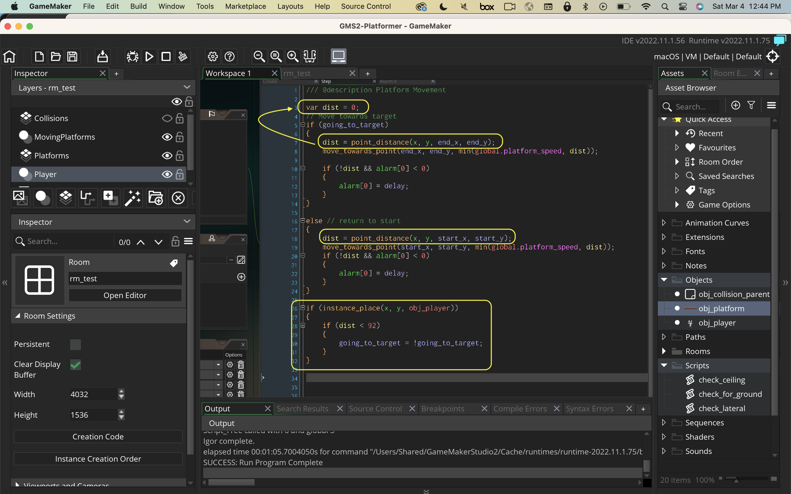
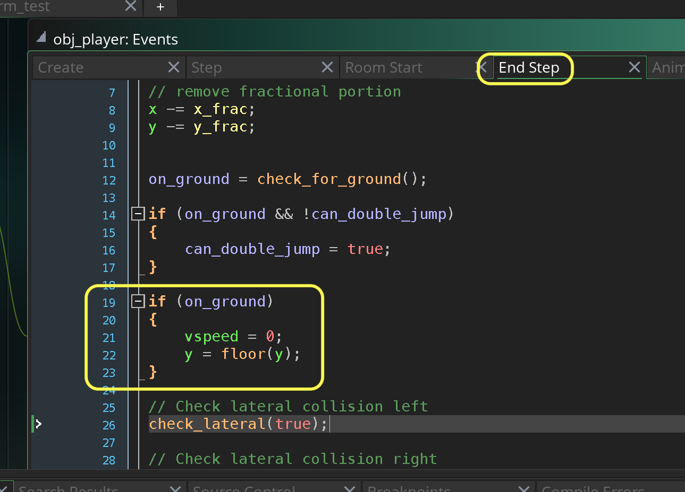

### Moving Platforms II

[previous](../moving-platforms/README.md#user-content-moving-platforms) • [home](../README.md#user-content-gms2-top-down-shooter) • [next](../)

Lets get collision detection working on objects.

 

---

##### `Step 1.`\|`SPCRK`|:small_blue_diamond:

 Open up `check_for_ground`. Now we need to also check in the `if (on ground)` section to see if the pixel below is on ground of a moving platform.  We look 1 pixel below then expand the check for being right on top of the ground.

##### `Step 2.`\|`FHIU`|:small_blue_diamond: :small_blue_diamond: 

Open up `check_lateral` and lets add collision for moving laterally.  We check left to the same zones as we do with the tiles but move as an offset off of the position of the object we collided with.

##### `Step 3.`\|`SPCRK`|:small_blue_diamond: :small_blue_diamond: :small_blue_diamond:

Now *press* the <kbd>Play</kbd> button in the top menu bar to launch the game. Run into the moving platform from the left and collisions should work.

##### `Step 4.`\|`SPCRK`|:small_blue_diamond: :small_blue_diamond: :small_blue_diamond: :small_blue_diamond:

Now we need to do the same thing to the right.  We need to place the offset left side one pixel to the left of the playeform.

##### `Step 5.`\|`SPCRK`| :small_orange_diamond:

Now *press* the <kbd>Play</kbd> button in the top menu bar to launch the game. The collision to the right works now!

https://user-images.githubusercontent.com/5504953/158003271-ea9380de-edd4-4c50-89a8-95132e3c89a2.mp4

##### `Step 6.`\|`SPCRK`| :small_orange_diamond: :small_blue_diamond:

Now open up `check_ceiling` and we will add a duplicate check of any object the player could run into. We use the same feelers distance as we did for the tiles.  We also now look for no collision acress tiles OR objects before deciding that there is no collsioin.

##### `Step 7.`\|`SPCRK`| :small_orange_diamond: :small_blue_diamond: :small_blue_diamond:

Now we will have to adjust the player to just below the sprite we have collided with to get into the right space just before the collision.  We will also use the same speed tapering that we did by removing 20% of the vertical speed if the player is moving up.

##### `Step 8.`\|`SPCRK`| :small_orange_diamond: :small_blue_diamond: :small_blue_diamond: :small_blue_diamond:

Now *press* the <kbd>Play</kbd> button in the top menu bar to launch the game. Now we collide with the top of the platform.  The issue now is that the platform will push the player into the ground if the player is under it and cause a pretty glichy bug.

https://user-images.githubusercontent.com/5504953/158018492-11bbd466-97cd-4c4b-b036-32d82134c156.mp4

##### `Step 9.`\|`SPCRK`| :small_orange_diamond: :small_blue_diamond: :small_blue_diamond: :small_blue_diamond: :small_blue_diamond:

Now we will reverse the direction of the platform if it collides with the player.  So we will add a check in the platfrom to see if the player is within 92 pixels and still collides with the platformer then reverse direction.  We will need to do this in an end step and access the distance variable.  Open up **obj_platform | Step** event and chnage the `dist` variable from a local `var` to a normal variable that will persist until the end step.

##### `Step 10.`\|`SPCRK`| :large_blue_diamond:

Press the <kbd>Add Event</kbd> and select a **Step | End Step** event. We want to look to after the platform has moved to the new position.  We will use `instance_place(x, y, obj)` to determine if there is still a collision between the player and the platform.  Now there is no guarantee that the player will run its collision detection and move the player out of the way and when this collision will run as both are in the `end step` event. So we will only reverse direction if the collision volume is within 92 pixels (the player is 92 pixels tall).  This should stop the platform from pushing the player out of the bottom of the level.

##### `Step 11.`\|`SPCRK`| :large_blue_diamond: :small_blue_diamond: 

Now *press* the <kbd>Play</kbd> button in the top menu bar to launch the game. Now run around the platform and it only seems to reverse when crushing the player.

https://user-images.githubusercontent.com/5504953/158018940-2dd167a8-8174-4448-b5ad-7e98043a438c.mp4

##### `Step 12.`\|`SPCRK`| :large_blue_diamond: :small_blue_diamond: :small_blue_diamond: 

Turn on the **Collision** layer so we can see it.  Select the **Platform** tile layer and on the right side of the room add two jump platforms that you need to double jump to (three blocks high).  Add another moving platform to take you from one end to another.

##### `Step 13.`\|`SPCRK`| :large_blue_diamond: :small_blue_diamond: :small_blue_diamond:  :small_blue_diamond: 

Now go back to the **Collision** layer and add the collisions to these two new platforms.

##### `Step 14.`\|`SPCRK`| :large_blue_diamond: :small_blue_diamond: :small_blue_diamond: :small_blue_diamond:  :small_blue_diamond: 

Turn the **Collisions** view off.

##### `Step 15.`\|`SPCRK`| :large_blue_diamond: :small_orange_diamond: 

You now should bring the moving platform to the starting point on the far right.  You can get the **start_X**, **start_Y** and **end_Y** based on its position.

##### `Step 16.`\|`SPCRK`| :large_blue_diamond: :small_orange_diamond:   :small_blue_diamond: 

Now you can move the platform to the left to its target position and set the **end_x**.

##### `Step 17.`\|`SPCRK`| :large_blue_diamond: :small_orange_diamond: :small_blue_diamond: :small_blue_diamond:

Now *press* the <kbd>Play</kbd> button in the top menu bar to launch the game. Now jump on the sideways platform.  Woops the platform moves underneath the player.  We want the player to move with the platform.

https://user-images.githubusercontent.com/5504953/158022971-00a35221-91c1-4392-8f0a-a3cf2802c446.mp4

##### `Step 18.`\|`SPCRK`| :large_blue_diamond: :small_orange_diamond: :small_blue_diamond: :small_blue_diamond: :small_blue_diamond:

When I first tried to implement the moving along platform I had some fractional errors of the player not being quite on top of the ground.  With precision errors in floats the player drifted downwards and caused issues.  This is solved by making sure that when we are on the ground that `vspeed` is still `0` and that the player is not between pixels (the number is NOT fractional).  Open up **obj_player | End Step**.

##### `Step 19.`\|`SPCRK`| :large_blue_diamond: :small_orange_diamond: :small_blue_diamond: :small_blue_diamond: :small_blue_diamond: :small_blue_diamond:

So we now open up **check_for_ground** and in the checking for 1 pixel below ground we look to see if we are on a moving platform (object collision).  If we are get a reference to the valid collision result then adjust the player's `x` by the `hspeed` of the platform.

##### `Step 20.`\|`SPCRK`| :large_blue_diamond: :large_blue_diamond:

Now *press* the <kbd>Play</kbd> button in the top menu bar to launch the game. Now you will move along with the platform when standing on it.  I also tested that the platform can't crush the player into the platform horizontally (our previous code should work here).

https://user-images.githubusercontent.com/5504953/158024490-4cf62262-32c2-4441-9a60-d5d73c80c938.mp4

___

| [previous](../moving-platforms/README.md#user-content-moving-platforms)| [home](../README.md#user-content-gms2-top-down-shooter) | [next](../)|
|---|---|---|
