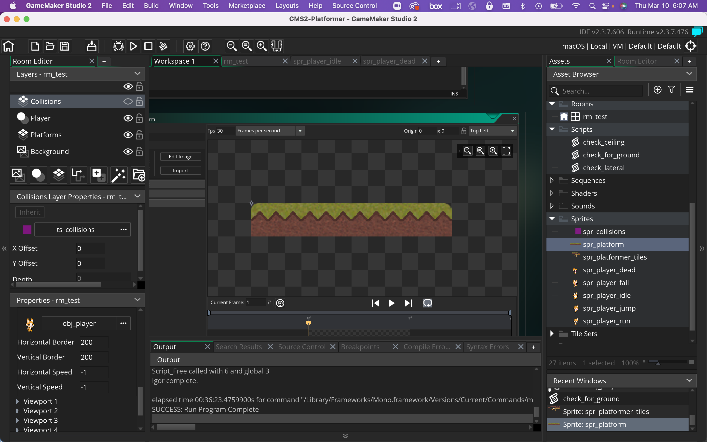
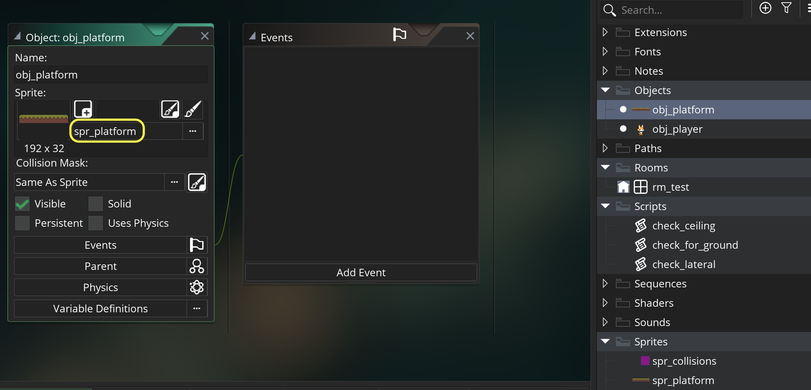
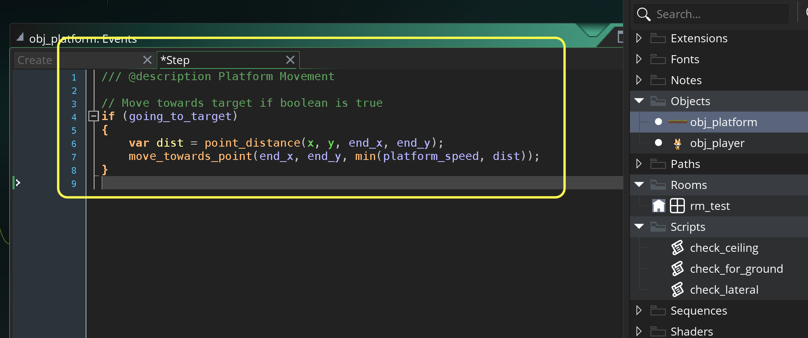
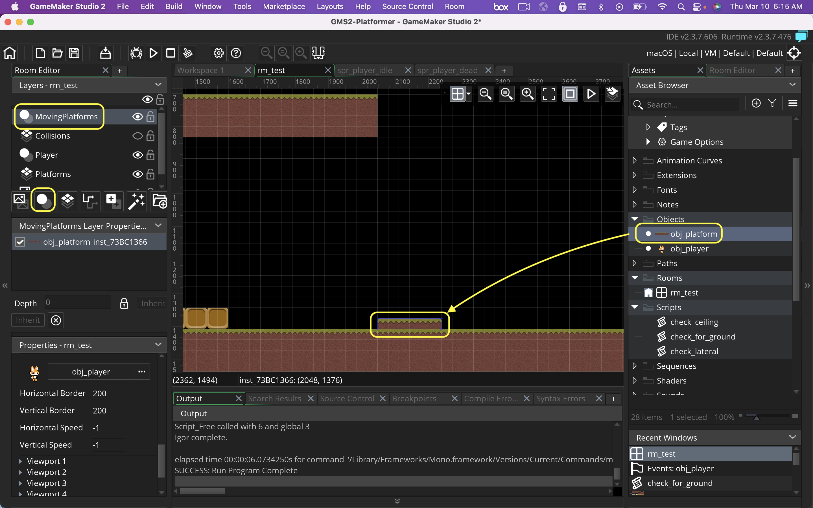

### Moving Platforms

[previous](../jumping-ceiling-ii/README.md#user-content-jumping-and-ceiling-collision-ii) • [home](../README.md#user-content-gms2-top-down-shooter) • [next](../)

Now another key feature of platformers is platforms that move.  We do have an issue though.  We cannot control our tiles like we do a game object and animation is limited.  We will need to use a game object to animate so we will have to add another entire section to our collisions for solid tiles.

 

---

##### `Step 1.`\|`SPCRK`|:small_blue_diamond:

Download [jumpPlatformSourceArt.png](images/jumpPlatformSourceArt.png). *Right click* on **Sprites** and select **New | Sprite** and name it `spr_platform`. Import the above image.

##### `Step 2.`\|`FHIU`|:small_blue_diamond: :small_blue_diamond: 

*Right click* on **Objects** and select **New | Object** and name it `obj_platform`. Set the **Sprite** to `spr_platform`. 

##### `Step 3.`\|`SPCRK`|:small_blue_diamond: :small_blue_diamond: :small_blue_diamond:

Press the **Variable Definitions** button on **obj_platform** as we want to have different start and end points on each platform in the level.  If we set it in the create event we would only be able to have one begining and end position.  We only need to use ingegers as you can't be placed in between pixels in the game.

##### `Step 4.`\|`SPCRK`|:small_blue_diamond: :small_blue_diamond: :small_blue_diamond: :small_blue_diamond:

Press the <kbd>Add Event</kbd> and select a **Step | Step** event. Then check to make sure we are moving towards the target.  Then lets stop the platform from overshooting its target.  Look at the distance between the current position and the target.  Then move the player toward the target with either the platform speed to the distance to the end whichever is smaller.

##### `Step 5.`\|`SPCRK`| :small_orange_diamond:

Open up **rm_test** and add another **Instance** layer and call it

##### `Step 6.`\|`SPCRK`| :small_orange_diamond: :small_blue_diamond:

##### `Step 7.`\|`SPCRK`| :small_orange_diamond: :small_blue_diamond: :small_blue_diamond:

##### `Step 8.`\|`SPCRK`| :small_orange_diamond: :small_blue_diamond: :small_blue_diamond: :small_blue_diamond:

##### `Step 9.`\|`SPCRK`| :small_orange_diamond: :small_blue_diamond: :small_blue_diamond: :small_blue_diamond: :small_blue_diamond:

##### `Step 10.`\|`SPCRK`| :large_blue_diamond:

##### `Step 11.`\|`SPCRK`| :large_blue_diamond: :small_blue_diamond: 

##### `Step 12.`\|`SPCRK`| :large_blue_diamond: :small_blue_diamond: :small_blue_diamond: 

##### `Step 13.`\|`SPCRK`| :large_blue_diamond: :small_blue_diamond: :small_blue_diamond:  :small_blue_diamond: 

##### `Step 14.`\|`SPCRK`| :large_blue_diamond: :small_blue_diamond: :small_blue_diamond: :small_blue_diamond:  :small_blue_diamond: 

##### `Step 15.`\|`SPCRK`| :large_blue_diamond: :small_orange_diamond: 

##### `Step 16.`\|`SPCRK`| :large_blue_diamond: :small_orange_diamond:   :small_blue_diamond: 

##### `Step 17.`\|`SPCRK`| :large_blue_diamond: :small_orange_diamond: :small_blue_diamond: :small_blue_diamond:

##### `Step 18.`\|`SPCRK`| :large_blue_diamond: :small_orange_diamond: :small_blue_diamond: :small_blue_diamond: :small_blue_diamond:

##### `Step 19.`\|`SPCRK`| :large_blue_diamond: :small_orange_diamond: :small_blue_diamond: :small_blue_diamond: :small_blue_diamond: :small_blue_diamond:

##### `Step 20.`\|`SPCRK`| :large_blue_diamond: :large_blue_diamond:

##### `Step 21.`\|`SPCRK`| :large_blue_diamond: :large_blue_diamond: :small_blue_diamond:

___

| [previous](../jumping-ceiling-ii/README.md#user-content-jumping-and-ceiling-collision-ii)| [home](../README.md#user-content-gms2-top-down-shooter) | [next](../)|
|---|---|---|
