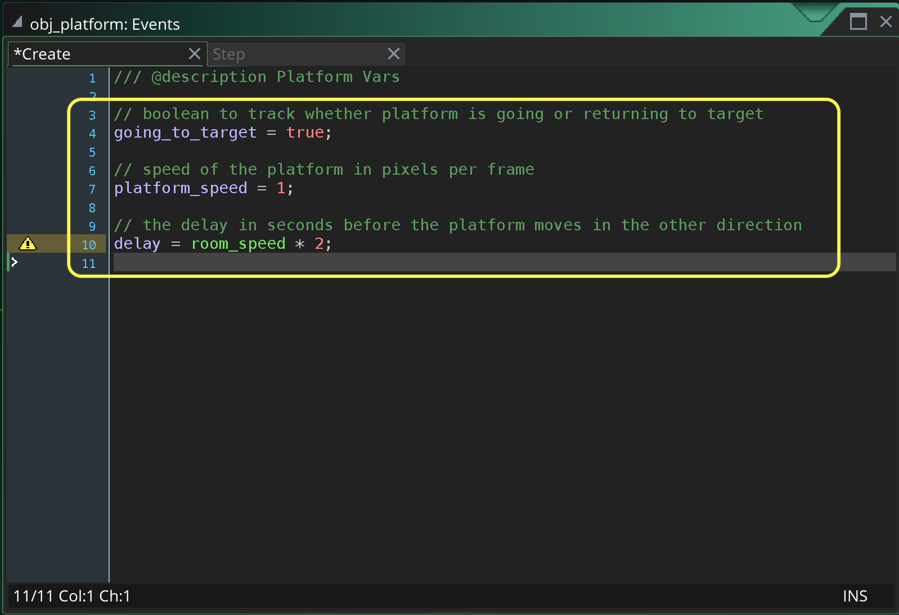
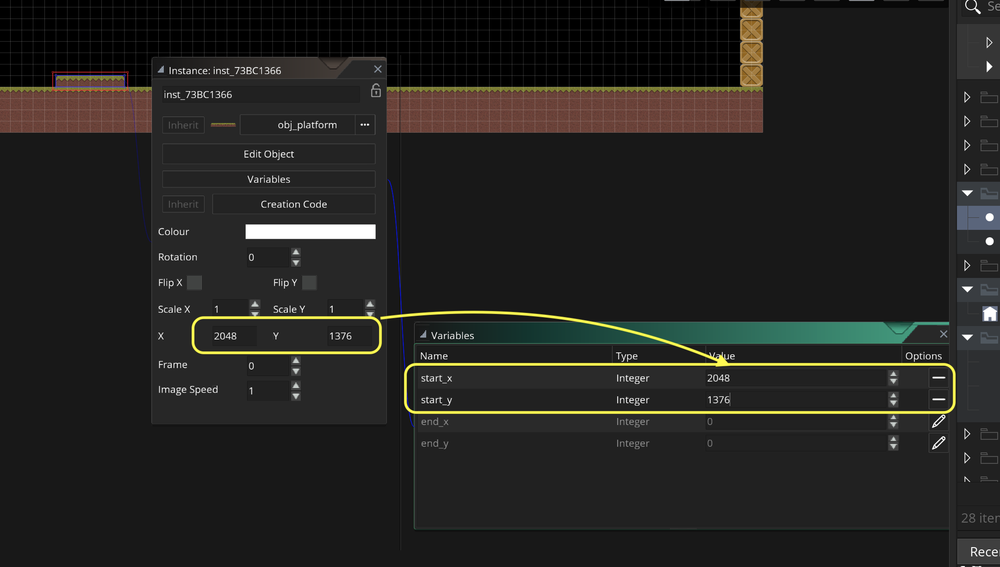
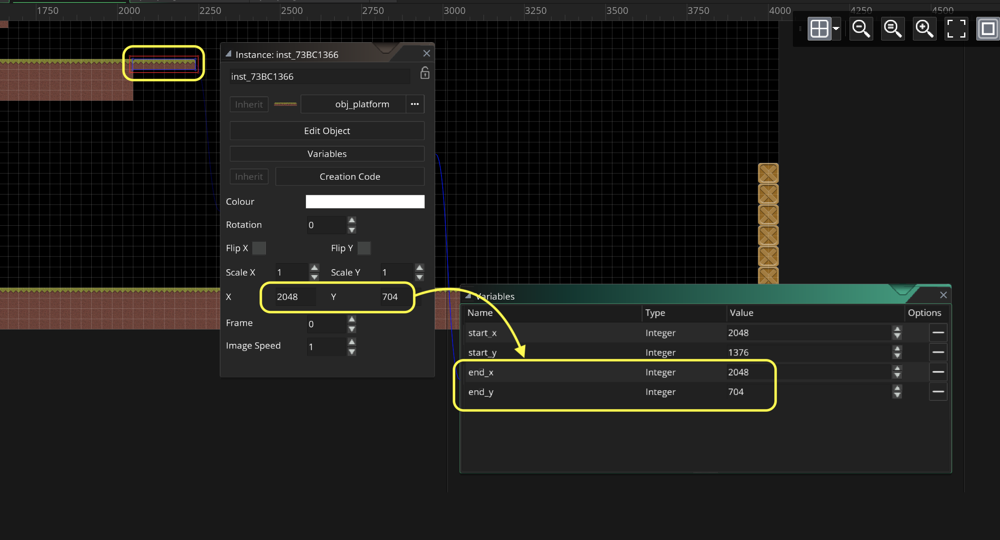
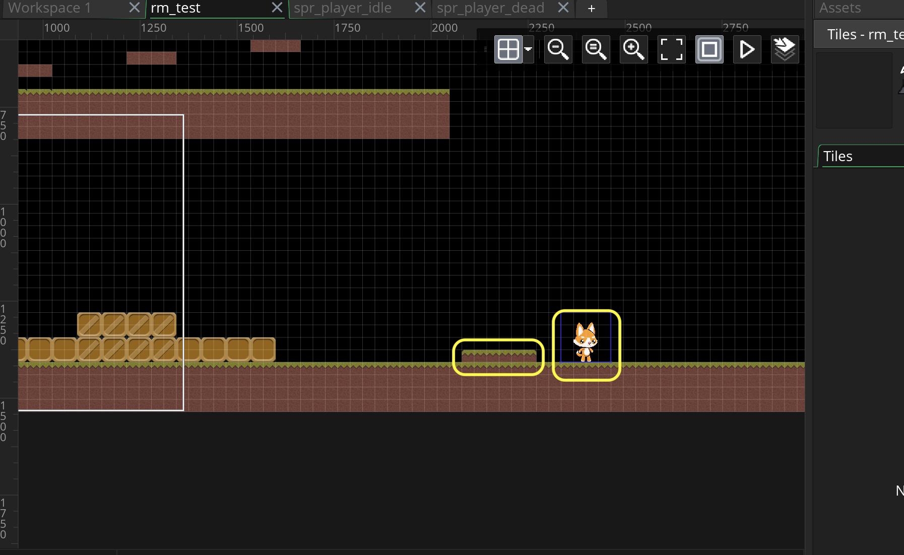
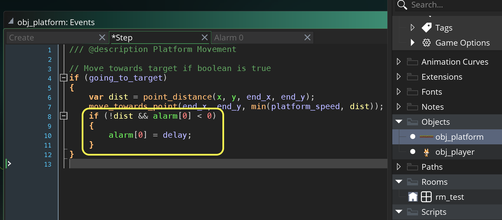
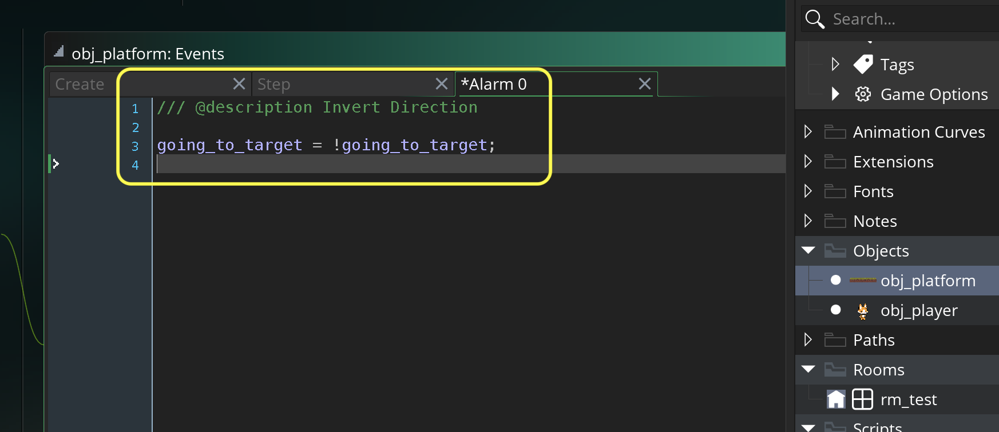
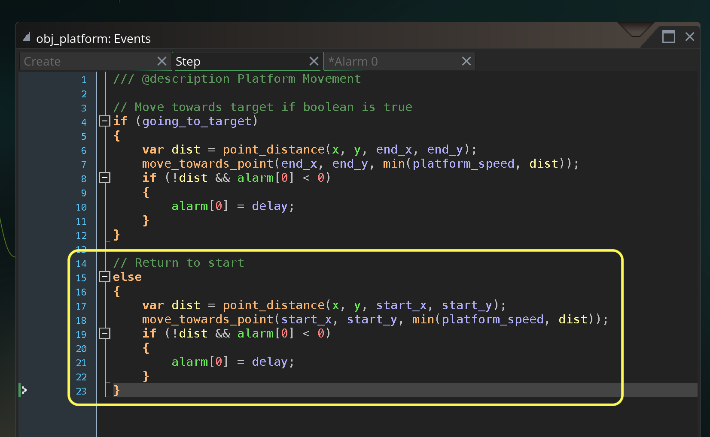
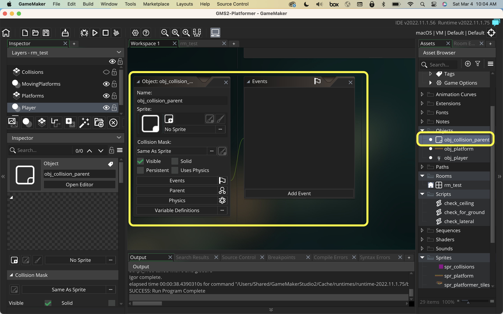
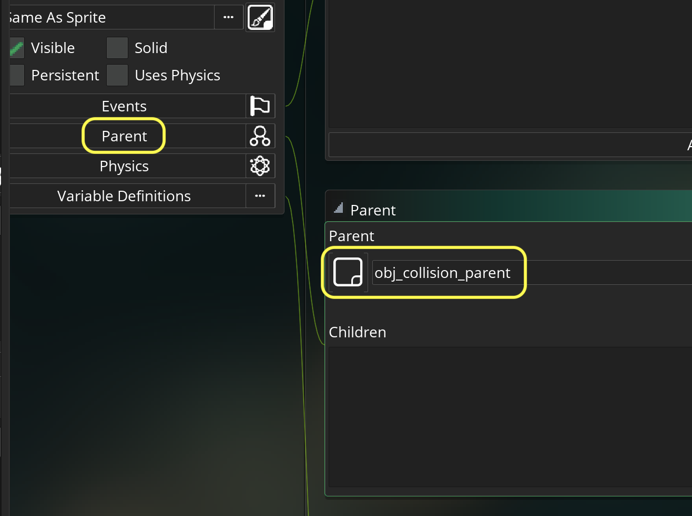

### Moving Platforms

[previous](../jumping-ceiling-ii/README.md#user-content-jumping-and-ceiling-collision-ii) • [home](../README.md#user-content-gms2-top-down-shooter) • [next](../)

Now another key feature of platformers is platforms that move.  We do have an issue though.  We cannot control our tiles like we do a game object and animation is limited.  We will need to use a game object to animate so we will have to add another entire section to our collisions for solid tiles.

 

---

##### `Step 1.`\|`SPCRK`|:small_blue_diamond:

Download [jumpPlatformSourceArt.png](images/jumpPlatformSourceArt.png). *Right click* on **Sprites** and select **New | Sprite** and name it `spr_platform`. Import the above image.

##### `Step 2.`\|`FHIU`|:small_blue_diamond: :small_blue_diamond: 

*Right click* on **Objects** and select **New | Object** and name it `obj_platform`. Set the **Sprite** to `spr_platform`. 

##### `Step 3.`\|`SPCRK`|:small_blue_diamond: :small_blue_diamond: :small_blue_diamond:

Press the **Variable Definitions** button on **obj_platform** as we want to have different start and end points on each platform in the level.  If we set it in the create event we would only be able to have one begining and end position.  We only need to use integers as you can't be placed in between pixels in the game.

##### `Step 4.`\|`SPCRK`|:small_blue_diamond: :small_blue_diamond: :small_blue_diamond: :small_blue_diamond:

 Press the <kbd>Add Event</kbd> and select a **Create** event. Create a variable to track the direction the platform is moving in (to target or back to start), the speed the platform moves at as well as the delay of how long it waits before switching to new direction.

##### `Step 5.`\|`SPCRK`| :small_orange_diamond:

Press the <kbd>Add Event</kbd> and select a **Step | Step** event. Then check to make sure we are moving towards the target.  Then lets stop the platform from overshooting its target.  Look at the distance between the current position and the target.  Then move the player toward the target with either the platform speed to the distance to the end whichever is smaller.

##### `Step 6.`\|`SPCRK`| :small_orange_diamond: :small_blue_diamond:

 Open up **rm_test** and add another **Instance** layer and call it `MovingPlatform`.  Drag **obj_platform** to the level and place it under the end of the platform we were at.

##### `Step 7.`\|`SPCRK`| :small_orange_diamond: :small_blue_diamond: :small_blue_diamond:

Double click the platform in the level and press the **Variables** button.  Click the pencil icon on **start_x** and **start_y**. Put in the room x and y position that you have. In my case it is an **x** of `2048` and **y** of `1376`.

##### `Step 8.`\|`SPCRK`| :small_orange_diamond: :small_blue_diamond: :small_blue_diamond: :small_blue_diamond:

Now move the platform to its final position.  Record its end position in **end_x** and **end_y**.

##### `Step 9.`\|`SPCRK`| :small_orange_diamond: :small_blue_diamond: :small_blue_diamond: :small_blue_diamond: :small_blue_diamond:

Move platform back to its starting position.  Move the player next to the platform.

##### `Step 10.`\|`SPCRK`| :large_blue_diamond:

Now *press* the <kbd>Play</kbd> button in the top menu bar to launch the game. Now the platform moves up to its target and there is no player platfrom collision.

https://user-images.githubusercontent.com/5504953/157665732-25129c80-e4d6-4937-bc0f-6d0a0d7a34b6.mp4

##### `Step 11.`\|`SPCRK`| :large_blue_diamond: :small_blue_diamond: 

Now we need to add a delay then return to the start.  So lets check to see if the `dist` variable is false (`0`) then we know that you have arrived to the destination.  The `alarm[n]` is set to -1 by default.  We only want to call it once otherwise it will keep moving the alarm forward.  In **Step Events** it is good practice to wrap an alarm in a conditional `if (alarm[0] < 0)`.  Then if both are true we trigger the alarm.

##### `Step 12.`\|`SPCRK`| :large_blue_diamond: :small_blue_diamond: :small_blue_diamond: 

Press the <kbd>Add Event</kbd> and select a **Alarm | Alarm 0** event.

Now lets invert the direction of the platform.  Our switch for this is 
`going_to_target`.  If we make it `!going_to_target`, this will change **true** to **false** or **false** to **true**. This means we do not care which direction it is going in, we will be going in the opposite direction after the not.

##### `Step 13.`\|`SPCRK`| :large_blue_diamond: :small_blue_diamond: :small_blue_diamond:  :small_blue_diamond: 

Now we add an `else` statement and do the exact same thing as the `if` except we change the target to `start_x` and `start_y`.

##### `Step 14.`\|`SPCRK`| :large_blue_diamond: :small_blue_diamond: :small_blue_diamond: :small_blue_diamond:  :small_blue_diamond: 

Now *press* the <kbd>Play</kbd> button in the top menu bar to launch the game. The platform now goes up and down and pauses.

##### `Step 15.`\|`SPCRK`| :large_blue_diamond: :small_orange_diamond: 

Now we may want to collide with multiple objects in our game.  So lets not check collisions with this one object. Lets create an object parent type that all object that want to collide with players can subscribe to.  

*Right click* on **Objects** and select **New | Object** and name it `obj_collision_parent`. DO NOT set a sprite.

##### `Step 16.`\|`SPCRK`| :large_blue_diamond: :small_orange_diamond:   :small_blue_diamond: 

Now go to **obj_platform** and press the <kbd>Parent</kbd> button.  Assign `obj_collision_parent`.

##### `Step 17.`\|`SPCRK`| :large_blue_diamond: :small_orange_diamond: :small_blue_diamond: :small_blue_diamond:

##### `Step 18.`\|`SPCRK`| :large_blue_diamond: :small_orange_diamond: :small_blue_diamond: :small_blue_diamond: :small_blue_diamond:

##### `Step 19.`\|`SPCRK`| :large_blue_diamond: :small_orange_diamond: :small_blue_diamond: :small_blue_diamond: :small_blue_diamond: :small_blue_diamond:

##### `Step 20.`\|`SPCRK`| :large_blue_diamond: :large_blue_diamond:

##### `Step 21.`\|`SPCRK`| :large_blue_diamond: :large_blue_diamond: :small_blue_diamond:

___

| [previous](../jumping-ceiling-ii/README.md#user-content-jumping-and-ceiling-collision-ii)| [home](../README.md#user-content-gms2-top-down-shooter) | [next](../)|
|---|---|---|
