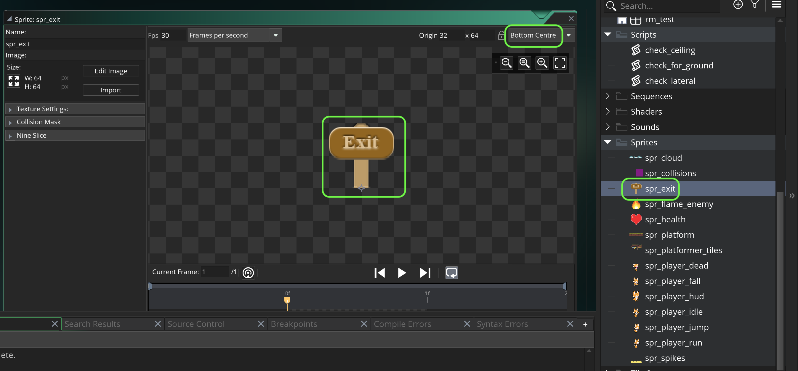
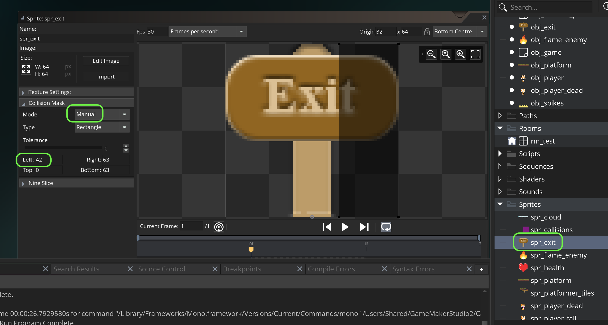
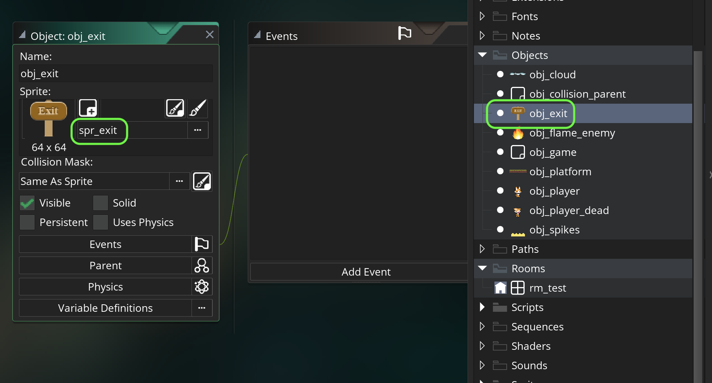
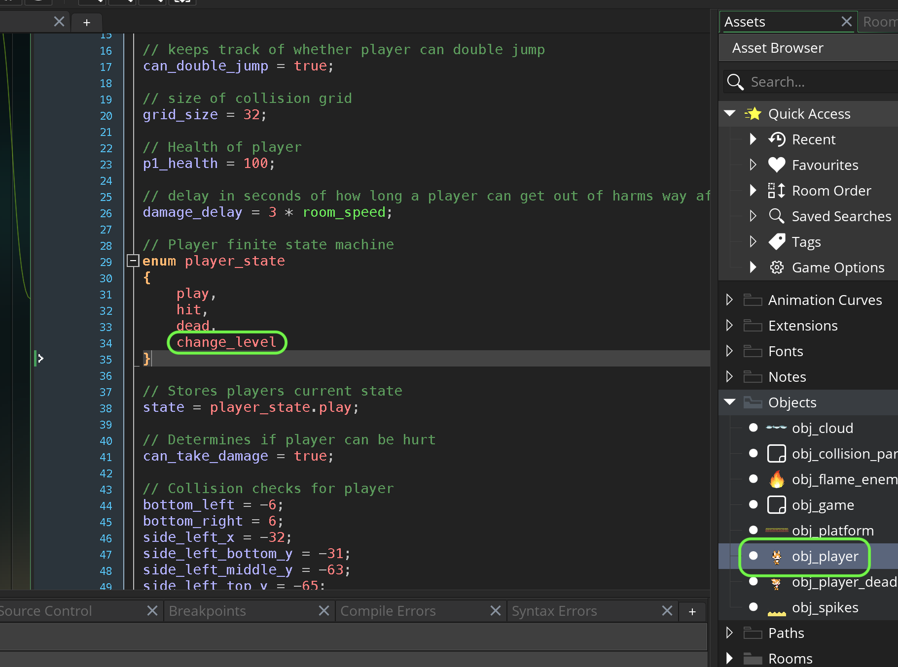
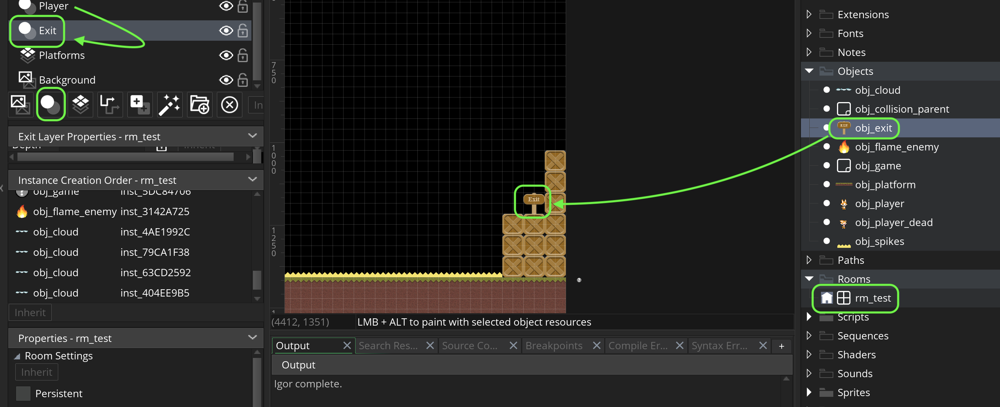
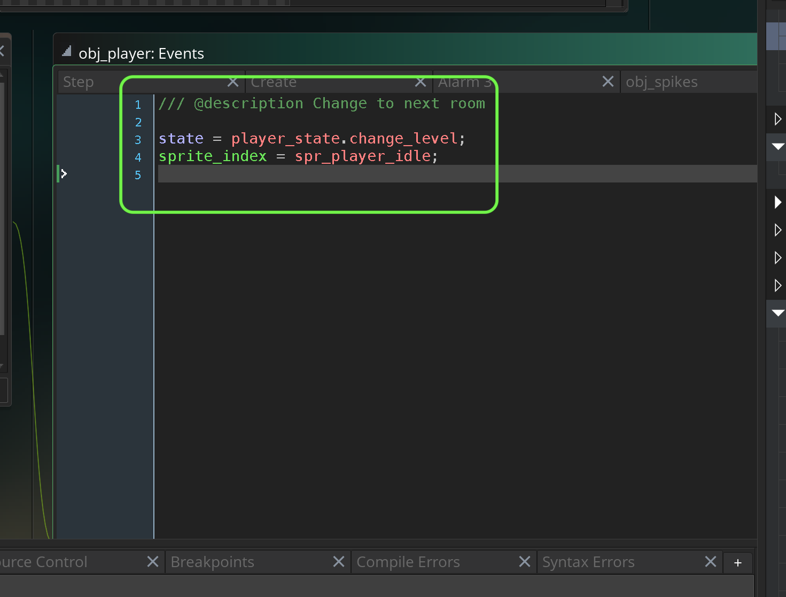
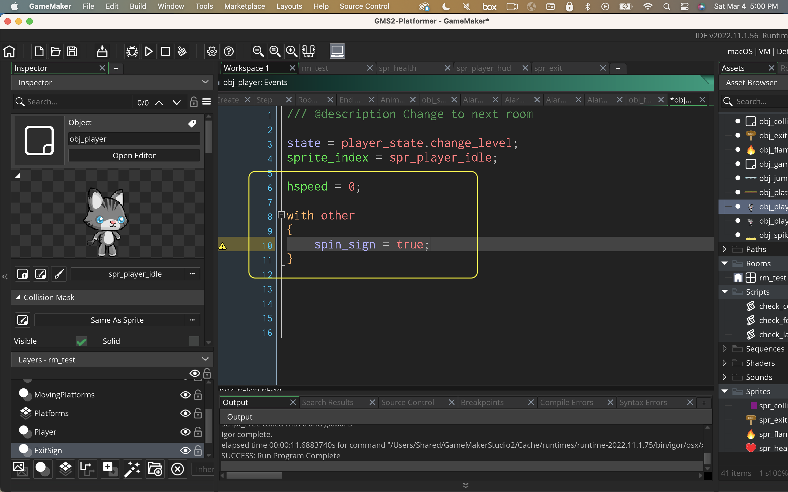

### Change Rooms

[previous](../clouds/README.md#user-content-jump-through-collisions) • [home](../README.md#user-content-gms2-top-down-shooter) • [next](../audio/README.md#user-content-audio)

Now lets allow the player to go from one room to another.

 

---

##### `Step 1.`\|`SPCRK`|:small_blue_diamond:

Now lets download an exit sign [spr_exit.png](images/spr_exit.png). *Right click* on **Sprites** and select **New | Sprite** and name it `spr_exit`. Change the **Origin** to `Bottom Center` as we will be animating sign when you cross it.

##### `Step 2.`\|`FHIU`|:small_blue_diamond: :small_blue_diamond: 

Change the **Collision Mask** to `Manual` and adjust **Left** to `42`. We only want the player to trigger the room change when they are well into the exit sign.

##### `Step 3.`\|`SPCRK`|:small_blue_diamond: :small_blue_diamond: :small_blue_diamond:

*Right click* on **Objects** and select **New | Object** and name it `obj_exit`. Set the **Sprite** to `spr_exit`.

##### `Step 4.`\|`SPCRK`|:small_blue_diamond: :small_blue_diamond: :small_blue_diamond: :small_blue_diamond:

Open up **obj_player | Create** event and add a **player_state** `change_level`.

##### `Step 5.`\|`SPCRK`| :small_orange_diamond:

Open up **rm_test** and add an **Instance** layer and name it `Exit`.  Make sure it is under player so the player is in front of the **Exit** sign. Drag `obj_exit` and place it in the far right hand side of the room.

##### `Step 6.`\|`SPCRK`| :small_orange_diamond: :small_blue_diamond:

Press the <kbd>Add Event</kbd> and select a **Collision | obj_exit** event. Change the player **state** to `player_state.change_level`.  Change the **sprite_index** to `spr_player_idle`.  This way the player will stop, no longer have control and go to an idle animation.

##### `Step 7.`\|`SPCRK`| :small_orange_diamond: :small_blue_diamond: :small_blue_diamond:

Now *press* the <kbd>Play</kbd> button in the top menu bar to launch the game. Now go to the end of the level and test the exit sign.  The player stops and can't be controlled right in front of the sign.

https://user-images.githubusercontent.com/5504953/158499701-264deeef-7af1-4b83-aa72-d674386736ac.mp4

##### `Step 8.`\|`SPCRK`| :small_orange_diamond: :small_blue_diamond: :small_blue_diamond: :small_blue_diamond:

Open up **Collision | obj_exit** event and add a neutralizing of the `hspeed`.  Also, lets change the sign by accessing it in the collision with `with (other)`.  We will then take the cosine of time which will return a value of -1 to 1 and make it look like the sign is rotating in 3d around the Y axis.  

##### `Step 9.`\|`SPCRK`| :small_orange_diamond: :small_blue_diamond: :small_blue_diamond: :small_blue_diamond: :small_blue_diamond:

##### `Step 10.`\|`SPCRK`| :large_blue_diamond:

##### `Step 11.`\|`SPCRK`| :large_blue_diamond: :small_blue_diamond: 

##### `Step 12.`\|`SPCRK`| :large_blue_diamond: :small_blue_diamond: :small_blue_diamond: 

##### `Step 13.`\|`SPCRK`| :large_blue_diamond: :small_blue_diamond: :small_blue_diamond:  :small_blue_diamond: 

##### `Step 14.`\|`SPCRK`| :large_blue_diamond: :small_blue_diamond: :small_blue_diamond: :small_blue_diamond:  :small_blue_diamond: 

##### `Step 15.`\|`SPCRK`| :large_blue_diamond: :small_orange_diamond: 

##### `Step 16.`\|`SPCRK`| :large_blue_diamond: :small_orange_diamond:   :small_blue_diamond: 

##### `Step 17.`\|`SPCRK`| :large_blue_diamond: :small_orange_diamond: :small_blue_diamond: :small_blue_diamond:

##### `Step 18.`\|`SPCRK`| :large_blue_diamond: :small_orange_diamond: :small_blue_diamond: :small_blue_diamond: :small_blue_diamond:

##### `Step 19.`\|`SPCRK`| :large_blue_diamond: :small_orange_diamond: :small_blue_diamond: :small_blue_diamond: :small_blue_diamond: :small_blue_diamond:

##### `Step 20.`\|`SPCRK`| :large_blue_diamond: :large_blue_diamond:

##### `Step 21.`\|`SPCRK`| :large_blue_diamond: :large_blue_diamond: :small_blue_diamond:

___

| [previous](../clouds/README.md#user-content-jump-through-collisions)| [home](../README.md#user-content-gms2-top-down-shooter) | [next](../audio/README.md#user-content-audio)|
|---|---|---|
