### Change Rooms

[previous](../clouds/README.md#user-content-jump-through-collisions) • [home](../README.md#user-content-gms2-platformer) • [next](../audio/README.md#user-content-audio)

Now lets allow the player to go from one room to another.

 

---

##### `Step 1.`\|`PLTFRMR`|:small_blue_diamond:

Open up **P4v**.  Select the top folder of the **GameMaker** project. Press the <kbd>Checkout</kbd> button.  Checkout out all files in P4V so that they are all writable (otherwise they will be read only and none of the changes will be saved). Select a **New** changelist and add a message describing the unit of work you will be performing. Press the <kbd>OK</kbd> button.

Open up the project you are working on in **GameMaker**. 

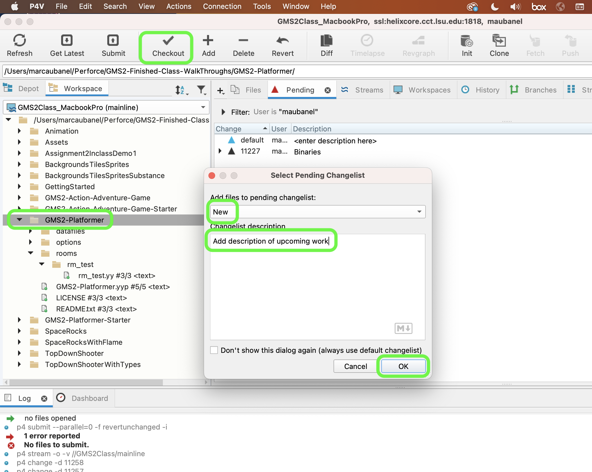

##### `Step 2.`\|`PLTFRMR`|:small_blue_diamond: :small_blue_diamond: 

Now lets download an exit sign [spr_exit.png](images/spr_exit.png). *Right click* on **Sprites** and select **New | Sprite** and name it `spr_exit`. Change the **Origin** to `Bottom Center` as we will be animating sign when you cross it.

##### `Step 3.`\|`PLTFRMR`|:small_blue_diamond: :small_blue_diamond: :small_blue_diamond:

Change the **Collision Mask** to `Manual` and adjust **Left** to `42`. We only want the player to trigger the room change when they are well into the exit sign.

##### `Step 4.`\|`PLTFRMR`|:small_blue_diamond: :small_blue_diamond: :small_blue_diamond: :small_blue_diamond:

*Right click* on **Objects** and select **New | Object** and name it `obj_exit`. Set the **Sprite** to `spr_exit`.

##### `Step 5.`\|`PLTFRMR`| :small_orange_diamond:

Open up **obj_player | Create** event and add a **player_state** `change_level`.

##### `Step 6.`\|`PLTFRMR`| :small_orange_diamond: :small_blue_diamond:

Open up **rm_test** and add an **Instance** layer and name it `Exit`.  Make sure it is under player so the player is in front of the **Exit** sign. Drag `obj_exit` and place it in the far right hand side of the room.

##### `Step 7.`\|`PLTFRMR`| :small_orange_diamond: :small_blue_diamond: :small_blue_diamond:

Press the <kbd>Add Event</kbd> and select a **Collision | obj_exit** event. Change the player **state** to `player_state.change_level`.  Change the **sprite_index** to `spr_player_idle`.  This way the player will stop, no longer have control and go to an idle animation.

##### `Step 8.`\|`PLTFRMR`| :small_orange_diamond: :small_blue_diamond: :small_blue_diamond: :small_blue_diamond:

Now *press* the <kbd>Play</kbd> button in the top menu bar to launch the game. Now go to the end of the level and test the exit sign.  The player stops and can't be controlled right in front of the sign.

https://user-images.githubusercontent.com/5504953/158499701-264deeef-7af1-4b83-aa72-d674386736ac.mp4

##### `Step 9.`\|`PLTFRMR`| :small_orange_diamond: :small_blue_diamond: :small_blue_diamond: :small_blue_diamond: :small_blue_diamond:

Now we want the sign to rotate when we go by it (or a face 2-d rotation).  Open up **obj_exit** and add a **Create** and **Step Event**. We will then take the sine of time which will return a value of -1 to 1 and make it look like the sign is rotating in 3d around the Y axis.   

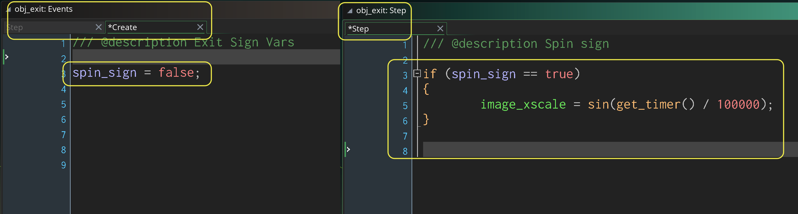

##### `Step 10.`\|`PLTFRMR`| :large_blue_diamond:

Open up **Collision | obj_exit** event and add a neutralizing of the `hspeed`.  Also, lets trigger the rotation with `with (other)`.  

##### `Step 11.`\|`PLTFRMR`| :large_blue_diamond: :small_blue_diamond: 

Now *press* the <kbd>Play</kbd> button in the top menu bar to launch the game. Run into the end and you should stop and the sign rotates.

https://user-images.githubusercontent.com/5504953/158501045-11a29f85-a0b7-448f-a42b-78646975da02.mp4

##### `Step 12.`\|`PLTFRMR`| :large_blue_diamond: :small_blue_diamond: :small_blue_diamond: 

*Right click* on **Rooms** and select **New | Room** and name it `rm_lvl_2`. Change the **Instance** layer name to `Player`.  Add a **Tile** layer and call it `Platforms` and place it under **Player**. Assign `ts_platformer_bkgs` to this new layer.

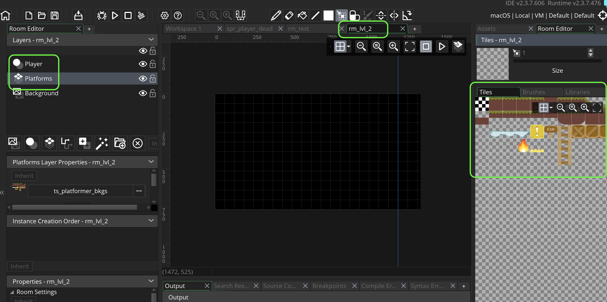

##### `Step 13.`\|`PLTFRMR`| :large_blue_diamond: :small_blue_diamond: :small_blue_diamond:  :small_blue_diamond: 

Add background tiles to layer.  Go crazy do what you like~!

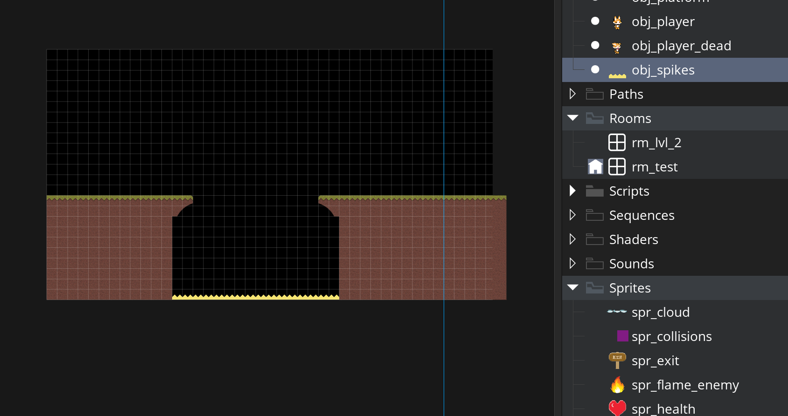

##### `Step 14.`\|`PLTFRMR`| :large_blue_diamond: :small_blue_diamond: :small_blue_diamond: :small_blue_diamond:  :small_blue_diamond: 

Add a new **Tile** layer called `Collisions`.  Assign `ts_collisions` to the layer.

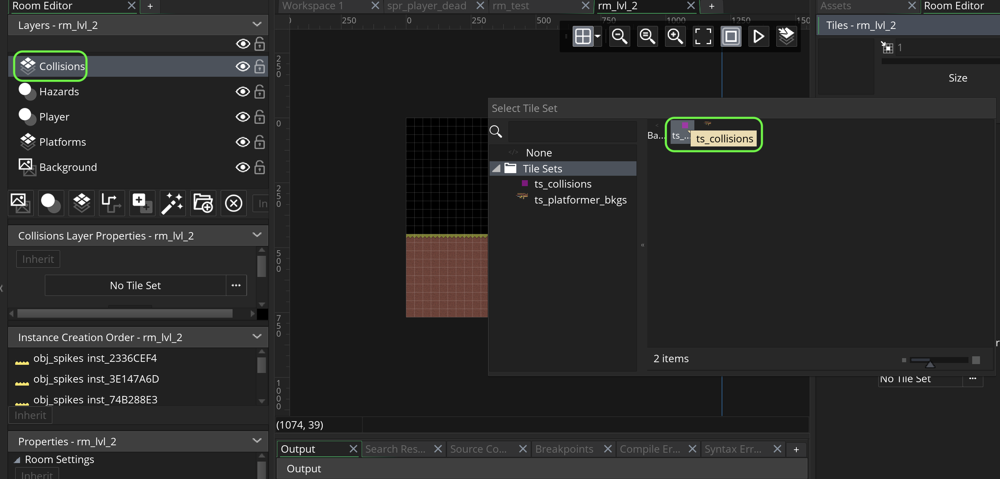

##### `Step 15.`\|`PLTFRMR`| :large_blue_diamond: :small_orange_diamond: 

Now add collisions on where you want the player to be able to jumnp to and walk to.

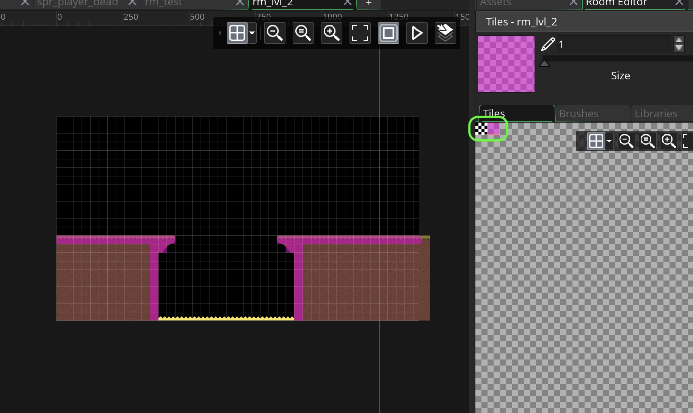

##### `Step 16.`\|`PLTFRMR`| :large_blue_diamond: :small_orange_diamond:   :small_blue_diamond: 

Add another **Instance** layer and call it `MovingPlatforms`.  Drag an `obj_platform` to the layer.  Double click the object and press the **Variables** button.  Then set the **start_x**, **start_y** and **end_y** to `448`.

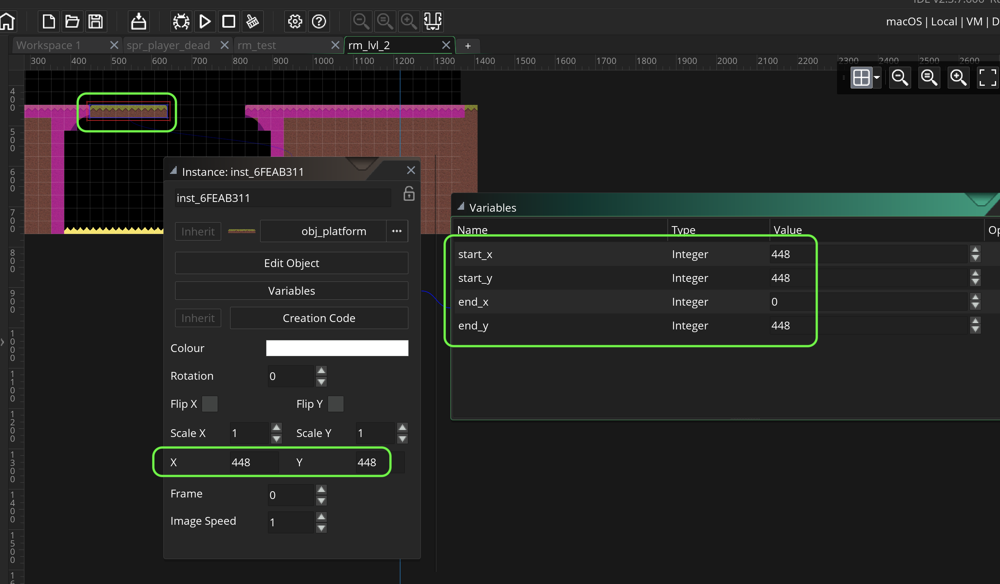

##### `Step 17.`\|`PLTFRMR`| :large_blue_diamond: :small_orange_diamond: :small_blue_diamond: :small_blue_diamond:

Now place the platform at the end and set the **end_x**.

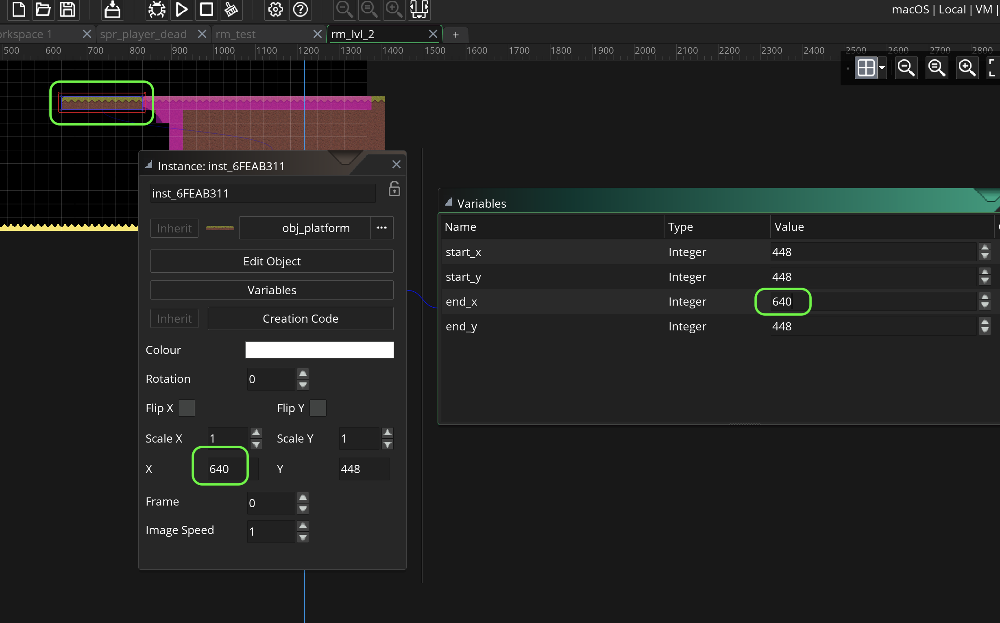

##### `Step 18.`\|`PLTFRMR`| :large_blue_diamond: :small_orange_diamond: :small_blue_diamond: :small_blue_diamond: :small_blue_diamond:

Now open up **obj_player | Collision | obj_exit** event and an alarm call to `alarm[4]`.

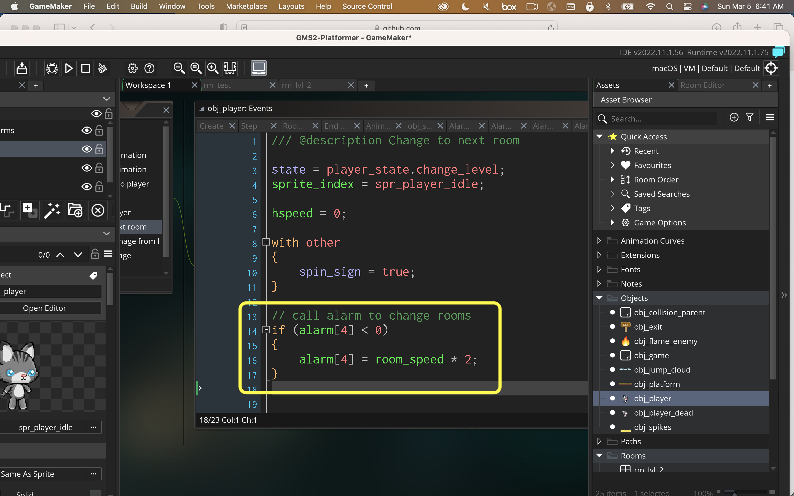

##### `Step 19.`\|`PLTFRMR`| :large_blue_diamond: :small_orange_diamond: :small_blue_diamond: :small_blue_diamond: :small_blue_diamond: :small_blue_diamond:

Now temporarilly drag a player into **rm_lvl_2** and place them in the starting point.  Record their **x** and **y** position for later. **DELETE** the player from the level.

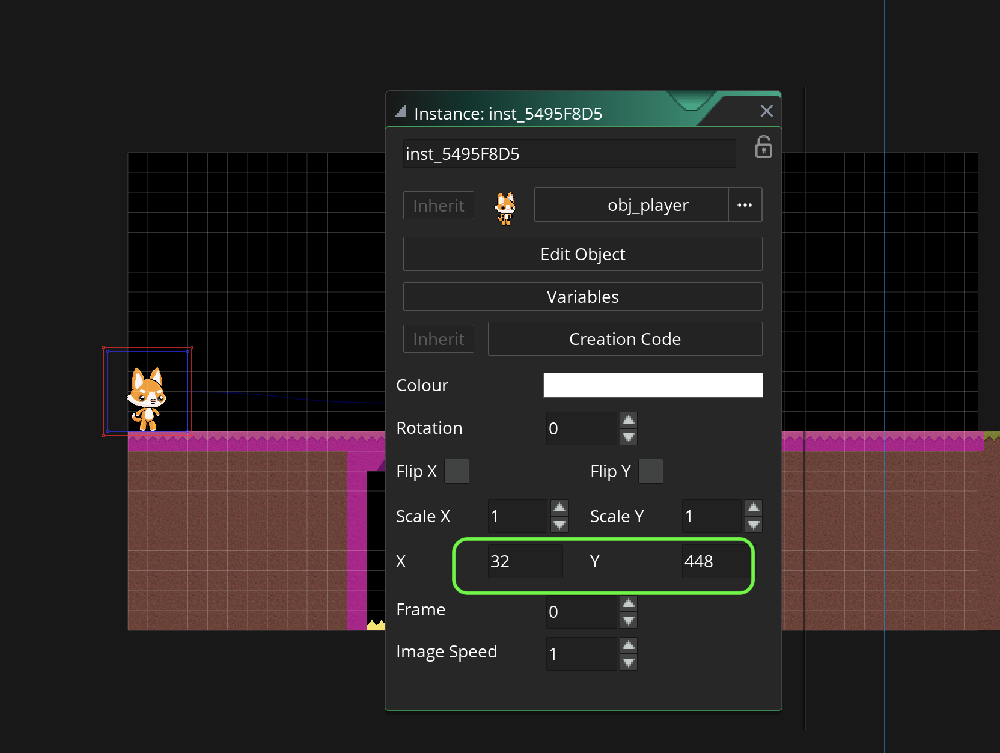

##### `Step 20.`\|`PLTFRMR`| :large_blue_diamond: :large_blue_diamond:

Press the <kbd>Add Event</kbd> and select a **Alarm | Alarm 4** event. Now check if we are in **rm_test**, if we are then go to the next level using the `room_goto(room)` function.  Then set the **x** and the **y** to the values you recorded in the previous step (make sure you deleted the player).  Change the player state back to `player_state.play`.

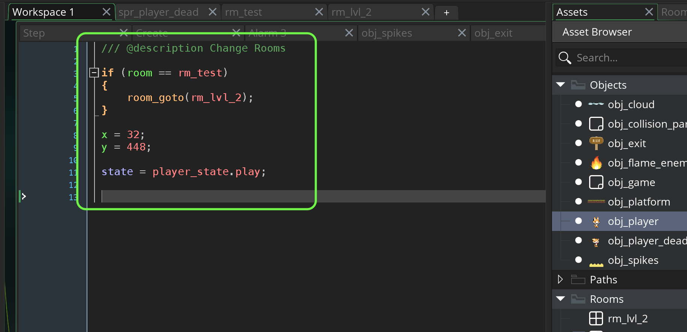

##### `Step 21.`\|`PLTFRMR`| :large_blue_diamond: :large_blue_diamond: :small_blue_diamond:

Now we want the player to keep its health when it changes level.  So we need to have the player go from level to level.  We do this by opening **obj_player** and setting `Persistent` to `true`.

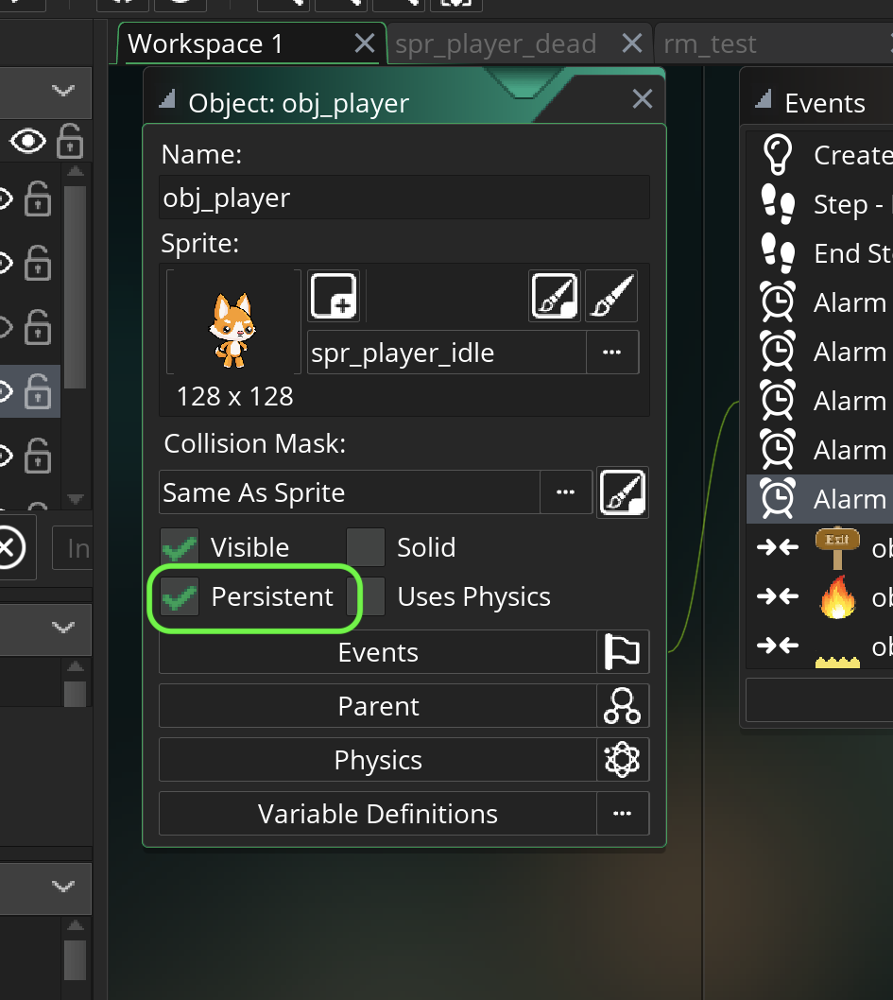

##### `Step 22.`\|`PLTFRMR`| :large_blue_diamond: :large_blue_diamond: :small_blue_diamond: :small_blue_diamond:

Now *press* the <kbd>Play</kbd> button in the top menu bar to launch the game. Now the level change should work perfectly as planned!

https://user-images.githubusercontent.com/5504953/158508214-83a2d9b3-f361-4677-bb2f-8d308e671305.mp4

Select the **File | Save Project**, then press **File | Quit** (PC) **Game Maker | Quit** on Mac to make sure everything in the game is saved.

##### `Step 23.`\|`PLTFRMR`| :large_blue_diamond: :large_blue_diamond: :small_blue_diamond: :small_blue_diamond: :small_blue_diamond:

Open up **P4V**.  Select the top folder and press the **Add** button.  We want to add all the new files we created during this last session.  Add these files to the last change list you used at the begining of the session. Make sure the message accurately represents what you have done. Press the <kbd>OK</kbd> button.

##### `Step 24.`\|`PLTFRMR`| :large_blue_diamond: :large_blue_diamond: :small_blue_diamond: :small_blue_diamond: :small_blue_diamond: :small_blue_diamond:

Now you can submit the changelist by pressing both <kbd>Submit</kbd> buttons.

<!--  -->

| [previous](../clouds/README.md#user-content-jump-through-collisions)| [home](../README.md#user-content-gms2-platformer) | [next](../audio/README.md#user-content-audio)|
|---|---|---|
