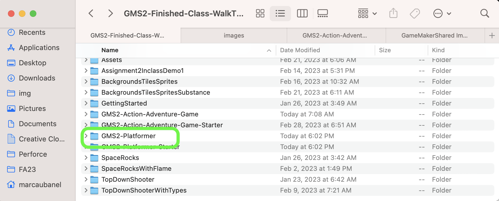
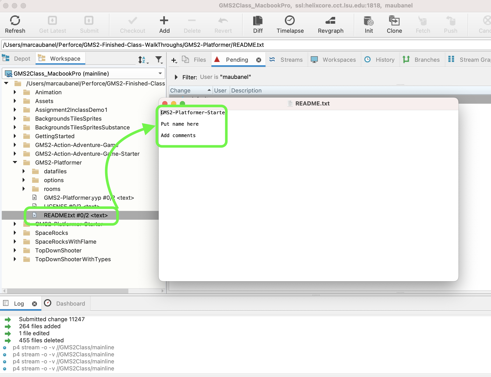
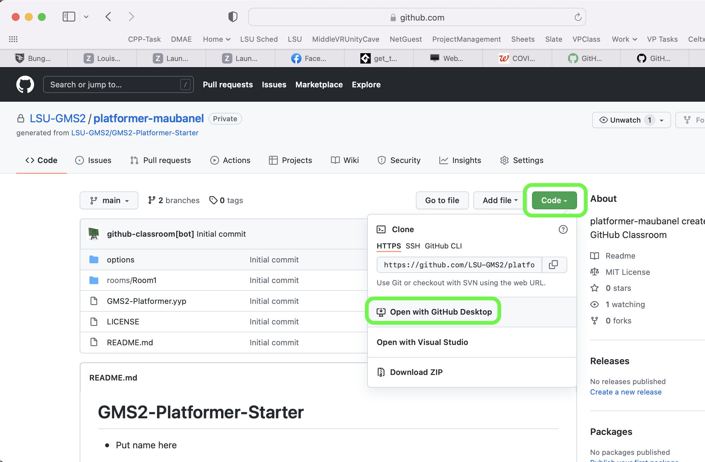
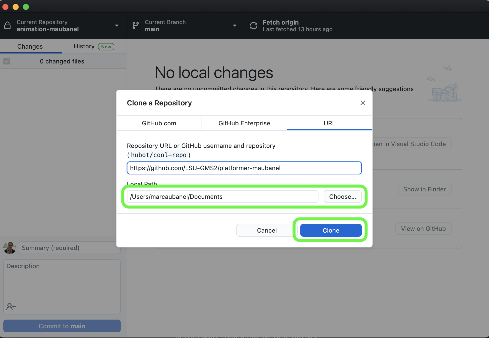
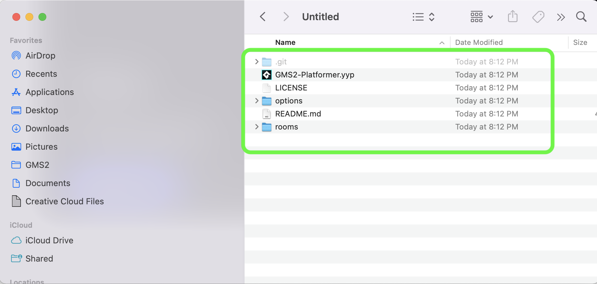
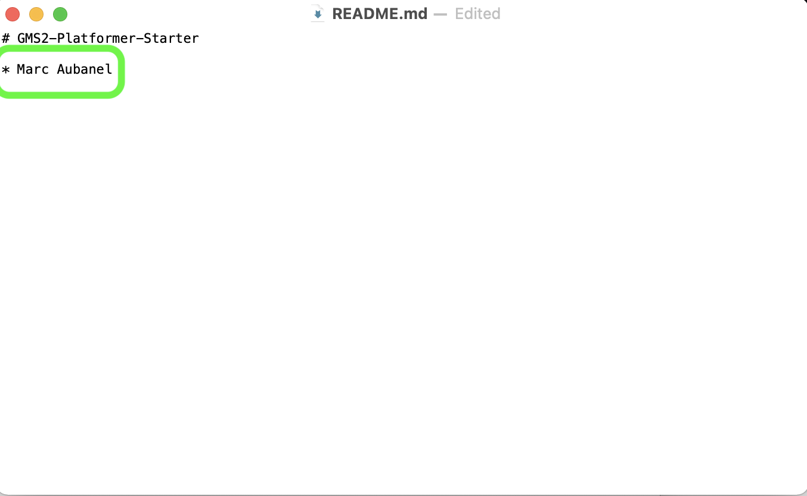
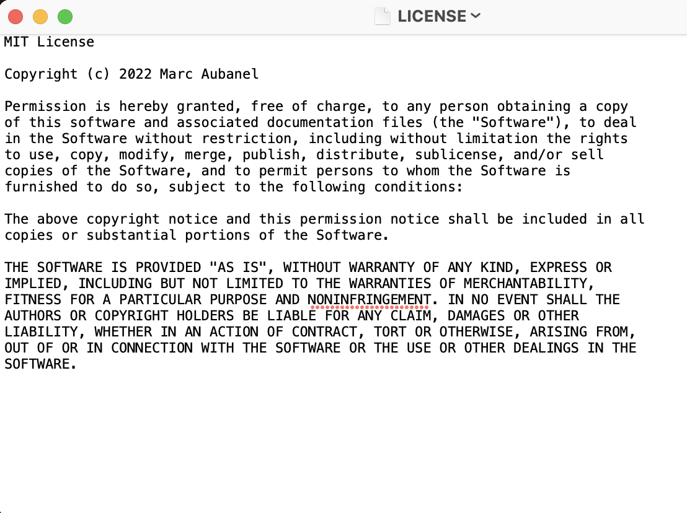
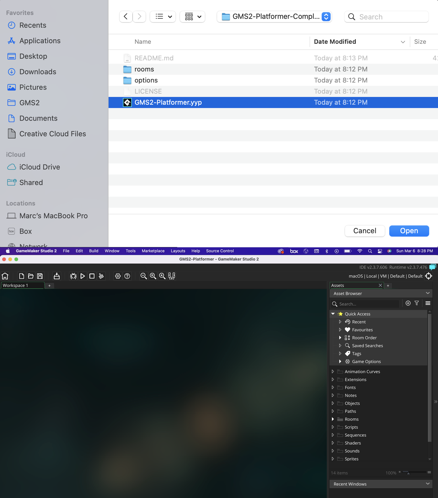
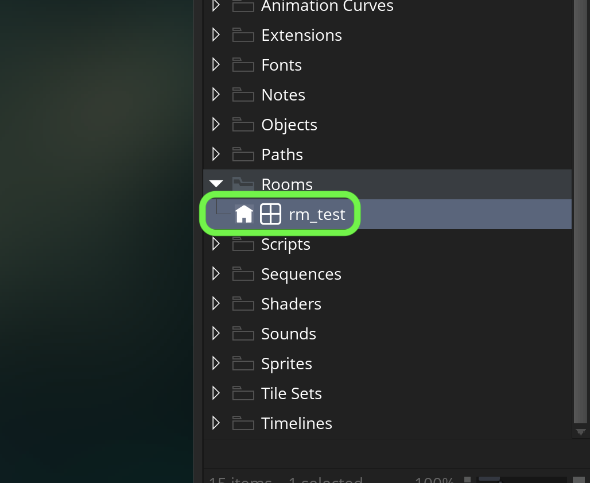

### Setting Up

[home](../README.md#user-content-gms2-platformer) • [next](../background-tiles/README.md#user-content-background-tiles)

Lets get set up so we can start creating the foundation for a platformer

 

---

##### `Step 1.`\|`PLTFRMR`|:small_blue_diamond:

You will have a new folder called **GMS2-Platformer**. If you open it you will find that I have a project that is ready to go with some artwork and scripts to help get you started faster.

##### `Step 2.`\|`PLTFRMR`|:small_blue_diamond: :small_blue_diamond: 

You have a **README.txt** file that you can add your name to. As you are completing the walk through, you can add comments about the walk through.

##### `Step 3.`\|`PLTFRMR`|:small_blue_diamond: :small_blue_diamond: :small_blue_diamond:

Double click the **GMS2-Platformer.yyp** up and you will see the **GameMaker IDE**.

##### `Step 4.`\|`PLTFRMR`|:small_blue_diamond: :small_blue_diamond: :small_blue_diamond: :small_blue_diamond:

Press the <kbd>Choose</kbd> button and select the folder you want to put the project in.  When it is set, press the <kbd>Clone</kbd> button.

##### `Step 5.`\|`PLTFRMR`| :small_orange_diamond:

Now navigate to the folder that you just cloned.  You should have a list of files the same as the below photo.

##### `Step 6.`\|`PLTFRMR`| :small_orange_diamond: :small_blue_diamond:

Open the **README.md** in a text editor and add your name to the repo.

##### `Step 7.`\|`PLTFRMR`| :small_orange_diamond: :small_blue_diamond: :small_blue_diamond:

I chose to publish the walk through under an MIT open source license.  You can choose to make a change for your project if you like.

##### `Step 8.`\|`PLTFRMR`| :small_orange_diamond: :small_blue_diamond: :small_blue_diamond: :small_blue_diamond:

Now double click the `.yyp` file to launch the game.  It iwll open a blank **GML** project in GameMaker.

##### `Step 9.`\|`PLTFRMR`| :small_orange_diamond: :small_blue_diamond: :small_blue_diamond: :small_blue_diamond: :small_blue_diamond:

Now lets rename the room to `rm_test`.  Now we are ready to begin.

___

<!--  -->

| [home](../README.md#user-content-gms2-platformer) | [next](../background-tiles/README.md#user-content-background-tiles)|
|---|---|
