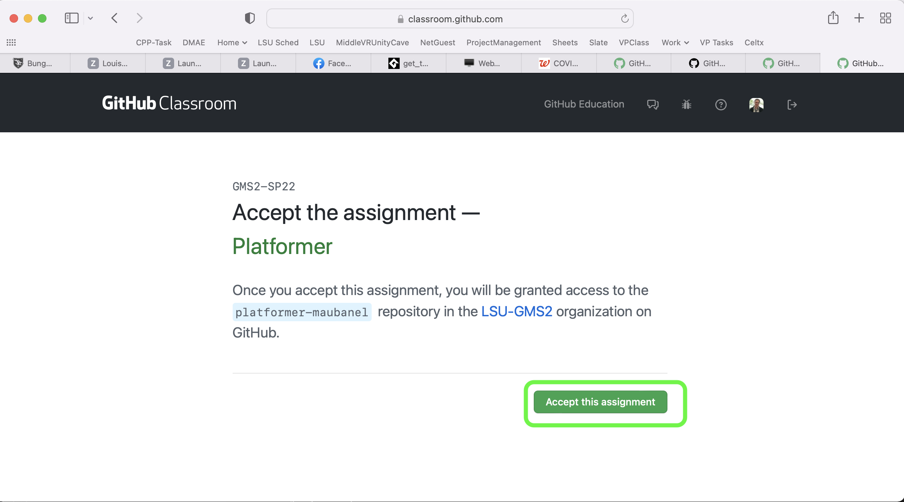
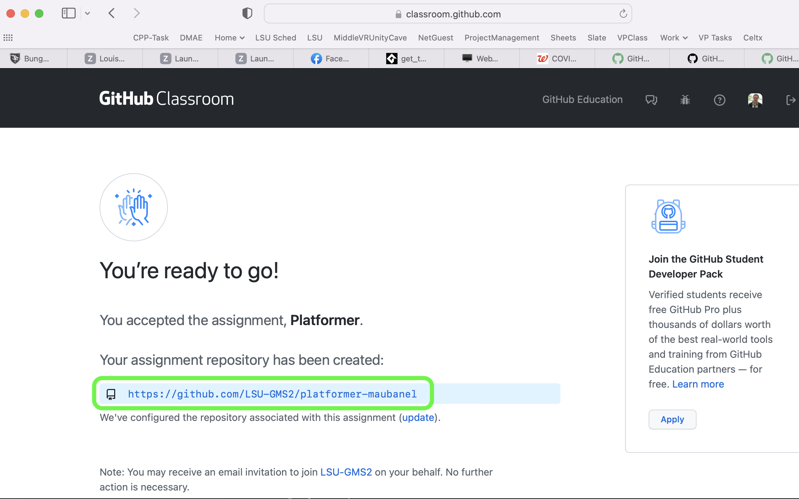

### Setting Up

[home](../README.md#user-content-gms2-top-down-shooter) • [next](../background-tiles/README.md#user-content-background-tiles)

Lets get set up so we can start creating the foundation for a platformer

 

---

##### `Step 1.`\|`SPCRK`|:small_blue_diamond:

Lets start by cloning a new project.  Go to [GitHub Classroom - GMS2-Platformer](https://classroom.github.com/a/GkXEdEOw). Press the <kbd>Accept this Assignment</kbd> button.

##### `Step 2.`\|`FHIU`|:small_blue_diamond: :small_blue_diamond: 

You will be taken to a page that says to wait for hte assignment to be prepared.  Refresh the web browser and you should see a link to your new repository.

##### `Step 3.`\|`SPCRK`|:small_blue_diamond: :small_blue_diamond: :small_blue_diamond:

Press the <kbd>Code</kbd> button and select **Open with GitHub Desktop**.

##### `Step 4.`\|`SPCRK`|:small_blue_diamond: :small_blue_diamond: :small_blue_diamond: :small_blue_diamond:

Press the <kbd>Choose</kbd> button and select the folder you want to put the project in.  When it is set, press the <kbd>Clone</kbd> button.

##### `Step 5.`\|`SPCRK`| :small_orange_diamond:

Now navigate to the folder that you just cloned.  You should have a list of files the same as the below photo.

##### `Step 6.`\|`SPCRK`| :small_orange_diamond: :small_blue_diamond:

Open the **README.md** in a text editor and add your name to the repo.

##### `Step 7.`\|`SPCRK`| :small_orange_diamond: :small_blue_diamond: :small_blue_diamond:

I chose to publish the walk through under an MIT open source license.  You can choose to make a change for your project if you like.

##### `Step 8.`\|`SPCRK`| :small_orange_diamond: :small_blue_diamond: :small_blue_diamond: :small_blue_diamond:

Now double click the `.yyp` file to launch the game.  It iwll open a blank **GML** project in GameMaker.

##### `Step 9.`\|`SPCRK`| :small_orange_diamond: :small_blue_diamond: :small_blue_diamond: :small_blue_diamond: :small_blue_diamond:

Now lets rename the room to `rm_test`.  Now we are ready to begin.

___

| [home](../README.md#user-content-gms2-top-down-shooter) | [next](../background-tiles/README.md#user-content-background-tiles)|
|---|---|
