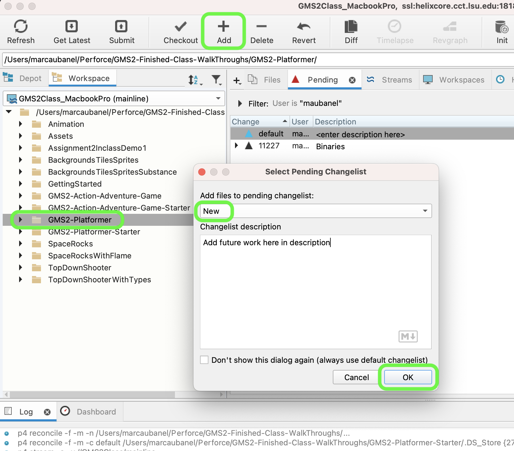

### Setting Up

[home](../README.md#user-content-gms2-platformer) • [next](../background-tiles/README.md#user-content-background-tiles)

Lets get set up so we can start creating the foundation for a platformer

 

---

##### `Step 1.`\|`PLTFRMR`|:small_blue_diamond:

You will have a new folder called **GMS2-Platformer**. If you open it you will find that I have a project that is ready to go with some artwork and scripts to help get you started faster.

##### `Step 2.`\|`PLTFRMR`|:small_blue_diamond: :small_blue_diamond: 

You have a **README.txt** file that you can add your name to. As you are completing the walk through, you can add comments about the walk through.

##### `Step 3.`\|`PLTFRMR`|:small_blue_diamond: :small_blue_diamond: :small_blue_diamond:

Double click the **GMS2-Platformer.yyp** up and you will see the **GameMaker IDE**.

##### `Step 4.`\|`PLTFRMR`|:small_blue_diamond: :small_blue_diamond: :small_blue_diamond: :small_blue_diamond:

Press the <kbd>Play</kbd> button and you will have an empty room.  This is just an empty gamemaker project.

##### `Step 5.`\|`PLTFRMR`| :small_orange_diamond:

Now lets rename the room to `rm_test`.  Now we are ready to begin.

##### `Step 6.`\|`PLTFRMR`| :small_orange_diamond: :small_blue_diamond:

Select the **File | Save Project**, then press **File | Quit** (PC) **Game Maker | Quit** on Mac to make sure everything in the game is saved.

##### `Step 7.`\|`PLTFRMR`| :small_orange_diamond: :small_blue_diamond: :small_blue_diamond:

Open up **P4V**.  Select the top folder and press the **Add** button.  We want to add all the new files we created during this last session.  Add these files to the last change list you used at the begining of the session. Make sure the message accurately represents what you have done. Press the <kbd>OK</kbd> button.

##### `Step 8.`\|`PLTFRMR`| :small_orange_diamond: :small_blue_diamond: :small_blue_diamond: :small_blue_diamond:

Now you can submit the changelist by pressing both <kbd>Submit</kbd> buttons.

<!--  -->

| [home](../README.md#user-content-gms2-platformer) | [next](../background-tiles/README.md#user-content-background-tiles)|
|---|---|
