### Setup Player

[previous](../background-tiles/README.md#user-content-background-tiles) • [home](../README.md#user-content-gms2-top-down-shooter) • [next](../gravity-collision/README.md#user-content-gravity-and-ground-collision)

Lets bring in a sprite sheet from the internet and set it up for our needs.

 

---

##### `Step 1.`\|`PLTFRMR`|:small_blue_diamond:

Download the free [Game Art 2D Dog Sprite](https://www.gameart2d.com/cat-and-dog-free-sprites.html) from gameart2d.com.  This will give us what we need to finish our prototype.  You can replace it with your own character after as long as it conforms to the same dimensions (64 wide by 96 tall). Press the **Free Download** button.

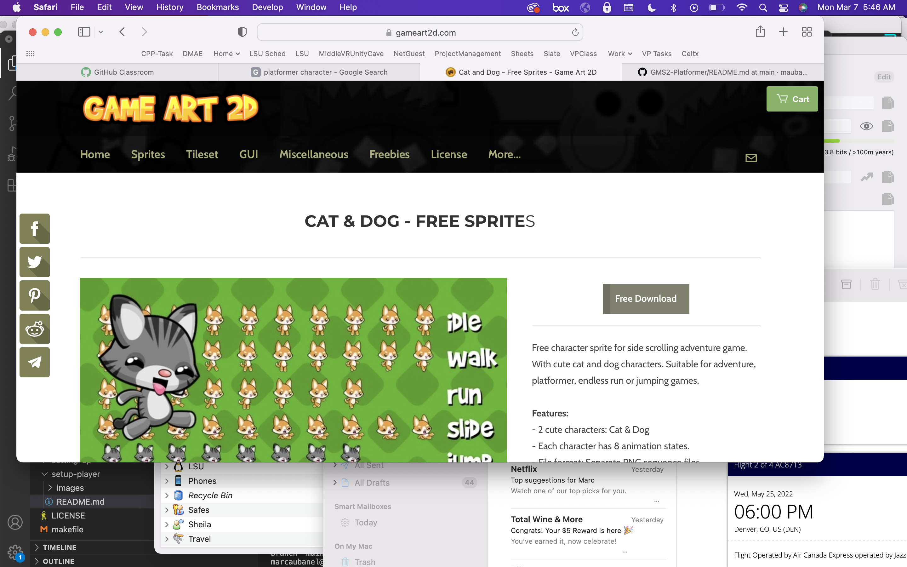

##### `Step 2.`\|`PLTFRMR`|:small_blue_diamond: :small_blue_diamond: 

Now you should have downloaded a file called **catndog.zip**.  Uncompress it and go into the **png | dog** folder.  We will start by adjusting the **Idle** animations.

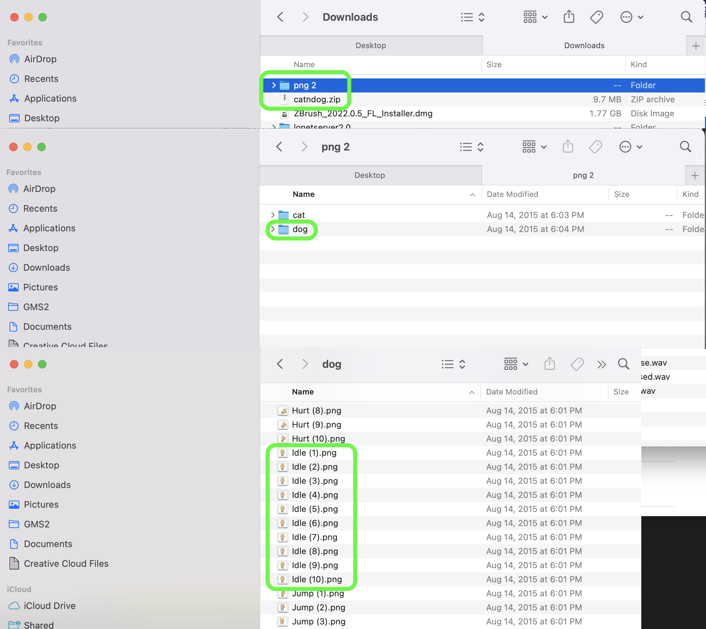

##### `Step 3.`\|`PLTFRMR`|:small_blue_diamond: :small_blue_diamond: :small_blue_diamond:

We have 10 frames of animation.  It will be easier to position the sprite the way we want to in Photoshop as opposed to **GameMaker**.  In GMS2 we cannot move the files for all frames. We want to load all the files of an animation as separate layers in a single **Photoshop** file.  We can do this by selecting **File | Scripts | Load Files Into Stack**. Press the <kbd>Open</kbd> button.

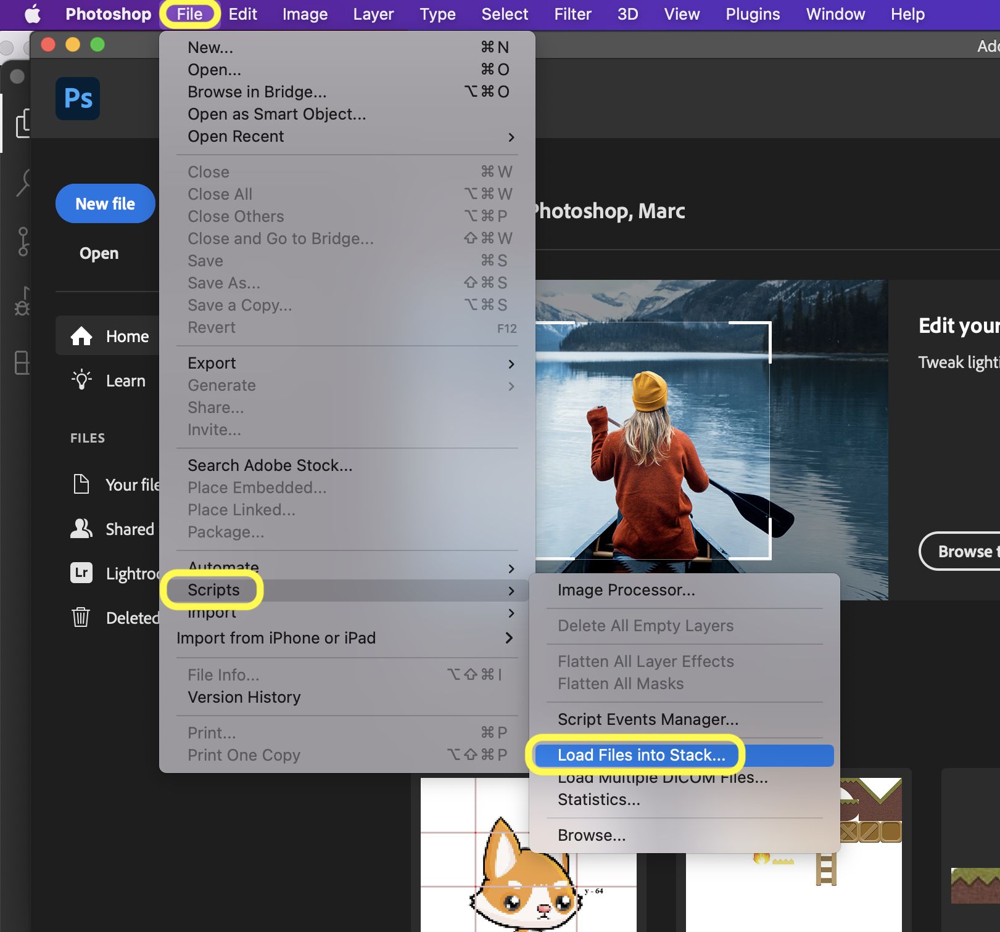

##### `Step 4.`\|`PLTFRMR`|:small_blue_diamond: :small_blue_diamond: :small_blue_diamond: :small_blue_diamond:

Now select the folder you downloaded and select the 10 idle frames of the animation.

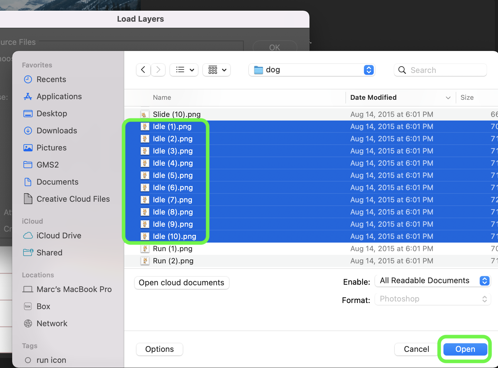

##### `Step 5.`\|`PLTFRMR`| :small_orange_diamond:

Now select all 10 idle frames and press the <kbd>Open</kbd> button.

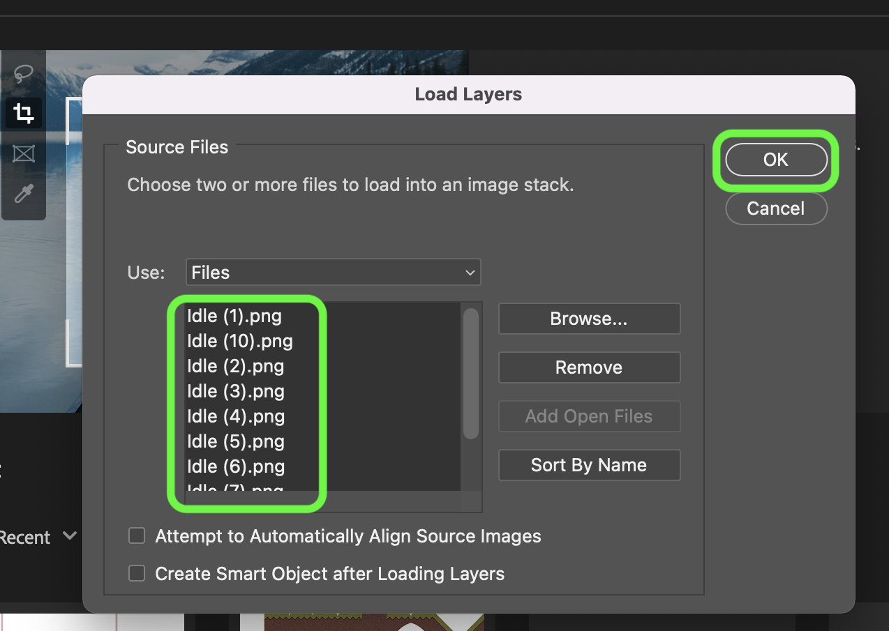

##### `Step 6.`\|`PLTFRMR`| :small_orange_diamond: :small_blue_diamond:

Select all 10 layers and grab the move tool.  Move the player down with all frames selected so that the feet touch the very bottom of the frame (don't go too far but don't leave any dmpety alpha pixels between the player's foot and the ground).

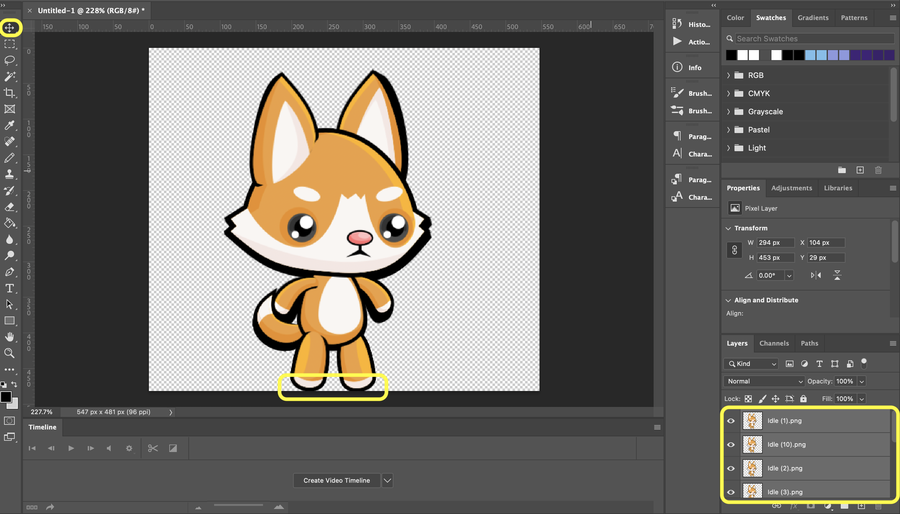

##### `Step 7.`\|`PLTFRMR`| :small_orange_diamond: :small_blue_diamond: :small_blue_diamond:

Left click on the ruler and add a guide to 273.5 the middle of the sprite.  Notice the player is off center.

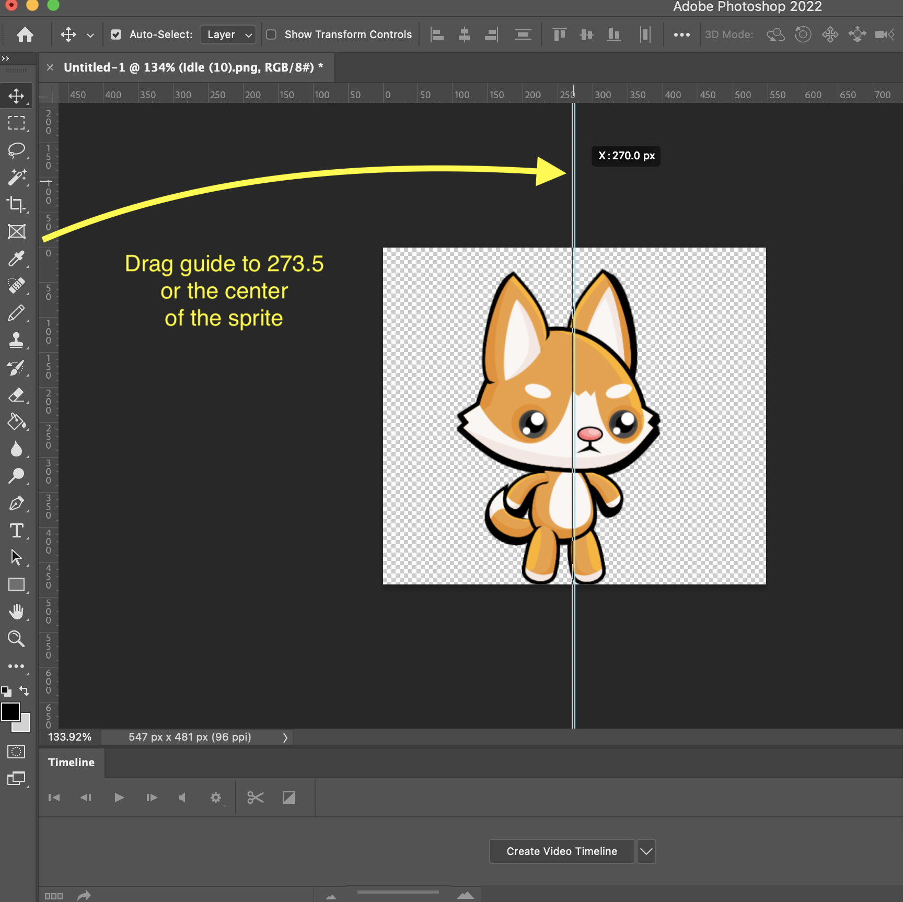

##### `Step 8.`\|`PLTFRMR`| :small_orange_diamond: :small_blue_diamond: :small_blue_diamond: :small_blue_diamond:

Center the player so that the middle of the sprite hits right between two legs.  This way when we move left and right the player will mirror perfectly (othewise there will be a jump).

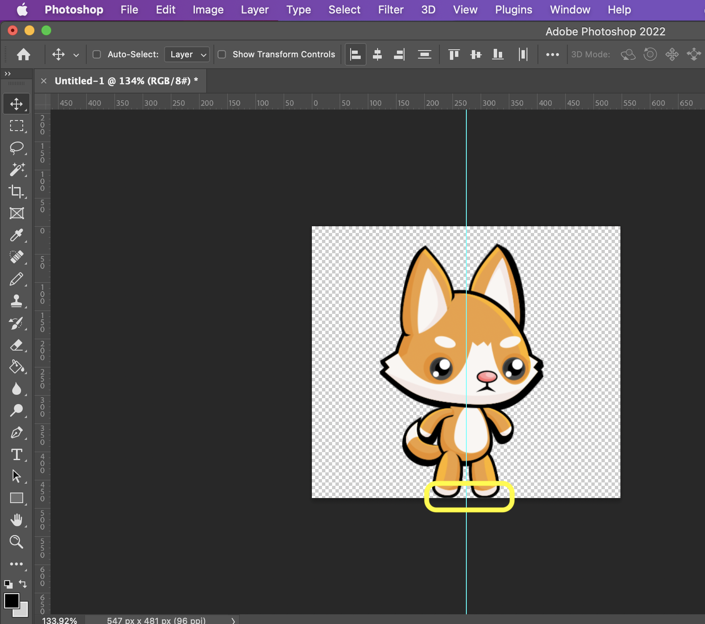

##### `Step 9.`\|`PLTFRMR`| :small_orange_diamond: :small_blue_diamond: :small_blue_diamond: :small_blue_diamond: :small_blue_diamond:

Now we need to export the layers as separate files.  Select **File | Export | Layers to Files**. Select a **Desitnation** directory, use the **Prefix** `spr_` and select a `PNG-24` type.  Press the <kbd>Run</kbd> button.

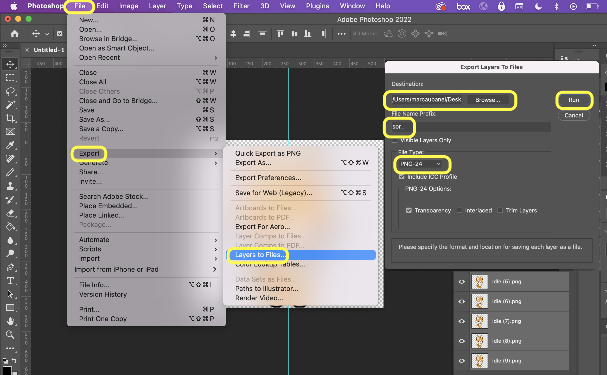

##### `Step 10.`\|`PLTFRMR`| :large_blue_diamond:
You should have 10 idle sprite files in the folder you exported to that looks like this:

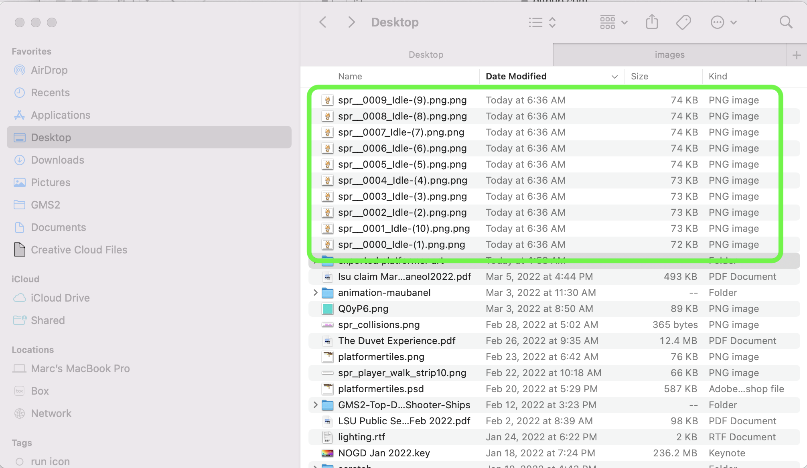

##### `Step 11.`\|`PLTFRMR`| :large_blue_diamond: :small_blue_diamond: 

Go back to **GameMaker**.  *Right click* on **Sprites** and select **New | Sprite** and name it `spr_player_idle`. Press the <kbd>Import</kbd> button and import all 10 frames.  Now adjust the framerate, I like `12` frames per second.  Play the animation and make sure it looks good.

https://user-images.githubusercontent.com/5504953/157036639-f5ac79c9-b449-4789-9169-24a7bb1668a1.mp4

##### `Step 12.`\|`PLTFRMR`| :large_blue_diamond: :small_blue_diamond: :small_blue_diamond: 

Press the <kbd>Resize sprite</kbd> button.  Change the **Scale Image | Width** to `128`.  Press the `Apply` button.

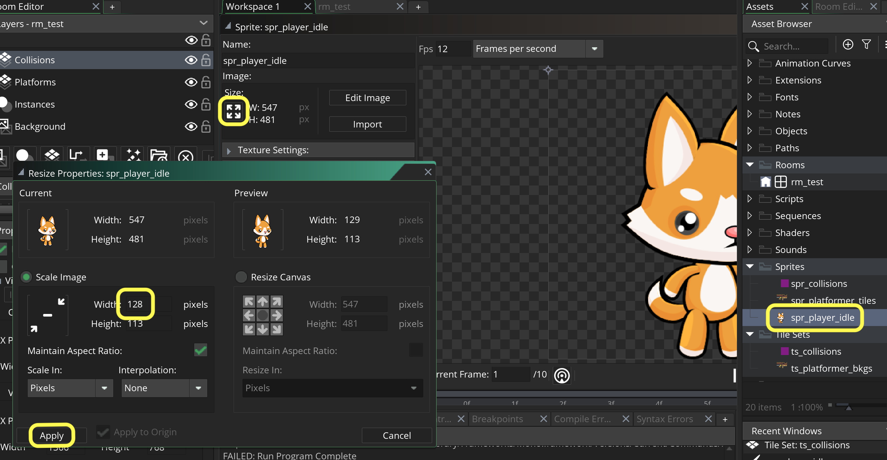

##### `Step 13.`\|`PLTFRMR`| :large_blue_diamond: :small_blue_diamond: :small_blue_diamond:  :small_blue_diamond: 

Lets make the sprite square to simplify our math.  Press the <kbd>Resize sprite</kbd> button. Now select **Resize Canvas | Height** to `128`.  Make sure you press the **Down** arrow so that the feet stay at the bottom of the frame.

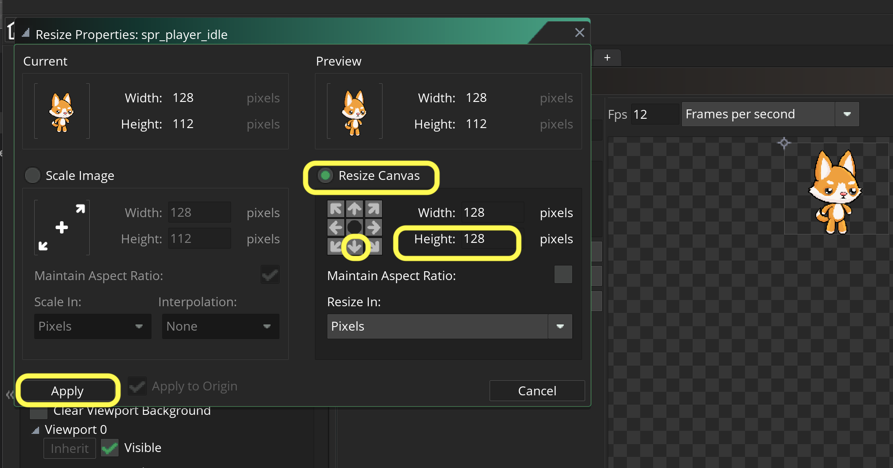

##### `Step 14.`\|`PLTFRMR`| :large_blue_diamond: :small_blue_diamond: :small_blue_diamond: :small_blue_diamond:  :small_blue_diamond: 

Now we should have our idle animation at the right size for this prototype.

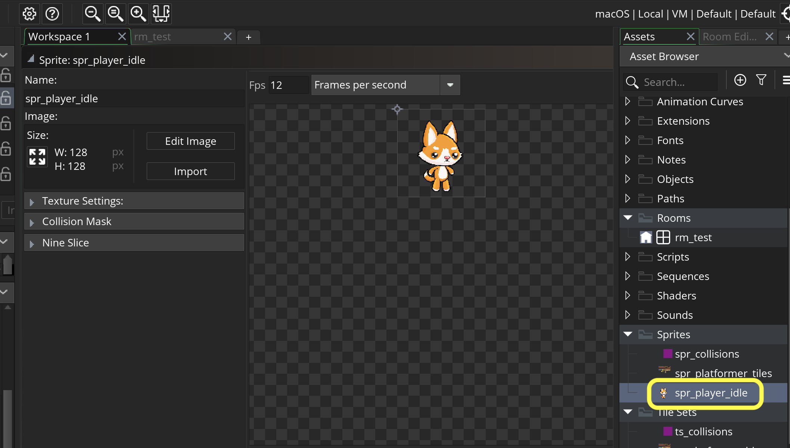

##### `Step 15.`\|`PLTFRMR`| :large_blue_diamond: :small_orange_diamond: 

*Right click* on **Objects** and select **New | Object** and name it `obj_player`. Set the **Sprite** to `spr_player_idle`.

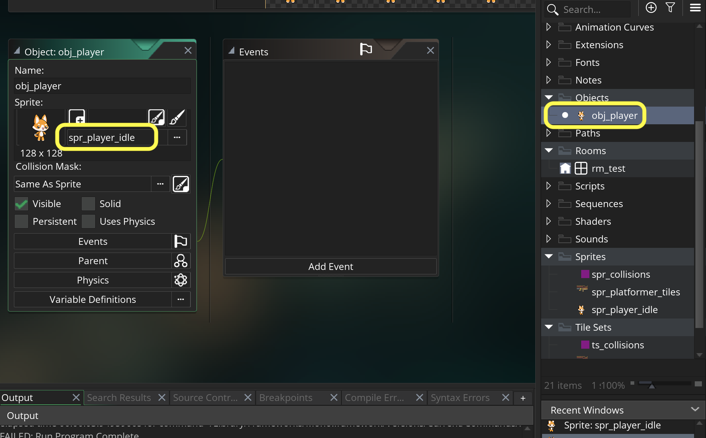

##### `Step 16.`\|`PLTFRMR`| :large_blue_diamond: :small_orange_diamond:   :small_blue_diamond: 

Open up **rm_test** and change the name of the **Instances** layer to `Player`. Drag the player into the room at the bottom left of the level.

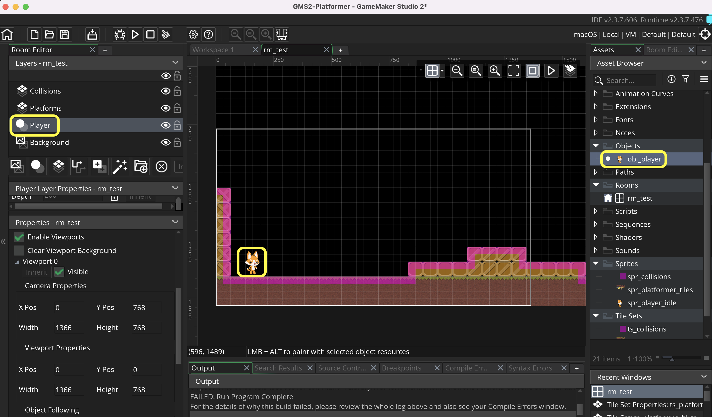

##### `Step 17.`\|`PLTFRMR`| :large_blue_diamond: :small_orange_diamond: :small_blue_diamond: :small_blue_diamond:

Now *press* the <kbd>Play</kbd> button in the top menu bar to launch the game. You will see a player idling!

https://user-images.githubusercontent.com/5504953/157048996-c62467b0-6112-40e1-9c26-59155c636611.mp4

##### `Step 18.`\|`PLTFRMR`| :large_blue_diamond: :small_orange_diamond: :small_blue_diamond: :small_blue_diamond: :small_blue_diamond:

Repeat the project and import `run (1).png` through `run (8)`. Import them into **Photoshop** with **File | Scripts | Load Files Into Stack** to bring them into one file in multiple layers.  Organize the layers in order of 1 through 8 then position the player at the very bottom of the frame and in the center.  Export each layer as a separate file with  **File | Export | Layers to Files**. Press the <kbd>Resize sprite</kbd> button.  

Open up **GameMaker** and *Right click* on **Sprites** and select **New | Sprite** and name it `spr_player run`. Change the **Scale Image | Width** to `128`.  Press the `Apply` button  Press the <kbd>Resize sprite</kbd> button. Now select **Resize Canvas | Height** to `128`.  Make sure you press the **Down** arrow so that the feet stay at the bottom of the frame. Set the **Frames per Second** to `12` and test the run animation.

https://user-images.githubusercontent.com/5504953/157051114-7f34d1ee-5ad8-4d3f-8078-9633dd898e65.mp4

##### `Step 19.`\|`PLTFRMR`| :large_blue_diamond: :small_orange_diamond: :small_blue_diamond: :small_blue_diamond: :small_blue_diamond: :small_blue_diamond:

Repeat the above for **jump (1).png** (all 8 files) and call it `spr_player_jump` and **fall (1).png** (all 8 files) and call it `spr_player_fall`. It should look like this:

https://user-images.githubusercontent.com/5504953/157056104-39fa3803-8866-4c26-b36c-5018ea605c03.mp4

##### `Step 20.`\|`PLTFRMR`| :large_blue_diamond: :large_blue_diamond:
 Now we will combine **Hurt (1).png** and **Dead (1).png**. We will go from hurt to die as a single animation.  So bring them both in and order them Hurt 1 through 8 and Dead 1 throug 10 in the photoshop layers.  It should end up looking like this when playing back at `8` frames per second.  We play this back slower to exaggerate and emphasize the death animation.

https://user-images.githubusercontent.com/5504953/157056858-fbf26bbd-6926-45df-b8cb-abbbb1a6bce5.mp4

___

<!--  -->

| [previous](../background-tiles/README.md#user-content-background-tiles)| [home](../README.md#user-content-gms2-platformer) | [next](../gravity-collision/README.md#user-content-gravity-and-ground-collision)|
|---|---|---|
